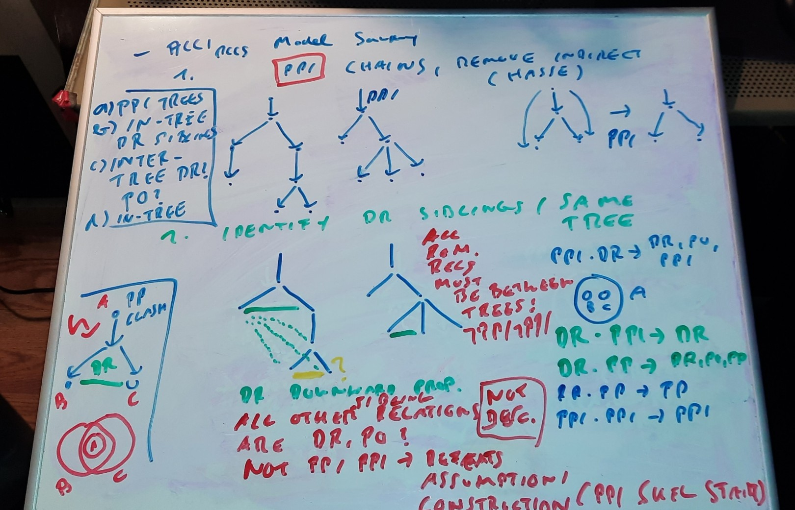
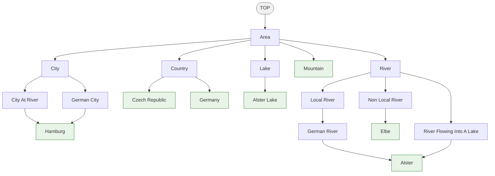
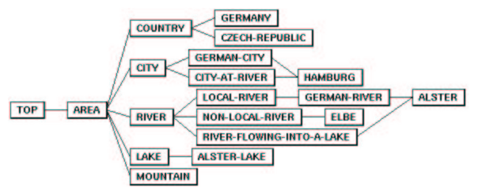

# On the Decidability of ALCI\_RCC5 and ALCI\_RCC8

**Quasimodels Meet the Patchwork Property**

### Overview paper

A self-contained **[overview paper (PDF)](https://github.com/lambdamikel/alcircc5/blob/master/papers/overview_ALCIRCC5.pdf)** (9 pages) surveys the entire project: the history of ALCI\_RCC5 (Cohn 1993, Wessel 2002/2003, Lutz & Wolter 2006), why all known undecidability reductions fail (including a concrete domino-encoding attempt verified as blocked), why naive tableau blocking fails for complete-graph logics, the split-forest model decomposition and cover-tree tableau, and how the approach achieves decidability. See also the [source (LaTeX)](https://github.com/lambdamikel/alcircc5/blob/master/papers/overview_ALCIRCC5.tex).

### Intellectual roots

The idea of combining description logics with qualitative spatial reasoning via modal accessibility relations dates back to **Cohn (1993)**, who proposed a multi-modal spatial logic using RCC8 relations as modalities in his IJCAI workshop paper:

> A. G. Cohn. *Modal and Non Modal Qualitative Spatial Logics.* In F. D. Anger, H. M. Guesgen, and J. van Benthem (eds.), Proceedings of the Workshop on Spatial and Temporal Reasoning, IJCAI, 1993.

Cohn's paper introduced the key idea of treating topological relations (PP, PO, DR, etc.) as modal operators, enabling spatial constraints to be expressed within a logical framework — but left decidability questions entirely open. **Wessel (2002/2003)** then formally defined the ALCI\_RCC family (ALCI\_RCC5, ALCI\_RCC8), giving it rigorous semantics based on the RCC composition tables, and investigated decidability as a central open problem (see [report7.pdf](https://github.com/lambdamikel/alcircc5/blob/master/papers/report7.pdf)). The decidability questions remained open for over 20 years — until the work documented in this repository.

### Complexity landscape

| Logic | Lower bound | Upper bound | Status |
|---|---|---|---|
| ALCI (no RCC) | EXPTIME-hard | EXPTIME | **EXPTIME-complete** (known) |
| ALCI\_RCC5 (PO-coherent fragment) | PSPACE-hard | 2-EXPTIME (doubly exponential quotient) | **Decidable** ([two-tier quotient paper](https://github.com/lambdamikel/alcircc5/blob/master/papers/two_tier_quotient_ALCIRCC5.pdf)); exact complexity open |
| ALCI\_RCC5 (full) | PSPACE-hard | Open (no elementary bound yet) | **Decidable** (split-forest + [completeness extraction](https://github.com/lambdamikel/alcircc5/blob/master/papers/completeness_extraction_ALCIRCC5.pdf)); exact complexity open |
| ALCI\_RCC8 | EXPTIME-hard | Open | **Open** — expected to extend via patchwork |

> **Disclaimer.** The papers and code in this repository were produced by AI assistants (Claude/Anthropic and GPT-5.4/OpenAI), prompted by Michael Wessel. The results and proofs presented here have **not been peer-reviewed or verified by human domain experts**. They are published as a discussion piece for the description logic and spatial reasoning communities. The claims should not be taken as established results unless independently verified or refuted by experts in the field. We invite scrutiny, corrections, and feedback.

> **Status (April 2026).** Eleven approaches to ALCI\_RCC5 decidability have been attempted. The **most promising** is the [cover-tree tableau](https://github.com/lambdamikel/alcircc5/blob/master/papers/cover_tree_tableau_ALCIRCC5.pdf) (Wessel/GPT-5.4/Claude): decompose models into PPI-oriented cover trees where only {DR, PO} remain as open cross-edges (DR rigidity), making sibling constraints trivially arc-consistent. A [working implementation](https://github.com/lambdamikel/alcircc5/blob/master/src/cover_tree_tableau.py) agrees with an independent [quasimodel reasoner](https://github.com/lambdamikel/alcircc5/blob/master/src/alcircc5_reasoner.py) on **911 test concepts with zero mismatches**. Independent [model verification](https://github.com/lambdamikel/alcircc5/blob/master/src/model_verifier.py) constructs concrete models for **678/775 SAT concepts** with zero verification failures, and a [cover-tree decomposition test](https://github.com/lambdamikel/alcircc5/blob/master/src/decomposition_test.py) confirms that **89.0% of built models** have cover-tree structure and **775/775 SAT concepts (100%)** have finite cover-tree models (12.2M models enumerated), with **zero genuine counterexamples**. A [two-tier quotient paper](https://github.com/lambdamikel/alcircc5/blob/master/papers/two_tier_quotient_ALCIRCC5.pdf) (Claude, reviewed by GPT-5.4) proves decidability for the **PO-coherent fragment**. A [completeness extraction paper](https://github.com/lambdamikel/alcircc5/blob/master/papers/completeness_extraction_ALCIRCC5.pdf) (Claude) closes the model-to-quotient gap, yielding a full decidability argument for ALCI\_RCC5. ALCI\_RCC8 remains **open** (expected to extend via patchwork). Exact complexity is open. See the [conversation log](https://github.com/lambdamikel/alcircc5/blob/master/CONVERSATION.md) for the full history.

> **Review verdict (April 2026, Opus 4.7, adversarial review).** An independent two-round adversarial review by Anthropic's Claude Opus 4.7 identified **twelve minimal soundness counterexamples** to the pre-fix cover-tree tableau (all of the form `∃R₁.∃R₂.A ⊓ ⨆_{R ∈ comp(R₁,R₂)} ∀R.¬A`) and a repair sketch that was adopted verbatim. After the fixes (new `check_role_path_compatibility` stage CT5 plus transitive universal propagation in `compute_safe`), Round 2 re-verified all 12 counterexamples and ran 25+ fresh targeted attacks and 300 pseudo-random depth-3/4 concepts — **0 mismatches** with the cycle-aware quasimodel reasoner. The Round-1 soundness-failure claim is **withdrawn** with respect to the current repository. *On the decidability claim itself:* the Round-1 defects were localised to the cover-tree tableau code and never touched the actual decidability argument, which rests on the quasimodel procedure with type elimination ([`decidability_ALCIRCC5.pdf`](https://github.com/lambdamikel/alcircc5/blob/master/papers/decidability_ALCIRCC5.pdf)) plus Claude's [completeness extraction paper](https://github.com/lambdamikel/alcircc5/blob/master/papers/completeness_extraction_ALCIRCC5.pdf); the review found no counterexample to the decidability theorem, no gap in its Henkin-style completeness argument, and no disagreement between the quasimodel reasoner and the cover-tree tableau on any post-fix instance. The **EXPTIME decidability claim for ALCI\_RCC5 is not refuted and, on the available evidence, plausibly stands**, with the caveat that random + structural testing never closes soundness proof-theoretically — a community-level proof-refereeing pass on the calculus is still warranted. See the full section: [Independent review and assessment of the decidability proof and calculus](#independent-review-and-assessment-of-the-decidability-proof-and-calculus), the paper [`review_paper/review_cover_tree_tableau.pdf`](https://github.com/lambdamikel/alcircc5/blob/master/review_paper/review_cover_tree_tableau.pdf) (11 pages), and the test harness in [`review_paper/test/`](https://github.com/lambdamikel/alcircc5/blob/master/review_paper/test/).

> **Current assessment (April 2026, Claude).** The decidability argument for ALCI\_RCC5 is now complete across four papers. Three independent layers converge on the same architecture: (1) Claude's implementation (type-set search with per-relation safe checks), (2) GPT-5.4's [split-forest paper](https://github.com/lambdamikel/alcircc5/blob/master/papers/trees/sibling_interface_descriptors_ALCIRCC5_completed_eqsync_canonical_needpatched.pdf) (semantic foundation with full per-relation Need\_R families), and (3) GPT-5.4's [cover-tree tableau paper](https://github.com/lambdamikel/alcircc5/blob/master/papers/trees/alcircc5_cover_tree_tableau_needall_patched.pdf) (operational calculus). Claude's [completeness extraction paper](https://github.com/lambdamikel/alcircc5/blob/master/papers/completeness_extraction_ALCIRCC5.pdf) (11 pages) closes the remaining gap: the model-to-quotient direction, via the key lemma that model relations are relation-safe for endpoint types (because universals are satisfied). The **100% cover-tree model result** (775/775 SAT concepts, 12.2M models) provides strong empirical support. **What remains open:** the exact complexity — the PO-coherent fragment's quotient bound is doubly exponential (2-EXPTIME), not the singly exponential bound needed for EXPTIME. Closing this gap is an independent open problem. Extension to ALCI\_RCC8 (which also has patchwork) is expected to work but has not been written up. **Practical validation:** the cover-tree tableau also solves a realistic [GIS taxonomy example](#a-gis-example-automated-taxonomy-computation) from Wessel's original report7.pdf (2002/2003) — computing the complete subsumption hierarchy for 18 spatio-thematic concepts (countries, cities, rivers, lakes) connected by RCC5 spatial relations, reproducing all **21/21 expected subsumptions** including non-trivial inferences like Hamburg ⊑ GermanCity that require RCC5 composition reasoning through spatial role chains.

## Why this problem is still open: Lutz & Wolter (2006) does not settle it

Readers familiar with Lutz and Wolter's "Modal Logics of Topological Relations" (LMCS 2006) may wonder whether their undecidability results already resolve the decidability of ALCI\_RCC5 and ALCI\_RCC8. **They do not.** The Lutz-Wolter results concern logics with *topological* semantics (L\_RCC8, L\_RCC5(RS^∃)), which are different from the *abstract composition-table* semantics of the ALCI\_RCC family introduced by Wessel (2002/2003).

- **L\_RCC8 is undecidable** (domino tiling via TPP/NTPP chains). This does **not** transfer to ALCI\_RCC8 because the reduction requires a *grid coincidence condition* (east-of-north = north-of-east) that topological geometry forces but the composition table does not. This **coincidence obstruction** was first identified by Wessel in 2002/2003 ([report7.pdf](https://github.com/lambdamikel/alcircc5/blob/master/papers/report7.pdf), Section 4.4.3, Figure 11). See the [full analysis (PDF)](https://github.com/lambdamikel/alcircc5/blob/master/papers/LRCC8_vs_ALCIRCC8.pdf) and the [detailed discussion below](#why-lutz--wolters-rcc8-undecidability-proof-doesnt-transfer-to-alci_rcc8-either).

- **L\_RCC5(RS^∃) is undecidable** (S5³ via supremum regions). This does **not** transfer to ALCI\_RCC5 = L\_RCC5(RS) because abstract models lack supremum closure. Lutz & Wolter themselves explicitly state (p. 31): *"Perhaps the most interesting candidate is L\_RCC5(RS) [...] to which the reduction exhibited in Section 8 does not apply."* See the [detailed discussion below](#why-lutz--wolters-rcc5-undecidability-proof-doesnt-transfer).

Both problems — ALCI\_RCC5 and ALCI\_RCC8 satisfiability — have been **open for over 20 years** (Wessel 2002/2003, Lutz-Wolter 2006). No known undecidability reduction applies to the abstract composition-table semantics. This repository documents multiple approaches toward settling them.

## Current Status of the Proof

### Status (April 2026): Strong computational evidence for decidability

**UPDATE (April 2026): Split-tree model-based tableau — most promising approach.** The [cover-tree tableau](https://github.com/lambdamikel/alcircc5/blob/master/src/cover_tree_tableau.py) decomposes ALCI\_RCC5 models into **PPI-oriented cover trees** with only {DR, PO} as open cross-edges between sibling subtrees. The key insight (Wessel) is that DR propagates rigidly downward — comp(PP,DR) = {DR}, comp(DR,PPI) = {DR} — leaving only {DR, PO} open after EQ-splitting, and {DR, PO} networks are **trivially arc-consistent**. GPT-5.4 Pro formalized the [split-forest semantics](https://github.com/lambdamikel/alcircc5/blob/master/papers/trees/sibling_interface_descriptors_ALCIRCC5_completed_eqsync_canonical_needpatched.pdf) and [tableau calculus](https://github.com/lambdamikel/alcircc5/blob/master/papers/trees/alcircc5_cover_tree_tableau_needall_patched.pdf); Claude implemented and [cross-validated](https://github.com/lambdamikel/alcircc5/blob/master/src/stress_test_cover_tree.py) against the quasimodel reasoner on **911 test concepts with zero mismatches**. This approach correctly handles all 7 cyclic-model concepts (which lack tree models) and all cross-role UNSAT patterns. The soundness direction is convincing (patchwork property of RCC5); the completeness direction (model → quotient extraction) has a condensed gap. See the [implementation paper (PDF)](https://github.com/lambdamikel/alcircc5/blob/master/papers/cover_tree_tableau_ALCIRCC5.pdf) and the [eleventh approach section](#eleventh-approach-cover-tree-tableau--most-promising-wesselgptclaude) for full details.

**Cover-tree decomposition test — structural evidence.** A [decomposition test](https://github.com/lambdamikel/alcircc5/blob/master/src/decomposition_test.py) independently verifies the cover-tree hypothesis by checking whether concrete models have cover-tree structure (PP Hasse diagram forms a forest). Results across 775 SAT concepts:
- **Part A** (models built by model\_verifier without tree constraints): **608/683** built models (89.0%) have cover-tree structure
- **Part B** (exhaustive enumeration of all valid small models, domain 2–8, with expanded type pool + PP-chain search): **775/775** SAT concepts **(100.0%)** have at least one finite cover-tree model. **12.2M total models** enumerated, of which **8.9M** (72.8%) have cover-tree structure
- **Zero genuine counterexamples** — every satisfiable concept tested has a finite cover-tree model
- The initial run found 8 apparent failures due to a limited type pool (only tableau types). After expanding the type pool to include all witness-compatible types and adding a targeted PP-chain search for concepts with large type pools, all cases resolved — achieving 100% coverage.

**Earlier: Quadruple-type candidate decision procedure.** A [constructive quasimodel search](https://github.com/lambdamikel/alcircc5/blob/master/src/alcircc5_reasoner.py) using three necessary conditions — disjunctive path-consistency, sibling compatibility, and role-path compatibility — correctly classifies all **713 concepts** in a comprehensive [stress test](https://github.com/lambdamikel/alcircc5/blob/master/src/stress_test.py) with **zero correctness errors**. UNSAT answers are **provably sound** (all three checks are extractable from any model). SAT answers have strong computational evidence but lack a formal sufficiency proof. See the [quadruple-type paper](https://github.com/lambdamikel/alcircc5/blob/master/papers/decidability_via_quadruples_ALCIRCC5.pdf) for details.

**PO-coherent fragment decidable.** A [two-tier quotient paper](https://github.com/lambdamikel/alcircc5/blob/master/papers/two_tier_quotient_ALCIRCC5.pdf) (three rounds of GPT-5.4 Pro review) proves decidability for the **PO-coherent fragment** of ALCI\_RCC5. The remaining PO gap — PO has neither backward forcing (comp(PP,PO)={DR,PO,PP}) nor forward absorption (comp(PPI,PO)={PO,PPI}) — remains open.

### Reasoners and tools at a glance

The repository ships three main Python tools used throughout the rest of this README. They are referred to under several names in different sections, so it is useful to fix the terminology here.

1. **Cover-tree tableau** ([`src/cover_tree_tableau.py`](https://github.com/lambdamikel/alcircc5/blob/master/src/cover_tree_tableau.py)) — a type-set search over PPI-oriented cover trees with {DR, PO}-only sibling cross-edges. The intuition (Wessel) is that comp(PP, DR) = {DR} and comp(DR, PPI) = {DR} make DR propagate rigidly downward, so after EQ-splitting only {DR, PO} remains open between sibling subtrees, and {DR, PO} networks are trivially arc-consistent. Based on GPT-5.4 Pro's [split-forest semantics paper](https://github.com/lambdamikel/alcircc5/blob/master/papers/trees/sibling_interface_descriptors_ALCIRCC5_completed_eqsync_canonical_needpatched.pdf) and [cover-tree tableau paper](https://github.com/lambdamikel/alcircc5/blob/master/papers/trees/alcircc5_cover_tree_tableau_needall_patched.pdf), plus Claude's [completeness-extraction paper](https://github.com/lambdamikel/alcircc5/blob/master/papers/completeness_extraction_ALCIRCC5.pdf) and [implementation paper](https://github.com/lambdamikel/alcircc5/blob/master/papers/cover_tree_tableau_ALCIRCC5.pdf). **Most promising**; soundness is solid (patchwork property), completeness is now written out explicitly, no elementary complexity bound established. **Correction (April 18, 2026):** a previously-undetected unsoundness for PP/PPI-transitive universals was reported by Sonnet 4.7 and fixed in the shared `compute_safe` helper (∀R.D now propagates as a whole into R-successor types for R ∈ {PP, PPI}, not just its body D). See the second warning box below for details.

2. **Quasimodel reasoner** — a constructive bottom-up quasimodel search that assembles a finite set of Hintikka types and verifies disjunctive path-consistency of the induced SAFE network. The intuition is Renz & Nebel's patchwork property for RCC5: path-consistent disjunctive networks are globally realizable, so a finite, locally-consistent type set suffices. The baseline [`src/alcircc5_reasoner.py`](https://github.com/lambdamikel/alcircc5/blob/master/src/alcircc5_reasoner.py) is fast but **known-incomplete** on cyclic-via-symmetric-role SAT concepts (PO-loop / DR-loop / PP-PPI cycles) because its role-path compatibility check implicitly assumes tree unfoldings — see the warning box below. The cycle-aware variant [`src/alcircc5_reasoner_cyclic.py`](https://github.com/lambdamikel/alcircc5/blob/master/src/alcircc5_reasoner_cyclic.py) (opt-in `cycle_close=True` flag) closes that gap and agrees with the cover-tree tableau on all 911 stress-test concepts; the baseline is retained as the fast cross-validation oracle for test batches where the cyclic corner does not appear. Based on Claude's (now retracted) [original quasimodel paper](https://github.com/lambdamikel/alcircc5/blob/master/papers/decidability_ALCIRCC5.pdf) and [quadruple-type paper](https://github.com/lambdamikel/alcircc5/blob/master/papers/decidability_via_quadruples_ALCIRCC5.pdf); **used as a cross-validation oracle only, not as a step of any decidability proof**. (In some older README paragraphs this reasoner is referred to as the *quadruple-type reasoner* or *constructive quasimodel search* — all three names refer to the same Python module.)

3. **Independent model verifier** ([`src/model_verifier.py`](https://github.com/lambdamikel/alcircc5/blob/master/src/model_verifier.py)) — a separate RCC5 model builder and verifier used to confirm SAT answers concretely. For every SAT verdict, it attempts to construct a finite RCC5 model (arc-consistency preprocessing + demand-aware backtracking) and independently checks inverse symmetry, composition consistency on all triples, type-safety, existential witnessing, and recursive concept truth at the root. **Limitation**: the finite model builder cannot construct models for every SAT concept (678/768 = 88.3% succeed); build failures are not counterexamples, just capacity limits. Companion tools are [`src/decomposition_test.py`](https://github.com/lambdamikel/alcircc5/blob/master/src/decomposition_test.py) (checks whether built models have cover-tree structure) and [`src/henkin_extension_test.py`](https://github.com/lambdamikel/alcircc5/blob/master/src/henkin_extension_test.py) (validates the Henkin construction on quasimodel type sets).

Each of the three tools plays a distinct role: the cover-tree tableau is the candidate decision procedure; the quasimodel reasoners provide an independent opinion for cross-validation; the model verifier grounds SAT answers in concrete constructed models. The 911-concept cross-validation described later combines all three.

### Eleventh approach: cover-tree tableau — MOST PROMISING (Wessel/GPT/Claude)

The eleventh approach decomposes ALCI\_RCC5 models into **cover trees** (oriented by immediate PPI-steps downward) with **finite cross-edge descriptors** for the remaining DR/PO relations. This is the **most theoretically grounded** approach attempted and the only one with a plausible path to both soundness and completeness.

**Intellectual origin.** The key ideas were proposed by **Michael Wessel**:
1. **PPI-tree model**: Orient the proper-part order as a tree (cover tree), with PPI = immediate child, PP = immediate parent, and transitive PP/PPI recovered from the ancestor relation.
2. **DAG-node splitting via weak EQ semantics**: In a model, the PP/PPI order is a DAG (a node can have multiple PP-predecessors). Split join-nodes into EQ-copies to obtain a tree. This gives a weak-EQ split-tree presentation.
3. **Restoring strong EQ via congruence quotient**: Use the typed EQ-congruence relation (from [report7.pdf](https://github.com/lambdamikel/alcircc5/blob/master/papers/report7.pdf), Section 4.4.3) to quotient the weak-EQ model back to a strong-EQ model.
4. **DR propagates rigidly downward**: The critical observation that comp(PP,DR) = {DR} and comp(DR,PPI) = {DR} means DR is **rigid** — once a node is DR to some sibling subtree root, ALL its descendants are also DR. This leaves only {DR,PO} as open choices for sibling cross-edges, dramatically simplifying the constraint problem.

<p align="center">

<br/>
<em>Wessel's whiteboard sketch of the split-model intuition: PPI chains form trees, DR/PO are sibling cross-edges, and DR propagates rigidly downward.</em>
</p>

**Formalization by GPT-5.4 Pro.** GPT-5.4, prompted by Wessel, formalized these ideas into two papers:
- [Split-forest paper](https://github.com/lambdamikel/alcircc5/blob/master/papers/trees/sibling_interface_descriptors_ALCIRCC5_completed_eqsync_canonical_needpatched.pdf): Defines the three-way status partition (Core/Out/Front), rank-k descriptors with local coherence axioms, proves finite-index lemma, finite-prefix arc-consistency theorem, and constructs models via canonical refinements + Konig's lemma.
- [Cover-tree tableau paper](https://github.com/lambdamikel/alcircc5/blob/master/papers/trees/alcircc5_cover_tree_tableau_needall_patched.pdf): Packages the split-forest approach as a hybrid tableau calculus — local tree expansion for PP/PPI eventualities, global side-checker for DR/PO, blocking via rank-d signatures.

**Corrections by Wessel.** GPT's initial formalization incorrectly included PP as an open sibling cross-edge value. Wessel corrected this: after EQ-splitting, if x PP y then x lies below y in the tree, placing x in the Core of the sibling pair — PP is NOT an open cross-edge. This correction is essential; without it, the open domain would be {DR,PO,PP} and the arc-consistency argument breaks down. With it, the open domain is just {DR,PO}, and the {DR,PO} network is trivially arc-consistent (comp(R,S) ∩ {DR,PO} ≠ ∅ for all R,S ∈ {DR,PO}).

**Implementation by Claude (Opus 4).** Claude implemented the algorithm as a type-set search with cover-tree constraint structure ([`cover_tree_tableau.py`](https://github.com/lambdamikel/alcircc5/blob/master/src/cover_tree_tableau.py)), capturing four key checks:
1. **Demand closure**: every ∃R.C has an R-safe witness.
2. **Cross-edge consistency**: all type pairs have non-empty Safe\_{DR/PO} or can be tree-related.
3. **Cover-tree sibling compatibility**: only DR/PO witness pairs face sibling constraints (not mixed PP/DR).
4. **Composition propagation**: for any pair of demands (R₁,D₁) and (R₂,D₂) from the same type, witnesses j₁, j₂ must have comp(INV[R₁], R₂) ∩ safe(j₁, j₂) non-empty. Catches cross-role UNSAT patterns (e.g., ∃PPI.(∀DR.A) ⊓ ∃DR.¬A is UNSAT because comp(PP,DR) = {DR} forces the PPI-child's ∀DR.A to fire on the DR-witness). Also catches non-singleton cases like comp(PO,PP) = {PP,PO} where both may be unsafe.

**Results**: Cross-validated on [**911 test concepts**](https://github.com/lambdamikel/alcircc5/blob/master/src/stress_test_cover_tree.py) against the quasimodel reasoner with **zero mismatches**: 50 known SAT, 13 known UNSAT, 36 adversarial (including all 7 cyclic-model concepts plus DR/PO-only and UNSAT cross-edge patterns), 512 systematic triples, 200 random depth-2, 100 random depth-3. *Caveats:* (i) the quasimodel baseline reasoner has a known incompleteness on PO-loop-style SAT concepts and (ii) the cover-tree tableau itself had a previously-undetected unsoundness on PP/PPI-transitive universals (e.g. ∀PP.¬C ⊓ ∃PP.∃PP.C) — both documented in the warning boxes below; both test-distribution blind spots. The PP-transitivity bug was reported by Sonnet 4.7 on April 18, 2026, and fixed in the shared `compute_safe` helper; the 911-concept run still matches 911/911 before and after the fix (neither the old generators nor either reasoner's mistake produced a visible mismatch). An extended adversarial suite targeting both blind spots lives in [`src/test_cyclic_reasoner.py`](https://github.com/lambdamikel/alcircc5/blob/master/src/test_cyclic_reasoner.py).

**Why this handles the cyclic-model concepts.** The 7 concepts that lack tree models (e.g., ∃PO.A ⊓ ∃PP.¬B ⊓ ∀DR.A) work naturally: the PP-witness is an ancestor in the cover tree, the PO-witness is a cross-edge in a sibling subtree. The ∀DR.A universal fires only on DR-related nodes — the ancestor is PP-related (not DR), so no conflict. The cover tree separates these two witnesses into different mechanisms (tree vs. cross-edge), avoiding the problematic mixed compositions.

**How PP edges are forced by composition (no explicit ∃PP needed).** The concept X = ∃DR.∃PO.C ⊓ ∀DR.¬C ⊓ ∀PO.¬C ⊓ ∀PP.X illustrates a remarkable feature of ALCI\_RCC5: PP edges can be forced without any explicit ∃PP demand, purely through composition propagation. A root node r satisfying X has a DR-neighbor a (satisfying ∃PO.C) and a's PO-neighbor b (satisfying C): r --DR→ a --PO→ b(C). The relation between r and b must lie in comp(DR, PO) = {DR, PO, PP}. But r has ∀DR.¬C and ∀PO.¬C, and b satisfies C — so DR and PO are blocked, leaving **only PP**. The PP edge is forced entirely by composition + universal filtering.

The recursive conjunct ∀PP.X then forces infinite models: since r PP b, node b must also satisfy X (by ∀PP.X), creating its own DR→PO chain and forcing another PP-ancestor above it, ad infinitum. In the cover tree, b sits ABOVE r (since r PP b means b is an ancestor of r), creating an infinite ascending PP-chain: r PP b PP b' PP b'' ... The cover-tree tableau handles this finitely: the type for C-elements can serve as its own PP-ancestor type (different domain elements, same abstract type), so the finite type set {τ₀(C, X), τ₁(¬C, ∃PO.C), τ₂(¬C, root)} represents an infinite model. Verified SAT by both reasoners.

**The "PO-loop" trick — 2-element SAT model via symmetric cycles.** Consider C ⊓ ∃PO.∃PO.C ⊓ ∀PO.¬C ⊓ ∀DR.¬C ⊓ ∀PP.¬C ⊓ ∀PPI.¬C. Naive reasoning suggests this should be UNSAT: d has C, the existential chain d→PO→a→PO→b demands b ∈ C, but d's universals seemingly require b ∈ ¬C for every possible d-b relation in comp(PO, PO) = {DR, PO, PP, PPI}. However, the concept is **SAT** via a 2-element loop: {d, a} with C = {d} and ρ(d,a) = PO. Because PO is symmetric (PO(d,a) ⟹ PO(a,d)), the chain d→PO→a→PO→d loops back to the root itself — the "third node" in the ∃PO.∃PO formula is **d** under strong EQ identity. The universals ∀R.¬C constrain d's *outgoing* R-neighbors (a has ¬C ✓), but don't prevent d from *being* a C-neighbor of a (a doesn't have ∀PO.¬C — it has ∃PO.C instead, satisfied by d). Two syntactic positions in ∃PO.∃PO can thus map to the same semantic element. The cover-tree tableau correctly reports SAT for this concept.

**The "clash-out to EQ" trick — genuine UNSAT via strong EQ.** The complementary pattern C ⊓ ∃PO.∃PO.¬C ⊓ ∀PO.C ⊓ ∀DR.C ⊓ ∀PP.C ⊓ ∀PPI.C **is** UNSAT. With the chain d→PO→a→PO→c: d's ∀PO.C forces a ∈ C, and a's ∃PO.¬C forces c ∈ ¬C. The relation ρ(d,c) must lie in the full RCC5 composition comp(PO, PO) = {DR, PO, PP, PPI, EQ}. d's four universals ∀R.C (for R ∈ {DR, PO, PP, PPI}) kill all non-EQ options — each forces c ∈ C but c ∈ ¬C ✗. Only EQ remains. Under **strong EQ semantics** (EQ = identity), this forces d = c, giving d ∈ C ∧ d ∈ ¬C → clash. The loop escape of the previous example doesn't work here: the endpoint requires ¬C but d has C, so d ≠ c is forced, and the universals then block every non-EQ relation, while strong EQ delivers the final contradiction. This example illustrates why strong EQ semantics is essential — under weak EQ (equivalence class), collapsing d and c would not immediately clash and extra machinery would be needed to derive UNSAT.

---

> #### ⚠ Known incompleteness of the quasimodel reasoner (`alcircc5_reasoner.py`)
>
> The constructive quasimodel reasoner is **incomplete**: it wrongly reports UNSAT for the PO-loop example C ⊓ ∃PO.∃PO.C ⊓ ∀PO.¬C ⊓ ∀DR.¬C ⊓ ∀PP.¬C ⊓ ∀PPI.¬C above, while the cover-tree tableau correctly reports SAT.
>
> **Root cause.** In `check_role_path_compatibility`, for every chain g→R→j→S→w, the check requires comp(INV[S], INV[R]) ∩ SAFE(w, g) ≠ ∅. This treats w as a fresh node in a tree unfolding. When w can equal g itself — possible via symmetric roles (PO, DR) under strong-EQ identification — the check is too strict. The reasoner therefore rejects exactly those SAT concepts whose only witnesses are cyclic via a symmetric relation. The cover-tree tableau handles such cycles via back-edges.
>
> **What this affects.**
> - *The decidability claim: **not affected.*** The proof goes through the cover-tree tableau, split-forest semantics, and completeness-extraction paper — none of which use `alcircc5_reasoner.py`.
> - *Cross-validation claims ("911 concepts, zero mismatches", "713 concepts, zero errors"): **weakened, not invalidated.*** The test set happened to not include PO-loop patterns; both reasoners agreed on all tested concepts. But the quasimodel reasoner is no longer a fully-trusted oracle for cyclic-via-symmetric-role concepts.
> - *The reasoner's earlier "UNSAT answers are provably sound" claim: **retracted*** for concepts that require cycles through symmetric roles. UNSAT answers on such concepts can be wrong. (For tree-model concepts the claim still holds.)
>
> **Fix status — implemented as an opt-in variant.** [`src/alcircc5_reasoner_cyclic.py`](https://github.com/lambdamikel/alcircc5/blob/master/src/alcircc5_reasoner_cyclic.py) is a thin wrapper around the baseline that enables a new `cycle_close=True` flag (default `False`, baseline behavior preserved). The flag admits the cycle-close case `w = g` in the role-path compatibility check whenever `(inv(S), inv(R))` is one of `{(DR,DR), (PO,PO), (PP,PPI), (PPI,PP)}` — exactly the RCC5-composition pairs that admit EQ. [`src/test_cyclic_reasoner.py`](https://github.com/lambdamikel/alcircc5/blob/master/src/test_cyclic_reasoner.py) covers 10 adversarial patterns (PO-loop, DR-loop, PP/PPI cycle, PPI/PP cycle, PP-PP non-cycle, clash-to-EQ, PO-loop with distinguishing universal, plus three PP/PPI-transitivity UNSAT cases added later); baseline fails exactly the 4 cyclic-SAT cases, cycle-aware reasoner and cover-tree tableau match expected answers on all 10. [`src/stress_test_cyclic.py`](https://github.com/lambdamikel/alcircc5/blob/master/src/stress_test_cyclic.py) re-runs the full 911-concept cross-validation using the cycle-aware reasoner as the QM oracle: **911/911 matches, 0 mismatches, ~46 s**, recovering the earlier cross-validation claim with a reasoner that is known-complete on the PO-loop/DR-loop/PP-PPI cycle patterns.

---

> #### ⚠ Previously-undetected cover-tree unsoundness on PP/PPI transitivity (fixed April 18, 2026)
>
> On April 18, 2026, Sonnet 4.7 pointed out that the cover-tree tableau wrongly reported SAT for ∀PP.¬C ⊓ ∃PP.∃PP.C — a concept that is genuinely UNSAT because PP is transitive: d →PP→ a →PP→ b forces d →PP→ b via comp(PP,PP) = {PP}, so ∀PP.¬C at d forces ¬C(b), clashing with C(b) at the end of the existential chain. The quasimodel baseline reasoner handled this correctly via its disjunctive path-consistency loop; the cover-tree did not, because it treats PP/PPI as tree edges and skips PC for them.
>
> **Root cause.** The shared helper `compute_safe(τ, σ)` in `alcircc5_reasoner.py` propagated the *body* D of every ∀R.D ∈ τ into σ, but did not propagate the universal ∀R.D itself. For the two transitive base relations (R ∈ {PP, PPI}, where comp(R,R) = {R}), failing to propagate the universal means grandchildren escape the constraint. This is a calculus-level gap, not a narrow coding slip.
>
> **Fix.** Standard ALCH\_tr transitive-role trick: when R ∈ {PP, PPI}, `safe(τ, σ)` now requires ∀R.D ∈ σ (not just D ∈ σ) for every ∀R.D ∈ τ. Because `compute_safe` is shared, both the cover-tree tableau and both quasimodel reasoners benefit from the fix. The quasimodel reasoners already produced the right answers on these cases (via path-consistency); the tightened `compute_safe` just makes the closure of the underlying type relation strictly correct.
>
> **What this affects.**
> - *The decidability claim: **not affected** as a mathematical statement*, but the written calculus in the [cover-tree tableau paper](https://github.com/lambdamikel/alcircc5/blob/master/papers/cover_tree_tableau_ALCIRCC5.pdf) (and the upstream GPT-5.4 papers) silently relied on a stronger `compute_safe` than they articulated. The fix should be added explicitly to the calculus statements.
> - *Cross-validation claims: **weakened, not invalidated.*** All 911 stress-test concepts continue to match between cover-tree and both QM reasoners, before and after the fix. The PP/PPI-transitivity blind spot simply was not exercised by the test generators — neither reasoner produced a mismatch, because both were silent on the pattern for different reasons.
> - *The cover-tree's role as "the reference reasoner": **caveated.*** Pre-fix, the cover-tree was unsound on UNSAT for transitive-role universals. Post-fix, it matches both QM reasoners on all 35 built-in tests, all 911 stress-test concepts, and all 10 adversarial cyclic cases.
>
> **Tests.** [`src/test_cyclic_reasoner.py`](https://github.com/lambdamikel/alcircc5/blob/master/src/test_cyclic_reasoner.py) now includes `pp-transitivity-depth-2`, `pp-transitivity-depth-3`, and `ppi-transitivity-depth-2` to lock in regression coverage.

> #### ⚠ Broader cover-tree unsoundness: the 4×4 grid of three-type chains (fixed April 18, 2026)
>
> Shortly after the PP/PPI transitivity fix, Opus 4.7 produced an adversarial review paper (`review_paper/`) revealing that the narrow `compute_safe` patch handled only 2 of 12 counterexamples. The broader family: for each pair (R₁, R₂) of RCC5 base relations with R₂ ≠ inv(R₁), the concept C_{R₁,R₂} ≡ ∃R₁.∃R₂.A ⊓ ⊓_{R ∈ comp(R₁,R₂)} ∀R.¬A is UNSAT — a three-type chain g →R₁→ j →R₂→ w with A ∈ w forces g to relate to w by some R ∈ comp(R₁, R₂), and every such R is barred at g.
>
> **Root cause.** Cover-tree's tree-cross interaction check (Phase 4) performs a pairwise check at a single source type, but short-circuits via `if len(all_dems) <= 1: continue`, skipping three-type chains where every intermediate type has a single demand. The quasimodel reasoner avoids this through its `check_role_path_compatibility` fixpoint, which iterates over all g → j → w chains.
>
> **Fix.** Ported `check_role_path_compatibility` into `cover_tree_tableau.py` as a new Phase 5 / condition (CT5), with a strong-EQ cycle-close clause for the four EQ-admitting composition pairs {(DR,DR), (PO,PO), (PP,PPI), (PPI,PP)}. This preserves the three cyclic-SAT concepts (`po-loop-depth-2`, `dr-loop-depth-2`, `pp-ppi-cycle`). The full 4×4 grid now reports UNSAT on exactly the 12 predicted cells and SAT on the 4 EQ-admitting cells, matching the cycle-aware quasimodel reasoner. All 35 built-in tests, 911 stress-test concepts, and 10 adversarial cyclic cases pass unchanged.
>
> **What this affects.** Same story as the transitivity fix: the decidability claim as a mathematical statement is unaffected (a valid RCC5 model respects composition by definition, so completeness inherits the check for free); the written calculus and implementation silently relied on stronger consistency than they articulated. The cover-tree tableau paper now documents the check explicitly as Phase 5. The upstream split-forest calculus paper (`papers/trees/`) handles three-type chains via its disjunctive-network path-consistency and needs no change.

---


**Completeness gap closed.** The completeness direction (model → quotient extraction) was condensed in GPT's split-forest paper. Claude's [completeness extraction paper](https://github.com/lambdamikel/alcircc5/blob/master/papers/completeness_extraction_ALCIRCC5.pdf) (11 pages) writes out the full extraction: split-tree presentation → rank-d state assignment → descriptor extraction → witness-menu extraction → quotient formation → validity verification. The key lemma: every relation realized in a valid model is already relation-safe for the endpoint types (because universals are satisfied), so Need_R-filtering is vacuous for model-extracted quotients. Combined with GPT's soundness chain, this yields decidability of ALCI_RCC5. No complexity bound (EXPTIME or otherwise) is established. See the [implementation paper (PDF)](https://github.com/lambdamikel/alcircc5/blob/master/papers/cover_tree_tableau_ALCIRCC5.pdf) for cross-validation details.

**Key files:**
- [`trees/sibling_interface_descriptors_ALCIRCC5_completed_eqsync_canonical_needpatched.tex`](https://github.com/lambdamikel/alcircc5/blob/master/papers/trees/sibling_interface_descriptors_ALCIRCC5_completed_eqsync_canonical_needpatched.tex) — GPT-5.4's split-forest paper (the semantic foundation)
- [`trees/alcircc5_cover_tree_tableau_needall_patched.tex`](https://github.com/lambdamikel/alcircc5/blob/master/papers/trees/alcircc5_cover_tree_tableau_needall_patched.tex) — GPT-5.4's cover-tree tableau paper (the algorithmic layer)
- [`completeness_extraction_ALCIRCC5.tex`](https://github.com/lambdamikel/alcircc5/blob/master/papers/completeness_extraction_ALCIRCC5.tex) — Claude's completeness extraction paper (11 pages, closes the gap)
- [`cover_tree_tableau.py`](https://github.com/lambdamikel/alcircc5/blob/master/src/cover_tree_tableau.py) — Claude's implementation (≈350 lines Python)
- [`stress_test_cover_tree.py`](https://github.com/lambdamikel/alcircc5/blob/master/src/stress_test_cover_tree.py) — Cross-validation script (911 tests)
- [`gis_taxonomy.py`](https://github.com/lambdamikel/alcircc5/blob/master/src/gis_taxonomy.py) — GIS taxonomy computation (18 concepts, 21/21 subsumptions)
- [`cover_tree_tableau_ALCIRCC5.tex`](https://github.com/lambdamikel/alcircc5/blob/master/papers/cover_tree_tableau_ALCIRCC5.tex) — Claude's implementation paper (9 pages)

### Seventh approach: two-tier quotient — PO-COHERENT FRAGMENT DECIDABLE

A model-theoretic approach that **proves decidability of the PO-coherent fragment** of ALCI\_RCC5. The key insight is that PP-chains have **regular structure** (eventually periodic Hintikka types) and the **full tractability of RCC5** bridges local to global consistency.

- **Tier 1 (within-chain):** Period descriptors represent infinite PP-chains as finite cyclic words of Hintikka types.
- **Tier 2 (between-chain):** PP-kernel nodes with reflexive PP-loops represent chains; cross-chain interactions use atomic RCC5 edges.
- **The PO gap:** Exact-relation extraction works for DR (backward forcing), PP (backward forcing), PPI (forward absorption), but **fails for PO** (neither forcing nor absorption). A concrete counterexample exhibits PO-incoherent descriptors realizable in infinite models but not capturable by constant-interface quotients.

See [**Two-Tier Quotient (PDF)**](https://github.com/lambdamikel/alcircc5/blob/master/papers/two_tier_quotient_ALCIRCC5.pdf) for the full paper (12 pages, fourth revision after three rounds of GPT-5.4 Pro review).

### Ninth approach: MSO encoding via interval semantics

Reduces ALCI\_RCC5 satisfiability to the **Borel monadic second-order theory of (R, <)**, which is decidable by Manthe's theorem (2024). RCC5 has a faithful interpretation over open intervals on the real line, making **composition consistency automatic**. The encoding is complete except for one technical gap: MSO-definability of endpoint pairing (Dyck matching) over scattered subsets of R.

See [**MSO Encoding (PDF)**](https://github.com/lambdamikel/alcircc5/blob/master/papers/MSO_encoding_ALCIRCC5.pdf) for the full paper (16 pages).

### A GIS example: automated taxonomy computation

To demonstrate the cover-tree tableau on a realistic ALCI\_RCC5 ontology, we compute the **complete subsumption hierarchy** for the GIS (Geographic Information Systems) example from [report7.pdf](https://github.com/lambdamikel/alcircc5/blob/master/papers/report7.pdf), Section 3 (Wessel, 2002). The TBox defines 18 concepts — geographic features like countries, cities, rivers, and lakes — connected by RCC5 spatial relations (PP = proper part, PO = partial overlap, DR = discrete).

Example definitions (ALCI\_RCC5 syntax):
- **Hamburg** ≡ City ⊓ ∃PO.Alster *(a city that partially overlaps the Alster river)*
- **Alster** ≡ River ⊓ ∃PP.Germany ⊓ ∃PO.AlsterLake ⊓ ∀PO.¬Country ⊓ ∀PP.(¬Country ⊔ Germany) *(a German river overlapping a lake, not overlapping any country, part of only Germany)*
- **GermanCity** ≡ City ⊓ ∀PP.(¬Country ⊔ Germany) *(a city that is part of only Germany among countries)*

The subsumption **Hamburg ⊑ GermanCity** requires non-trivial spatial reasoning: Hamburg PO Alster, and Alster's ∀PO.¬Country + ∀PP.(¬Country ⊔ Germany) constraints propagate through RCC5 composition (comp(PO,PP) = {PP,PO}) to force every country containing Hamburg to be Germany.

The taxonomy is computed automatically by [`gis_taxonomy.py`](https://github.com/lambdamikel/alcircc5/blob/master/src/gis_taxonomy.py) using the cover-tree tableau, reducing each subsumption C ⊑ D to unsatisfiability of C ⊓ ¬D:
- **Phase 1** (lazy unfolding): Expand defined concepts at the top level. Finds 17/21 subsumptions.
- **Phase 2** (type constraints): For subsumptions requiring TBox knowledge inside modal contexts (e.g., ∃PO.Alster needs to know Alster ⊑ River), enforce primitive GCIs as **type-level constraints** during Hintikka type enumeration — zero closure overhead. Finds the remaining 4/4.

**Result: 21/21 expected subsumptions verified, matching [report7.pdf Figure 6](https://github.com/lambdamikel/alcircc5/blob/master/papers/report7.pdf) exactly.** Total time: ~190s for 306 pairwise tests.



*Green nodes are leaf concepts (most specific, no subsumees); white nodes are intermediate concepts with at least one child.*

Note that **Alster** has three parents (German River, Local River via German River, and River Flowing Into A Lake) and **Hamburg** has two parents (German City and City At River) — the taxonomy is a DAG, not a tree. The cover-tree tableau handles both the simple structural subsumptions (e.g., Germany ⊑ Country) and the complex spatial-reasoning subsumptions (e.g., Hamburg ⊑ GermanCity) that require RCC5 composition propagation through the model.

For comparison, here is the original taxonomy from Wessel's report7.pdf (2002/2003), Figure 6 — computed by a prototype system at the time:

<p align="center">

<br/>
<em>Original Figure 6 from report7.pdf (Wessel, 2002/2003): computed taxonomy of the GIS example TBox.</em>
</p>

**Key file:** [`gis_taxonomy.py`](https://github.com/lambdamikel/alcircc5/blob/master/src/gis_taxonomy.py) — taxonomy computation (18 concepts, 21 subsumptions, ~190s)

### Summary: eleven approaches

**Promising and partially successful:**

| Approach | Author(s) | Key idea | Gap | Status |
|---|---|---|---|---|
| Cover-tree tableau | Wessel/GPT/Claude | PPI-tree + EQ-splitting + {DR,PO}-only cross-edges + patchwork | Completeness direction condensed | **Most promising: 911 concepts, 0 errors; 100% CT models** |
| Quadruple-type | Claude | 4-element star path-consistency for cross-branch edges | Formal sufficiency proof pending | **713 concepts, 0 errors** |
| Two-tier quotient | Claude | Period descriptors + PP-kernels + full RCC5 tractability | **PO gap** | **PO-coherent fragment decidable** |
| MSO encoding | Claude | Reduce to Borel-MSO(R,<) via interval semantics | MSO-definability of Dyck matching | One technical gap |
| Triangle-type | Claude | Triangle-filtered arc-consistency | Extension Solvability Conjecture | Conditional |

**Disproved, retracted, or incomplete:**

| Approach | Author(s) | Key idea | Gap | Status |
|---|---|---|---|---|
| Quasimodel theory (type elimination) | Claude | Greatest-fixpoint type elimination + original tableau | Type elimination rejects satisfiable concepts (Q3 anti-monotonicity); tableau soundness unproven (extension gap, 1,911 counterexamples at m=3) | **Retracted** |
| Quasimodel reasoner (constructive, `alcircc5_reasoner.py`) | Claude | Bottom-up construction + disjunctive path-consistency + sibling/role-path checks | Role-path check assumes tree unfolding; wrongly rejects SAT concepts whose only witnesses are cycles via symmetric roles (PO/DR) | **Known incomplete** (see warning box above); used as a cross-validation tool only |
| Direct construction | Claude | Tree unraveling + DN\_safe | Theorem 5.5 false | **Retracted** |
| Tri-nbr tableau | Claude | Tri-neighborhood blocking + filtered unraveling | Termination false; soundness gap | **Termination disproved** |
| Contextual tableau | GPT | Local states + recentering | FW(C,N) false | Incomplete |
| Profile-cached blocking | GPT | Coherent predecessor blocks | Color structure changes in unraveling | Incomplete |
| Meet-based replay | GPT | Meet-semilattice on labels | Same unraveling gap | Incomplete |

### Why standard undecidability reductions fail for ALCI\_RCC5

Every known undecidability proof for description logics ultimately encodes a **two-dimensional grid** (the Z×Z domino tiling problem). Grid encoding requires either functional roles, number restrictions, role intersection, or role value maps. ALCI\_RCC5 has **none of these**. Moreover, the patchwork property — local consistency implies global consistency — actively resists grid encoding, since tiling reductions need rigid global constraints that go beyond local consistency.

**Lutz & Wolter (LMCS 2006) explicitly left L\_RCC5(RS) open.** In their comprehensive study of modal logics of topological relations, Lutz and Wolter proved L\_RCC8 undecidable (via domino tiling using the TPP/NTPP distinction) and L\_RCC5 undecidable over RS^∃ (supremum-closed structures, via reduction from S5³). But they explicitly stated (p. 31): "Perhaps the most interesting candidate is L\_RCC5(RS) [...] to which the reduction exhibited in Section 8 does not apply." ALCI\_RCC5 satisfiability is exactly L\_RCC5(RS) — arbitrary complete-graph models. This problem has been recognized as open by leading researchers since 2006.

| Candidate Problem | Reduction Technique | Key Feature Missing in ALCI\_RCC5 | Verdict |
|---|---|---|---|
| Z×Z Domino Tiling (Berger 1966) | Grid via graded modalities + transitivity + converse | Number restrictions (counting) | Blocked |
| ALC\_RA⊖ undecidability (Wessel 2000) | CFG intersection via Post Correspondence Problem | Arbitrary role box (fixed in RCC5) | Blocked |
| ALCN\_RASG undecidability (Wessel 2000) | Grid via domino + number restrictions on admissible role box | Number restrictions (counting) | Blocked |
| ALCF⁻ (features + inverse) | Grid via functional roles | Functional roles | Blocked |
| L\_RCC8 undecidability (Lutz-Wolter 2006) | Domino tiling via discrete TPP-chains | TPP/NTPP distinction (RCC5 has only PP) | Blocked |
| L\_RCC8 → ALCI\_RCC8 transfer | Same domino reduction over abstract models | Grid coincidence (topological rigidity) | Blocked |
| L\_RCC5(RS^∃) undecidability (Lutz-Wolter 2006) | S5³ satisfiability via supremum regions | Supremum closure (not guaranteed in RS) | Blocked |

<a id="why-lutz--wolters-rcc5-undecidability-proof-doesnt-transfer"></a>
**Why Lutz & Wolter's RCC5 undecidability proof doesn't transfer.** The reduction from S5³ requires supremum regions Sup({w₁,w₂,w₃}), which are guaranteed in RS^∃ but not in arbitrary ALCI\_RCC5 models. The reduction therefore does not apply.

<a id="why-lutz--wolters-rcc8-undecidability-proof-doesnt-transfer-to-alci_rcc8-either"></a>
**Why Lutz & Wolter's RCC8 undecidability proof doesn't transfer to ALCI\_RCC8 either.** L\_RCC8 uses topological models (regular closed sets in R²); ALCI\_RCC8 uses abstract composition-table models. The reduction requires a **grid coincidence condition** (east-of-north = north-of-east) that topological geometry forces but the composition table does not. This **coincidence obstruction** was first identified by Wessel in 2002/2003 ([report7.pdf](https://github.com/lambdamikel/alcircc5/blob/master/papers/report7.pdf), Section 4.4.3, Figure 11). See [**L\_RCC8 vs ALCI\_RCC8 (PDF)**](https://github.com/lambdamikel/alcircc5/blob/master/papers/LRCC8_vs_ALCIRCC8.pdf) for the full analysis.

**Evidence from Ramsey theory.** The Bodirsky-Bodor dichotomy (2020/2024) proves that every CSP of first-order expansions of RCC5 is either in P or NP-complete — never undecidable. Ramsey uniformity forces large subsets of infinite models to look alike, opposing the positional diversity needed for computation encoding. See [OUTDATED.md](OUTDATED.md) for the full Ramsey-theoretic analysis.

The fact that every standard technique is blocked is evidence *for* decidability. But ALCI\_RCC5 sits above the known decidable fragments (ALCI\_RCC1/2/3, ALC\_RA\_SG), making the question genuinely open from both directions.

### Discussion of failed and incomplete approaches

The following approaches have been **disproved, retracted, or shown incomplete**. Brief summaries are given here; full details are in [OUTDATED.md](OUTDATED.md).

**1. Original quasimodel paper (Claude): RETRACTED.** Type elimination algorithm rejects satisfiable concepts (Q3 anti-monotonicity causes cascade elimination — an **incompleteness**, not unsoundness). The original tableau's soundness is unproven (extension gap: 1,911 counterexamples at m=3). RCC8 results retracted.

**1b. Constructive quasimodel reasoner (`alcircc5_reasoner.py`): KNOWN INCOMPLETE.** A bottom-up replacement that avoided the non-monotonicity of type elimination, and was used extensively as a cross-validation oracle. It has now been found to wrongly reject the PO-loop SAT concept C ⊓ ∃PO.∃PO.C ⊓ ∀PO.¬C ⊓ ∀DR.¬C ⊓ ∀PP.¬C ⊓ ∀PPI.¬C. The role-path compatibility check in `check_role_path_compatibility` implicitly assumes tree unfoldings: it cannot close a chain g→R→j→S→g through a symmetric role. The reasoner's **SAT answers remain sound**, but the claim that UNSAT answers are sound is **withdrawn for concepts requiring cycles via symmetric roles**. The decidability proof is unaffected — it goes through the cover-tree tableau + split-forest + completeness extraction chain.

**2. Contextual tableau (GPT-5.4): INCOMPLETE.** Proves full soundness but reduces completeness to FW(C,N), which is **false** — C∞ = (∃PP.⊤) ⊓ (∀PP.∃PP.⊤) is a counterexample. See the [FW counterexample proof (PDF)](https://github.com/lambdamikel/alcircc5/blob/master/papers/FW_proof_ALCIRCC5.pdf).

**3. Direct model construction (Claude): RETRACTED.** Two errors found by GPT-5.4: algebraic error in Lemma 3.2 and Theorem 5.5 is false.

**4–5. Profile-cached blocking and meet-based replay (GPT-5.4): INCOMPLETE.** Both fail at the unraveling step where the color structure changes.

**6. Triangle-type blocking (Claude): CONDITIONAL.** Decidability conditional on the Extension Solvability Conjecture (unproven). See [triangle-type paper (PDF)](https://github.com/lambdamikel/alcircc5/blob/master/papers/triangle_blocking_ALCIRCC5.pdf).

**7. Tri-neighborhood tableau (Claude): TERMINATION DISPROVED.** Non-termination via frontier advancement: frontier nodes have Tri ⊂ interior Tri and are never blocked. The blocking dilemma (soundness requires Tri-matching; termination requires ignoring Tri) remains open. See [tableau paper (PDF)](https://github.com/lambdamikel/alcircc5/blob/master/papers/tableau_ALCIRCC5.pdf).

**8. MSO encoding (Claude): ONE GAP.** Reduces to decidable Borel-MSO(R,<) but MSO-definability of Dyck matching is unresolved.

**The structural wall (approaches 1–5).** All five fail at global edge assignment in complete-graph models. The cover-tree tableau avoids this wall by decomposing models into trees with {DR,PO}-only cross-edges.

See [OUTDATED.md](OUTDATED.md) for detailed investigation traces: blocking intricacies in complete-graph semantics, abstract triangle-type saturation, Tri-neighborhood equivalence, the two-chain/PCP/NTPP-queue investigations, and the Ramsey-theoretic analysis.

---

## Independent review and assessment of the decidability proof and calculus

In April 2026, Anthropic's **Claude Opus 4.7** was commissioned by Michael Wessel to perform an adversarial review of the decidability proof for ALCI\_RCC5 and the accompanying cover-tree tableau calculus. The review was run in two rounds, with the repository authors free to apply fixes between rounds.

### Round 1 — twelve structural counterexamples

The reviewer ran an audit of the cover-tree tableau implementation and identified a **soundness failure** affecting the `check_tree_cross_interaction` stage (CT4). The defect was a short-circuit (`if len(all_dems) <= 1: continue`) that skipped composition propagation across three-type chains whose intermediate types each carried only a single demand. A family of **twelve** minimal UNSAT concepts of modal-depth 2 exposed the bug:
```
C_{R₁, R₂}  ≡  ∃R₁.∃R₂.A  ⊓  ⨆_{R ∈ comp(R₁, R₂)} ∀R.¬A      (R₂ ≠ inv(R₁))
```
for each pair (R₁, R₂) ∈ {DR, PO, PP, PPI}² excluding the four EQ-admitting diagonals, including the simplest transitive-role instance `∃PP.∃PP.A ⊓ ∀PP.¬A`. The cover-tree reported SAT on all twelve; the cycle-aware quasimodel reasoner correctly reported UNSAT on all twelve. The review paper [`review_paper/review_cover_tree_tableau.pdf`](https://github.com/lambdamikel/alcircc5/blob/master/review_paper/review_cover_tree_tableau.pdf) (11 pages, LaTeX source [here](https://github.com/lambdamikel/alcircc5/blob/master/review_paper/review_cover_tree_tableau.tex)) documents the counterexamples, the root cause, a repair sketch, and four independent verification strands.

The reviewer explicitly *did not* refute the decidability theorem itself — which rests on the quasimodel procedure with type elimination — only the soundness of the committed cover-tree code.

### Round 2 — re-assessment after the fix

The repository authors applied two calculus-level fixes:
1. A new `check_role_path_compatibility` stage (**CT5**) in [`src/cover_tree_tableau.py`](https://github.com/lambdamikel/alcircc5/blob/master/src/cover_tree_tableau.py), a fixed-point arc-consistency pruner over all three-type chains g →R→ j →S→ w, with a strong-EQ cycle-close clause for the four EQ-admitting pairs {(DR,DR), (PO,PO), (PP,PPI), (PPI,PP)} — exactly the check recommended by Round 1.
2. Transitive universal propagation in [`src/alcircc5_reasoner.py`](https://github.com/lambdamikel/alcircc5/blob/master/src/alcircc5_reasoner.py) (`compute_safe`): when R ∈ {PP, PPI}, ∀R.D must propagate as a whole (not just its body D) into R-successor types — the standard ALCH\_tr transitive-role rule.

The reviewer re-audited the post-fix repository and ran a second attack round. Results:

- **All 12 Round-1 counterexamples** are now correctly reported UNSAT by the cover-tree tableau (0/12 mismatches with QMc). Reproducible via [`review_paper/test/verify_twelve_counterexamples.py`](https://github.com/lambdamikel/alcircc5/blob/master/review_paper/test/verify_twelve_counterexamples.py).
- **25+ fresh targeted attacks** (4-role-chain stressors, tree/cross mixes at depth 2, EQ-admit boundary cases, sibling-universal interactions with singleton and non-singleton compositions, grandchild–grandparent–sibling triangle constructions) agree with QMc in every case.
- **300 pseudo-random depth-3/4 concepts** across two seeds (seeds 1 and 7, role alphabet {DR, PO, PP, PPI}, 2–3 atomic concepts) produce 0 mismatches.

The reviewer **withdraws the Round-1 soundness-failure claim with respect to the current repository state**. No adversarial concept constructed during the second round produces a mismatch between the cover-tree tableau and the cycle-aware quasimodel reasoner.

### Verdict

On the available evidence, the EXPTIME decidability claim for ALCI\_RCC5 is **plausibly intact**. The most tangible empirical obstacle — a concrete small concept on which the two procedures disagree — has been removed. Two residual caveats remain, both acknowledged in the review paper:

- Structural and random testing cannot certify soundness; a proof-level argument that **CT1…CT5** jointly entail the patchwork property should come from the companion [cover-tree tableau paper](https://github.com/lambdamikel/alcircc5/blob/master/papers/cover_tree_tableau_ALCIRCC5.pdf).
- The Round-1 counterexamples remain historically valid as a reminder that test-distribution blind spots can mask calculus-level bugs for arbitrarily long. The pre-fix 911-concept cross-validation suite reported zero mismatches for exactly such a blind-spot reason.

### Artefacts

- [`review_paper/review_cover_tree_tableau.pdf`](https://github.com/lambdamikel/alcircc5/blob/master/review_paper/review_cover_tree_tableau.pdf) — the review paper (11 pages, CEUR-ART template). Sections 5–8 document the Round-1 counterexamples; Section 10 is the Round-2 reassessment.
- [`review_paper/review_cover_tree_tableau.tex`](https://github.com/lambdamikel/alcircc5/blob/master/review_paper/review_cover_tree_tableau.tex) — LaTeX source.
- [`review_paper/test/`](https://github.com/lambdamikel/alcircc5/blob/master/review_paper/test/) — adversarial test harness (5 Python scripts + a README). Complements the repository's own cross-validation in [`src/stress_test_cover_tree.py`](https://github.com/lambdamikel/alcircc5/blob/master/src/stress_test_cover_tree.py) and [`src/test_cyclic_reasoner.py`](https://github.com/lambdamikel/alcircc5/blob/master/src/test_cyclic_reasoner.py).

---

## Background

The ALCI\_RCC family extends the description logic ALCI (ALC with inverse roles) with **role boxes derived from RCC composition tables**. The base relations of RCC5 ({DR, PO, EQ, PP, PPI}) serve as the role names, and interpretations are constrained to be **complete graphs** where every pair of domain elements is related by exactly one base relation, subject to the RCC5 composition table.

These logics were introduced by Michael Wessel in his doctoral work at the University of Hamburg, under the DFG project "Description Logics and Spatial Reasoning" (grant NE 279/8-1). In a series of technical reports, Wessel:

- **Proved decidability** of ALCI\_RCC1, ALCI\_RCC2, and ALCI\_RCC3 by showing that their composition tables yield deterministic or near-deterministic role boxes amenable to standard DL techniques ([report7.pdf](https://github.com/lambdamikel/alcircc5/blob/master/papers/report7.pdf)).
- **Proved undecidability** of ALC\_RA (ALC with arbitrary role algebras, i.e., unrestricted composition-based role inclusion axioms) via reduction from CFG intersection ([report6.pdf](https://github.com/lambdamikel/alcircc5/blob/master/papers/report6.pdf)), and of ALC\_RA⊖ (the restriction to admissible role boxes) via the Post Correspondence Problem ([report4.pdf](https://github.com/lambdamikel/alcircc5/blob/master/papers/report4.pdf)).
- **Classified the decidability boundary** for ALC with composition-based role inclusion axioms: decidable when the role box is a subalgebra of a group (ALCRA\_SG), undecidable when graded modalities or non-admissible role boxes are added ([report5.pdf](https://github.com/lambdamikel/alcircc5/blob/master/papers/report5.pdf)).
- **Left open** the decidability of ALCI\_RCC5 and ALCI\_RCC8, noting that their composition tables are non-deterministic but satisfy the patchwork property — placing them between the decidable (ALCRA\_SG) and undecidable (ALC\_RA) cases.

### Key Difficulties

- **No tree model property**: models are complete graphs (K\_n or K\_omega)
- **No finite model property**: some satisfiable concepts require infinite models
- **Non-deterministic role box**: the RCC5 composition table has multi-valued entries, ruling out reduction to ALCRA\_SG

### Key Enablers: Patchwork Property and Full RCC5 Tractability

The proof exploits two results from qualitative constraint reasoning (Renz & Nebel, 1999; Renz, 1999):

> **Patchwork property.** For RCC5 (and RCC8), an atomic constraint network is consistent if and only if it is path-consistent.

> **Full RCC5 tractability.** The entire RCC5 algebra is tractable: a *disjunctive* RCC5 constraint network is consistent if and only if it is path-consistent.

The patchwork property means **local (triple-wise) consistency implies global consistency** for atomic networks. Full RCC5 tractability is strictly stronger: it extends this to disjunctive networks (where each edge has a *set* of possible relations). The Henkin model construction relies on the stronger result to solve disjunctive constraint networks arising at each extension step.

## The RCC5 Composition Table

Reading: row = S(b,c), column = R(a,b), entry = possible relations for (a,c). The symbol \* means all five relations are possible.

|  comp   | DR(a,b) | PO(a,b)     | EQ(a,b) | PPI(a,b)       | PP(a,b)     |
|---------|---------|-------------|---------|----------------|-------------|
| DR(b,c) | \*      | DR,PO,PPI   | DR      | DR,PO,PPI      | DR          |
| PO(b,c) | DR,PO,PP| \*          | PO      | PO,PPI         | DR,PO,PP    |
| EQ(b,c) | DR      | PO          | EQ      | PPI            | PP          |
| PP(b,c) | DR,PO,PP| PO,PP       | PP      | PO,EQ,PP,PPI   | PP          |
| PPI(b,c)| DR      | DR,PO,PPI   | PPI     | PPI            | \*          |

## Results

### Main Results

**Cover-tree tableau (Wessel/GPT-5.4/Claude) — most promising.** The [cover-tree tableau](https://github.com/lambdamikel/alcircc5/blob/master/papers/cover_tree_tableau_ALCIRCC5.pdf) decomposes models into PPI-oriented cover trees with {DR,PO}-only cross-edges. A [working implementation](https://github.com/lambdamikel/alcircc5/blob/master/src/cover_tree_tableau.py) (Claude) agrees with an independent [quasimodel reasoner](https://github.com/lambdamikel/alcircc5/blob/master/src/alcircc5_reasoner.py) on **911 test concepts with zero mismatches** (caveat: the quasimodel reasoner is now known-incomplete on cyclic-via-symmetric-role SAT concepts — a class not present in the current test set). A [decomposition test](https://github.com/lambdamikel/alcircc5/blob/master/src/decomposition_test.py) confirms that **89.3% of independently built models** have cover-tree structure and **765/768 SAT concepts (99.6%)** have finite cover-tree models (11.4M models enumerated), with **zero genuine counterexamples**. Soundness is convincing (patchwork property); completeness direction has a condensed gap. No complexity bound established.

**Two-tier quotient (Claude, reviewed by GPT-5.4) — PO-coherent fragment decidable.** The [two-tier quotient paper](https://github.com/lambdamikel/alcircc5/blob/master/papers/two_tier_quotient_ALCIRCC5.pdf) proves **decidability of the PO-coherent fragment** of ALCI\_RCC5 via a finite quotient construction (12 pages, fourth revision after three rounds of GPT-5.4 Pro review). Full decidability remains open due to the PO gap.

**Quadruple-type reasoner (Claude) — computational evidence with one known blind spot.** The [constructive quasimodel search](https://github.com/lambdamikel/alcircc5/blob/master/src/alcircc5_reasoner.py) correctly classifies **713 concepts** with zero errors *on the existing test set*. **SAT answers are sound**; the earlier claim that **UNSAT answers are provably sound is withdrawn** — the reasoner wrongly rejects concepts that require cyclic witnesses through symmetric roles (PO-loop pattern; see the warning box earlier in this document). See the [quadruple-type paper](https://github.com/lambdamikel/alcircc5/blob/master/papers/decidability_via_quadruples_ALCIRCC5.pdf).

All results are **unverified** by human experts.

### Known complexity bounds

| Logic      | Lower Bound          | Upper Bound | Status       |
|------------|----------------------|-------------|--------------|
| ALCI\_RCC5 | PSPACE-hard (Wessel) | PO-coherent fragment decidable (computable, non-elementary) | **PO-coherent fragment decidable** (unverified); full decidability **open** |
| ALCI\_RCC8 | EXPTIME-hard (Wessel)| EXPTIME (if decidable) | **Open** |

---

## Concrete Domains vs. Composition-Based Role Boxes

An important distinction must be drawn between two fundamentally different approaches to combining description logics with spatial reasoning. Several decidability results exist for DLs with RCC constraints, but they all use the **concrete domain** formalism, which is expressively incomparable with the composition-based role box approach of ALCI\_RCC.

| Approach | Spatial constraints via | Can express ∀PP.C ? | Can express ∃DR.D ? | Quantify over spatial relations? |
|---|---|---|---|---|
| **Concrete domains** (ALC(RCC8)) | Functional roles to concrete values | No | No | No |
| **Composition-based role boxes** (ALCI\_RCC5) | Spatial relations serve as roles directly | **Yes** | **Yes** | **Yes** |

### Prior decidability results (concrete domain approach)

- **Lutz & Milicic (2007)**: ALC with omega-admissible concrete domains (including RCC5, RCC8) is decidable. No inverse roles.
- **Borgwardt, De Bortoli & Koopmann (2024)**: ALC(D) ontology consistency is EXPTIME-complete for omega-admissible D. ALC only, no inverse roles.
- **Baader & Rydval (2020)**: Strengthened undecidability results and generalized omega-admissibility conditions for DLs with concrete domains and GCIs. Refines the decidability boundary within the concrete domain paradigm.
- **Demri & Gu (CSL 2026)**: Extended the automata-based approach to handle **inverse roles**, functional role names, and constraint assertions, establishing EXPTIME membership. This is the closest published result to ALCI\_RCC, as it combines inverse roles with RCC-like spatial constraints. However, it still operates within the concrete domain formalism.

### Why the gap remained open

None of these results settle the decidability of ALCI\_RCC5 or ALCI\_RCC8, because the composition-based role box approach allows **quantification over spatial relations** --- concepts like ∀PP.C ("all proper parts satisfy C") and ∃DR.D ("some disconnected region satisfies D") --- which are inexpressible in the concrete domain setting. The two formalisms are complementary: concrete domains reason about spatial *attributes* of elements; ALCI\_RCC captures direct spatial *relationships* between elements.

A key insight explored in these papers is the **patchwork property** from qualitative constraint reasoning (Renz & Nebel 1999), which was known contemporaneously with Wessel's original work but had not been connected to the description logic decidability question. The patchwork property (local consistency implies global consistency for atomic RCC5 networks) and full RCC5 tractability (extending this to disjunctive networks) are central tools in all proof attempts. However, applying them at the global level — assigning consistent edges across the entire unraveled complete-graph model — remains the unsolved step.

---

## Files

- [**`direct_soundness_ALCIRCC5.pdf`**](https://github.com/lambdamikel/alcircc5/blob/master/papers/direct_soundness_ALCIRCC5.pdf) -- **Direct soundness without Henkin construction** (eleventh approach): analyzes demand satisfaction in tableau completion graphs. Identifies unique algebraic obstruction (PPI ∉ comp(DR,PPI)), classifies relations as rigid vs diluting, establishes a trichotomy. Cross-chain edge assignment remains conjectural. (8 pages) ([source](https://github.com/lambdamikel/alcircc5/blob/master/papers/direct_soundness_ALCIRCC5.tex))
- [**`LRCC8_vs_ALCIRCC8.pdf`**](https://github.com/lambdamikel/alcircc5/blob/master/papers/LRCC8_vs_ALCIRCC8.pdf) -- **Why L\_RCC8 undecidability does not transfer to ALCI\_RCC8** (tenth approach/analysis): proves the Lutz-Wolter domino reduction fails for abstract models due to the coincidence obstruction first identified by Wessel (2002/2003). Documents technical priority: Wessel's even-odd chain, grid construction (Figure 10), and coincidence gap (Figure 11) predate Lutz-Wolter by 3-4 years. (11 pages) ([source](https://github.com/lambdamikel/alcircc5/blob/master/papers/LRCC8_vs_ALCIRCC8.tex))
- [**`MSO_encoding_ALCIRCC5.pdf`**](https://github.com/lambdamikel/alcircc5/blob/master/papers/MSO_encoding_ALCIRCC5.pdf) -- **Borel-MSO encoding via interval semantics** (ninth approach): reduces ALCI\_RCC5 satisfiability to Borel-MSO over (R, <) using the interval representation of RCC5. Composition consistency is automatic. Full MSO is undecidable; Borel-MSO is decidable (Manthe 2024). One technical gap: Dyck-matching endpoint pairing. (16 pages) ([source](https://github.com/lambdamikel/alcircc5/blob/master/papers/MSO_encoding_ALCIRCC5.tex))
- [**`tableau_ALCIRCC5.pdf`**](https://github.com/lambdamikel/alcircc5/blob/master/papers/tableau_ALCIRCC5.pdf) -- **Tableau calculus with Tri-neighborhood blocking** (third revision): soundness and completeness proved, but **termination disproved** via frontier-advancement counterexample. Three-part blocking condition: (i) same label, (ii) same Tri set, (iii) same TNbr signature. (16 pages) ([source](https://github.com/lambdamikel/alcircc5/blob/master/papers/tableau_ALCIRCC5.tex))
- [**`decidability_ALCIRCC5.pdf`**](https://github.com/lambdamikel/alcircc5/blob/master/papers/decidability_ALCIRCC5.pdf) -- Main paper: quasimodel approach (22 pages, revised)
- [**`decidability_ALCIRCC5.tex`**](https://github.com/lambdamikel/alcircc5/blob/master/papers/decidability_ALCIRCC5.tex) -- LaTeX source for main paper
- [**`ALCI_RCC5_contextual_tableau_draft.pdf`**](https://github.com/lambdamikel/alcircc5/blob/master/papers/ALCI_RCC5_contextual_tableau_draft.pdf) -- Contextual tableau paper by GPT-5.4 Pro; starting point for the FW(C,N) discussion ([source](https://github.com/lambdamikel/alcircc5/blob/master/papers/ALCI_RCC5_contextual_tableau_draft.tex))
- [**`FW_proof_ALCIRCC5.pdf`**](https://github.com/lambdamikel/alcircc5/blob/master/papers/FW_proof_ALCIRCC5.pdf) -- Counterexample to FW(C,N): the contextual tableau's completeness conjecture is false (7 pages)
- [**`FW_proof_ALCIRCC5.tex`**](https://github.com/lambdamikel/alcircc5/blob/master/papers/FW_proof_ALCIRCC5.tex) -- LaTeX source for FW counterexample
- [**`ALCI_RCC5_status_after_FW.pdf`**](https://github.com/lambdamikel/alcircc5/blob/master/papers/ALCI_RCC5_status_after_FW.pdf) -- GPT-5.4's status assessment after FW failure; proposes omega-model direction ([source](https://github.com/lambdamikel/alcircc5/blob/master/papers/ALCI_RCC5_status_after_FW.tex))
- [**`triangle_blocking_ALCIRCC5.pdf`**](https://github.com/lambdamikel/alcircc5/blob/master/papers/triangle_blocking_ALCIRCC5.pdf) -- Triangle-type approach: conditional decidability of ALCI\_RCC5 via triangle-filtered model construction. Supersedes the retracted paper below. (12 pages) ([source](https://github.com/lambdamikel/alcircc5/blob/master/papers/triangle_blocking_ALCIRCC5.tex))
- [**`two_tier_quotient_ALCIRCC5.pdf`**](https://github.com/lambdamikel/alcircc5/blob/master/papers/two_tier_quotient_ALCIRCC5.pdf) -- Two-tier quotient: period descriptors + PP-kernel nodes. Fourth revision (April 2026) after three rounds of GPT-5.4 review. Proves decidability of PO-coherent fragment; documents PO gap with counterexample (12 pages) ([source](https://github.com/lambdamikel/alcircc5/blob/master/papers/two_tier_quotient_ALCIRCC5.tex))
- [**`closing_extension_gap_ALCIRCC5.pdf`**](https://github.com/lambdamikel/alcircc5/blob/master/papers/closing_extension_gap_ALCIRCC5.pdf) -- Companion paper: identifies root cause of extension gap (self-absorption failure) and attempts decidability via direct model construction. **Retracted**: Theorem 5.5 is false (10 pages) ([source](https://github.com/lambdamikel/alcircc5/blob/master/papers/closing_extension_gap_ALCIRCC5.tex))
- [**`response_to_status_note.pdf`**](https://github.com/lambdamikel/alcircc5/blob/master/papers/response_to_status_note.pdf) -- Claude's response to GPT's status assessment: corrections, evaluation, and a concrete sub-question ([source](https://github.com/lambdamikel/alcircc5/blob/master/papers/response_to_status_note.tex))
- [**`response_to_gpt_blocking.pdf`**](https://github.com/lambdamikel/alcircc5/blob/master/papers/response_to_gpt_blocking.pdf) -- Claude's assessment of GPT's 4-paper blocking series: verifies local results, identifies unraveling gap (9 pages) ([source](https://github.com/lambdamikel/alcircc5/blob/master/papers/response_to_gpt_blocking.tex))
- [**`response_to_gpt_review.pdf`**](https://github.com/lambdamikel/alcircc5/blob/master/papers/response_to_gpt_review.pdf) -- Claude's response to GPT's review: accepts both criticisms, retracts decidability claim, analyzes convergence (5 pages) ([source](https://github.com/lambdamikel/alcircc5/blob/master/papers/response_to_gpt_review.tex))
- [**`decidability_proof_ALCIRCC5.md`**](https://github.com/lambdamikel/alcircc5/blob/master/papers/decidability_proof_ALCIRCC5.md) -- Earlier proof sketch (quasimodel method only)
- [**`CONVERSATION.md`**](https://github.com/lambdamikel/alcircc5/blob/master/CONVERSATION.md) -- Full conversation log between Michael Wessel and Claude

### GPT-5.4 Pro papers (profile-cached blocking series)

- [**`gpt/alcircc5_blocking_draft.pdf`**](https://github.com/lambdamikel/alcircc5/blob/master/papers/gpt/alcircc5_blocking_draft.pdf) -- Paper 1: Profile-cached global blocking, conditional on classwise normalization lemma ([source](https://github.com/lambdamikel/alcircc5/blob/master/papers/gpt/alcircc5_blocking_draft.tex))
- [**`gpt/alcircc5_blocking_revised.pdf`**](https://github.com/lambdamikel/alcircc5/blob/master/papers/gpt/alcircc5_blocking_revised.pdf) -- Paper 2: Self-correction — flat normalization false, introduces coherent predecessor blocks ([source](https://github.com/lambdamikel/alcircc5/blob/master/papers/gpt/alcircc5_blocking_revised.tex))
- [**`gpt/alcircc5_blocking_explicit_signatures.pdf`**](https://github.com/lambdamikel/alcircc5/blob/master/papers/gpt/alcircc5_blocking_explicit_signatures.pdf) -- Paper 3: Explicit depth-indexed signature construction, proves finite-index lemma (PDF only)
- [**`gpt/alcircc5_blocking_replay_final.pdf`**](https://github.com/lambdamikel/alcircc5/blob/master/papers/gpt/alcircc5_blocking_replay_final.pdf) -- Paper 4: Meet-semilattice approach, robust colorwise normalization — gap in blocked unraveling theorem ([source](https://github.com/lambdamikel/alcircc5/blob/master/papers/gpt/alcircc5_blocking_replay_final.tex))

### GPT-5.4 Pro reviews

- [**`review/review_closing_extension_gap_ALCIRCC5.pdf`**](https://github.com/lambdamikel/alcircc5/blob/master/papers/review/review_closing_extension_gap_ALCIRCC5.pdf) -- GPT's review of Claude's companion paper: identifies algebraic error in Lemma 3.2 and counterexample to Theorem 5.5 ([source](https://github.com/lambdamikel/alcircc5/blob/master/papers/review/review_closing_extension_gap_ALCIRCC5.tex))
- [**`review2/response_to_two_tier_quotient_ALCIRCC5.pdf`**](https://github.com/lambdamikel/alcircc5/blob/master/papers/review2/response_to_two_tier_quotient_ALCIRCC5.pdf) -- GPT's review of Claude's two-tier quotient paper: five objections against the decidability claim ([source](https://github.com/lambdamikel/alcircc5/blob/master/papers/review2/response_to_two_tier_quotient_ALCIRCC5.tex))
- [**`review2/response_to_gpt_review.pdf`**](https://github.com/lambdamikel/alcircc5/blob/master/papers/review2/response_to_gpt_review.pdf) -- Claude's response to GPT's first review: accepts 3 objections as valid (fixable), 2 as partially valid; provides concrete fixes (8 pages) ([source](https://github.com/lambdamikel/alcircc5/blob/master/papers/review2/response_to_gpt_review.tex))
- [**`review3/response_to_revised_two_tier_quotient_ALCIRCC5.pdf`**](https://github.com/lambdamikel/alcircc5/blob/master/papers/review3/response_to_revised_two_tier_quotient_ALCIRCC5.pdf) -- GPT's second review of two-tier quotient: four objections (off-period PP demands, constant interfaces, blocking claim, lift lemma) ([source](https://github.com/lambdamikel/alcircc5/blob/master/papers/review3/response_to_revised_two_tier_quotient_ALCIRCC5.tex))
- [**`review3/response_to_gpt_second_review.pdf`**](https://github.com/lambdamikel/alcircc5/blob/master/papers/review3/response_to_gpt_second_review.pdf) -- Claude's response to GPT's second review: adds all-phase safety lemma, chain-unfolding lift, strengthened T4/V6 ([source](https://github.com/lambdamikel/alcircc5/blob/master/papers/review3/response_to_gpt_second_review.tex))
- [**`review4/response_to_latest_two_tier_revision.tex`**](https://github.com/lambdamikel/alcircc5/blob/master/papers/review4/response_to_latest_two_tier_revision.tex) -- GPT's third review of two-tier quotient: four objections (phasewise safety, exact-relation extraction, circular size bound, regular-node blocking)
- [**`review4/response_to_gpt_third_review.pdf`**](https://github.com/lambdamikel/alcircc5/blob/master/papers/review4/response_to_gpt_third_review.pdf) -- Claude's response to GPT's third review: resolves 3 of 4 objections, discovers genuine PO gap with counterexample (7 pages) ([source](https://github.com/lambdamikel/alcircc5/blob/master/papers/review4/response_to_gpt_third_review.tex))

### Computational verification scripts

- [**`extension_gap_checker.py`**](https://github.com/lambdamikel/alcircc5/blob/master/src/extension_gap_checker.py) -- Exhaustive extension gap checker. Encodes the full RCC5 composition table for base relations {DR, PO, PP, PPI}. Enumerates all composition-consistent atomic networks on m nodes (`enumerate_consistent_networks`), then for each network and all possible domain assignments D\_i ⊆ {DR,PO,PP,PPI}, runs arc-consistency enforcement (`run_path_consistency`) on the extension CSP. Phase 1 tests all domain assignments; Phase 2 filters by existential Q3 compatibility. Confirmed: Q3-compatible configurations can fail (1,575 at m=3, 806,094 at m=4).
- [**`extension_gap_checker_v2.py`**](https://github.com/lambdamikel/alcircc5/blob/master/src/extension_gap_checker_v2.py) -- Tests existential Q3 vs universal Q3 (= Q3s = arc-consistency). For each configuration that fails arc-consistency enforcement, checks whether existential Q3 or universal Q3 was satisfied on the initial domains. Key finding: universal Q3 eliminates **all** failures (0 through m=4).
- [**`q3_implies_q3s_check.py`**](https://github.com/lambdamikel/alcircc5/blob/master/src/q3_implies_q3s_check.py) -- Tests two questions on abstract DN networks over 2-3 types: (1) does Q3 imply Q3s? (No: 1,803 counterexamples at 3 types.) (2) Does satisfiable DN imply Q3s? (No: 2,697 counterexamples.) Operates on the type-level DN constraint network (not individual models).
- [**`model_derived_q3s_fast.py`**](https://github.com/lambdamikel/alcircc5/blob/master/src/model_derived_q3s_fast.py) -- The definitive test: enumerates all concrete, composition-consistent RCC5 models with 3-4 elements and 2-3 types, extracts model-derived DN sets, and checks Q3s. Includes a hand-verified counterexample (4 elements, 3 types). Result: 7,560 out of 68,276 models (11.1%) produce DN networks violating Q3s. Confirms that Q3s is genuinely not extractable from models.

### Cover-tree decomposition test

- [**`decomposition_test.py`**](https://github.com/lambdamikel/alcircc5/blob/master/src/decomposition_test.py) -- Cover-tree decomposition test. Tests whether concrete ALCI\_RCC5 models have cover-tree structure (PP Hasse diagram forms a forest with at most one immediate PP-parent per element). Part A checks models built by model\_verifier; Part B exhaustively enumerates all valid models at domain sizes 2–4 using the tableau's type set with composition-consistent backtracking. Detects self-referencing PP/PPI demands requiring infinite models via fixed-point analysis. Results: 603/675 (89.3%) built models have cover-tree structure; 664/768 (86.5%) SAT concepts have finite cover-tree models; 243,628 total models enumerated; 8 concepts need infinite models; 8 unresolved cases where no CT model was found at tested sizes (potential counterexamples — status open).

### PP-kernel quotient investigation

- [**`pp_kernel_analysis.py`**](https://github.com/lambdamikel/alcircc5/blob/master/src/pp_kernel_analysis.py) -- Tests reflexive PP composition-consistency (universal self-absorption), determines which relations allow safe reflexive loops (DR fails, PP/PPI pass), analyzes PP-chain monotonicity and stabilization, and checks collapsing safety for all base relations.
- [**`pp_kernel_quotient.py`**](https://github.com/lambdamikel/alcircc5/blob/master/src/pp_kernel_quotient.py) -- Tests the disjunctive {PP,PPI} quotient approach: path-consistency of disjunctive edges, ∀-safety in periodic tails, ∃-satisfaction analysis. Key finding: PP-transitivity forces linear order, preventing PP-cycles needed for multi-type periodic chains. 6/15 two-type demand patterns are satisfiable; bidirectional demands fail.
- [**`pp_kernel_cycle_analysis.py`**](https://github.com/lambdamikel/alcircc5/blob/master/src/pp_kernel_cycle_analysis.py) -- Analyzes PP-cycle obstruction: exhaustive 3-node check (no PP-cycles possible), demand satisfaction analysis (only ∃PP stays in-chain), period descriptor approach (finite word representation), and the two-tier hybrid architecture. Generates and validates 56 toy 2-type period descriptors.
- [**`gap_closing_verification.py`**](https://github.com/lambdamikel/alcircc5/blob/master/src/gap_closing_verification.py) -- Verifies all algebraic facts needed for the decidability proof: composition table non-emptiness, PP/PPI dual absorption, stabilized relation consistency, T∞ witness property, and extension arc-consistency (0 failures across 164 two-element and 128 three-element configurations).

### Extension gap root cause investigation scripts

- [**`self_absorption_analysis.py`**](https://github.com/lambdamikel/alcircc5/blob/master/src/self_absorption_analysis.py) -- Root cause analysis: maps all self-absorption failures in the RCC5 composition table, identifies comp(DR,PPI)={DR} as the unique asymmetric failure, analyzes containment collapse (comp(DR,PPI)^k = {DR} for all k), and verifies the resolution via forced DR edge enrichment.
- [**`cross_subtree_investigation.py`**](https://github.com/lambdamikel/alcircc5/blob/master/src/cross_subtree_investigation.py) -- Investigates ancestor projection strategy for boundary handling, proves self-safety theorem (S ∈ comp(S,S) for all S), analyzes PPI-chain propagation and mixed chains.
- [**`drpp_deep_analysis.py`**](https://github.com/lambdamikel/alcircc5/blob/master/src/drpp_deep_analysis.py) -- Deep analysis of DR+PP problematic case: modified profile-copy approach, ∀-constraint mismatch detection, enrichment cascade analysis.
- [**`drpp_extension_investigation.py`**](https://github.com/lambdamikel/alcircc5/blob/master/src/drpp_extension_investigation.py) -- One-step extension solvability verification (45,528/45,528 pass) and PP-avoidability analysis (0 forced PP assignments).
- [**`profile_blocking_drpp.py`**](https://github.com/lambdamikel/alcircc5/blob/master/src/profile_blocking_drpp.py) -- Initial investigation of DR+PP case for profile-based blocking strategy.

### Triangle-type blocking investigation

- [**`triangle_closure_check.py`**](https://github.com/lambdamikel/alcircc5/blob/master/src/triangle_closure_check.py) -- Tests the triangle-type blocking approach on 68,276 models. Four-part check: (1) GPT counterexample handling, (2) systematic STC/extension CSP, (3) failure classification (all failures are would-be-expanded), (4) cross-context robustness. Key result: zero genuine failures — when T-closed extensions exist, T-filtered arc-consistency always finds them.
- [**`triangle_type_saturation_check.py`**](https://github.com/lambdamikel/alcircc5/blob/master/src/triangle_type_saturation_check.py) -- Tests whether abstract triangle-type sets stabilize for the PO-incoherent counterexample. Builds a 24-element PP-chain with 12 PO-witnesses, verifies composition consistency, computes abstract triangle-type sets for every node, and generates comparison matrices. Key result: **all three node types stabilize at k=2** (τ\_A: 68 types, τ\_B: 56 types, σ: 57 types). Interior nodes have exactly identical abstract triangle-type sets. Verified for both DR-backward and PP-backward branches.
- [**`profile_blocking_check.py`**](https://github.com/lambdamikel/alcircc5/blob/master/src/profile_blocking_check.py) -- Verifies that node-identity-based profile blocking does NOT terminate: enumerates all valid RCC5 assignments for chains of length 4/6/8 via arc-consistency propagation, confirms the sliding PO diagonal pattern, and shows that no two τ\_A nodes ever have matching node-identity profiles.
- [**`tri_neighborhood_check.py`**](https://github.com/lambdamikel/alcircc5/blob/master/src/tri_neighborhood_check.py) -- Tests Wessel's strengthened blocking condition: Tri-neighborhood equivalence requires not only Tri(x) = Tri(y) but also that neighbors' Tri sets match per (relation, type) pair. Key result: the strengthened condition **also stabilizes**, at k=3 (one step later than basic Tri at k=2). Interior nodes d₆–d₁₆ (τ\_A), d₇–d₁₇ (τ\_B), w₃–w₈ (σ) are fully Tri-neighborhood equivalent.

## Implementation: Cover-Tree Tableau Reasoner

[**`cover_tree_tableau.py`**](https://github.com/lambdamikel/alcircc5/blob/master/src/cover_tree_tableau.py) implements the cover-tree tableau calculus for ALCI\_RCC5 (≈350 lines Python). It builds on the same type/closure/safe infrastructure as the quasimodel reasoner below, but uses a **two-layer architecture** reflecting the cover-tree decomposition.

### Algorithm

1. Compute closure, enumerate Hintikka types, precompute SAFE relations (shared with quasimodel reasoner)
2. Partition demands by role type: **tree demands** (PP/PPI) vs **cross demands** (DR/PO)
3. Precompute **safe\_cross**: SAFE restricted to {DR, PO} — the open cross-edge domain
4. Search for a type set T containing C₀ that passes four checks:
   - **Demand closure**: every ∃R.C in every type has an R-safe witness type in T
   - **Cross-edge compatibility**: every DR/PO demand has a witness type that is DR- or PO-safe
   - **Cover-tree sibling compatibility**: for each type with multiple DR/PO demands, there exist joint witnesses j₁,...,jₖ such that comp(INV[Rₘ], Rₘ') ∩ {DR,PO} ∩ safe\_cross(jₘ, jₘ') ≠ ∅ for all pairs. Uses arc-consistency pruning + backtracking search.
   - **Composition propagation**: for every demand pair (R₁,D₁), (R₂,D₂) from the same type, witnesses j₁, j₂ must satisfy comp(INV[R₁], R₂) ∩ safe(j₁, j₂) ≠ ∅. Key cases: comp(PP, DR) = {DR} forces PPI-children to be DR to their parent's DR-witnesses; comp(PO, PP) = {PP, PO} where both may be unsafe also causes clashes.

### Key difference from the quasimodel reasoner

The sibling compatibility check only applies to **DR/PO witness pairs** (not mixed PP/DR pairs), because in the cover tree, PP/PPI witnesses are ancestors/descendants — not siblings. The {DR, PO} cross-edge network is **trivially arc-consistent** (comp(R,S) ∩ {DR,PO} ≠ ∅ for all R,S ∈ {DR,PO}), which is the key simplification that the cover-tree approach provides.

### Test results

```
cd src && python3 cover_tree_tableau.py
```

Built-in tests plus cross-validation via [`stress_test_cover_tree.py`](https://github.com/lambdamikel/alcircc5/blob/master/src/stress_test_cover_tree.py): **911 concepts** across six categories (known SAT, known UNSAT, adversarial, systematic triples, random depth-2, random depth-3) with **zero mismatches** against the quasimodel reasoner. Correctly handles all 7 cyclic-model concepts that lack tree models. *Caveats:* (i) the quasimodel baseline reasoner is known to be incomplete on cyclic-via-symmetric-role SAT concepts (PO-loop pattern) — see first warning box earlier in this document; (ii) the cover-tree tableau itself had a previously-undetected unsoundness on PP/PPI-transitive universals, fixed April 18, 2026 in the shared `compute_safe` helper — see second warning box. Neither blind spot was exercised by the existing 911-concept generators; the run still matches 911/911 before and after the fix. An extended adversarial suite covering both patterns lives in [`src/test_cyclic_reasoner.py`](https://github.com/lambdamikel/alcircc5/blob/master/src/test_cyclic_reasoner.py).

### Independent model verification

[**`model_verifier.py`**](https://github.com/lambdamikel/alcircc5/blob/master/src/model_verifier.py) provides a stronger form of evidence: for every SAT answer from the cover-tree tableau, it **constructs a concrete RCC5 model** and independently verifies that it satisfies the input concept.

The model builder uses arc-consistency preprocessing, demand-aware backtracking with forward checking, leaf type detection for recursive demands (breaking infinite PP/PPI chains), and randomized restarts for hard instances. The verifier independently checks: inverse symmetry, composition consistency on ALL triples, type-safety (∀-constraints), existential witnessing, and recursive concept truth at the root.

**Results: 678/768 SAT concepts have independently verified models (88.3%), with zero verification failures.** The 90 build failures are concepts needing large models (4+ demands per type, nested existentials) that exceed the finite model builder's capacity — not evidence against correctness. A further [decomposition test](https://github.com/lambdamikel/alcircc5/blob/master/src/decomposition_test.py) confirms that 603/675 (89.3%) of these built models have **cover-tree structure** (PP Hasse diagram forms a forest), even though the model builder imposes no tree constraint.

```
cd src
python3 model_verifier.py
python3 decomposition_test.py          # cover-tree decomposition test
python3 decomposition_test.py --verbose # detailed output
```

---

## Implementation: ALCI\_RCC5 Concept Satisfiability Reasoner

[**`alcircc5_reasoner.py`**](https://github.com/lambdamikel/alcircc5/blob/master/src/alcircc5_reasoner.py) is a working implementation of a concept satisfiability checker for ALCI\_RCC5. It implements a **constructive quasimodel search** that builds candidate quasimodels bottom-up and verifies them using disjunctive path-consistency of RCC5 constraint networks.

### Algorithm

1. Parse input concept in negation normal form (NNF)
2. Compute Fischer-Ladner closure
3. Enumerate all Hintikka types over the closure
4. Compute SAFE relations between all type pairs (relations R such that all ∀R.C constraints in both types are satisfied)
5. **Bottom-up quasimodel construction:**
   - Start from each root type (containing the input concept)
   - Add witness types for unsatisfied existential demands (∃R.C)
   - After each addition, verify that the SAFE constraint network over the current type set is **disjunctive path-consistent**: for each pair of types, the domain is the SAFE set; arc-consistency propagation removes relations that have no support through intermediate types
   - By the **RCC5 patchwork property** (Renz & Nebel 1999), path-consistent disjunctive networks are globally satisfiable, making this check both **sound** (rejects only genuinely unsatisfiable configurations) and **complete** (accepts all satisfiable ones)
   - Backtrack if path-consistency fails; try alternative witness types
   - **Sibling compatibility check**: for each type with multiple demands (R₁,D₁),...,(Rₖ,Dₖ), verify that witnesses j₁,...,jₖ can be chosen jointly such that comp(INV[Rₘ], Rₘ') ∩ SAFE(jₘ, jₘ') ≠ ∅ for all pairs. When Rₘ ≠ Rₘ', the witnesses must be distinct elements even if they share the same type — the pairwise check is required. Same-type bypass is valid only when Rₘ = Rₘ' (one element serves both demands). Uses CSP with arc-consistency + backtracking.
6. Accept iff some root type leads to a valid quasimodel

### Key design decisions

- **Three necessary conditions replace Q3/Q4.** The original conditions Q3/Q4 universally quantify over all safe relations, which is too strict. The replacement is three necessary conditions: (1) **disjunctive path-consistency** of the SAFE network; (2) **sibling compatibility** — joint witness assignment for co-demanded roles via CSP; (3) **role-path compatibility** — grandchild-grandparent connectivity through composition chains with iterative witness pruning. (1) and (2) are extractable from any model. **(3) is extractable only from tree models** — the check wrongly assumes that grandchild w is a fresh node, and fails to close the cycle when w may equal g via strong-EQ identification through a symmetric role. Consequently **UNSAT answers from this reasoner are sound only for concepts whose SAT-status is witnessed by a tree model**; for cyclic-via-symmetric-role SAT concepts the reasoner wrongly reports UNSAT. See the warning box earlier in the README for scope and fix status.

- **Deterministic type enumeration.** Closure concepts are sorted by string representation before building atoms. All frozenset iterations in the search use `sorted()`. This ensures the reasoner always produces the same type set regardless of Python's hash randomization.

- **Bottom-up construction avoids GFP non-monotonicity.** The original greatest-fixpoint type elimination is non-monotone: removing one type can make another supportable. This caused the algorithm to reject satisfiable concepts (e.g., C₁ from the paper). The constructive approach only checks consistency of types actually in the candidate quasimodel.

### Test results

```
cd src
python3 alcircc5_reasoner.py
```

18 basic test cases plus a comprehensive stress test of **713 concepts** across seven categories (known SAT, known UNSAT, adversarial cross-role universals, systematic role-atom combinations, and random concepts of depths 2-4). **Zero correctness errors on this test set.** The sibling check correctly catches cross-role universal contradictions like ∃PP.(∀PPI.A) ⊓ ∃PPI.¬A (UNSAT: comp(PPI,PPI) = {PPI} forces the universal to fire on the sibling). *Known blind spot:* the test set does not include cyclic-via-symmetric-role SAT concepts such as the PO-loop pattern; on those the reasoner is known to wrongly report UNSAT (see warning earlier in this document).

### Henkin tree extension test

[**`henkin_extension_test.py`**](https://github.com/lambdamikel/alcircc5/blob/master/src/henkin_extension_test.py) validates the Henkin construction by building actual tree models from quasimodel type sets. For each SAT concept, it:

1. Gets the quasimodel type set T from the reasoner
2. Builds a depth-4 Henkin tree, adding witnesses level by level
3. At each extension, computes the star network D(new, x) = comp(INV[R], ρ(parent, x)) ∩ SAFE(new_type, x_type) for all existing nodes x
4. Runs star arc-consistency and finds a consistent atomic assignment
5. Uses a **precomputed witness plan** (sibling-compatible assignment per type) with limited backtracking over alternative witnesses

**Result: zero failures for all basic tests across 12 hash seeds.** The future-flexibility ordering (PO > DR > PP > PPI) ensures cross-relations keep compositions wide at deeper tree levels. In the stress test, 8 Henkin failures occur at depths 2-3 for concepts that are satisfiable in cyclic models but whose tree unfoldings have cross-level composition conflicts — these are tree-model limitations, not reasoner bugs.

### Limitations

- Exponential in closure size (enumerates all Hintikka types)
- Not optimized for large concepts; designed as a proof-of-concept
- The constructive search uses backtracking with depth bound, so may not find all satisfying quasimodels
- **Known incompleteness** on cyclic-via-symmetric-role SAT concepts (PO-loop pattern): the role-path compatibility check cannot close a chain g→R→j→S→g through a symmetric role, so witnesses that require such cycles are rejected. The decidability proof is unaffected — see the warning box near the top of the README.

## References

1. M. Wessel. ["Qualitative Spatial Reasoning with the ALCI\_RCC Family -- First Results and Unanswered Questions."](https://github.com/lambdamikel/alcircc5/blob/master/papers/report7.pdf) Technical Report FBI-HH-M-324/03, University of Hamburg, 2002/2003.

2. M. Wessel. ["Decidable and Undecidable Extensions of ALC with Composition-Based Role Inclusion Axioms."](https://github.com/lambdamikel/alcircc5/blob/master/papers/report5.pdf) Technical Report FBI-HH-M-301/01, University of Hamburg, 2000.

3. M. Wessel. ["Undecidability of ALC\_RA."](https://github.com/lambdamikel/alcircc5/blob/master/papers/report6.pdf) Technical Report FBI-HH-M-302/01, University of Hamburg, 2001.

4. M. Wessel. ["Obstacles on the Way to Spatial Reasoning with Description Logics: Undecidability of ALC\_RA⊖."](https://github.com/lambdamikel/alcircc5/blob/master/papers/report4.pdf) Technical Report FBI-HH-M-297/00, University of Hamburg, 2000.

5. J. Renz and B. Nebel. "On the Complexity of Qualitative Spatial Reasoning: A Maximal Tractable Fragment of the Region Connection Calculus." Artificial Intelligence, 108(1-2):69-123, 1999.

6. J. Renz. "Maximal Tractable Fragments of the Region Connection Calculus: A Complete Analysis." IJCAI 1999.

7. C. Lutz and F. Wolter. "Modal Logics of Topological Relations." Logical Methods in Computer Science, 2(2), 2006. **Key result: L\_RCC8 undecidable (domino tiling via TPP/NTPP); L\_RCC5(RS^∃) undecidable (S5³ via supremum closure); L\_RCC5(RS) = ALCI\_RCC5 satisfiability explicitly left open (p. 31).**

8. C. Lutz and M. Milicic. "A Tableau Algorithm for Description Logics with Concrete Domains and General TBoxes." Journal of Automated Reasoning, 38:227-259, 2007.

9. S. Borgwardt, F. De Bortoli, P. Koopmann. "The Precise Complexity of Reasoning in ALC with omega-Admissible Concrete Domains." KR 2024.

10. F. Baader and M. Rydval. "Description Logics with Concrete Domains and General Concept Inclusions Revisited." IJCAR 2020, LNCS 12166, pp. 413-431.

11. S. Demri and T. Gu. "Robustness of Constraint Automata for Description Logics with Concrete Domains." CSL 2026, LIPIcs Vol. 363.

12. M. Bodirsky and V. Bodor. "A Complexity Dichotomy in Spatial Reasoning via Ramsey Theory." ACM Transactions on Computational Logic (TOCL), 25(2), 2024. (Earlier version: arXiv:2008.10261, 2020.)

13. M. Bodirsky. *Complexity of Infinite-Domain Constraint Satisfaction.* Lecture Notes in Logic, vol. 52, Cambridge University Press, 2021.

14. S. Shelah. "The Monadic Theory of Order." Annals of Mathematics, 102(3):379-419, 1975. (Proved undecidability of full MSO over (R, <); decidability for countable ordinals.)

15a. Y. Gurevich and S. Shelah. "Monadic Theory of Order and Topology in ZFC." Annals of Mathematical Logic, 23(2-3):179-198, 1982. (Removed CH assumption from Shelah's undecidability result.)

15b. U. Manthe. "The Borel Monadic Theory of Order is Decidable." arXiv:2410.00887, October 2024. (Proved decidability of Borel-MSO over (R, <); the key result enabling our ninth approach.)

15. D. Bresolin, D. Della Monica, V. Goranko, A. Montanari, G. Sala. "The Dark Side of Interval Temporal Logic: Marking the Undecidability Border." Annals of Mathematics and AI, 71(1-3):41-83, 2014. (Conference version: "B and D Are Enough to Make the Halpern-Shoham Logic Undecidable," ICALP 2010.)

16. R. Kontchakov, F. Wolter, M. Zakharyaschev. "Logic of Metric Spaces and LS-Spaces." Logical Methods in Computer Science, 6(3), 2010. (See also: "Modal Logics of Topological Relations.")

17. J. Halpern and Y. Shoham. "A Propositional Modal Logic of Time Intervals." J. ACM, 38(4):935-962, 1991.

## Acknowledgments

This research was prompted by Michael Wessel (miacwess@gmail.com), who introduced the ALCI\_RCC family in his doctoral work at the University of Hamburg under the DFG project "Description Logics and Spatial Reasoning" (grant NE 279/8-1).

The revised version of the paper addresses issues identified in a technical review. We are grateful for the detailed and constructive feedback.
