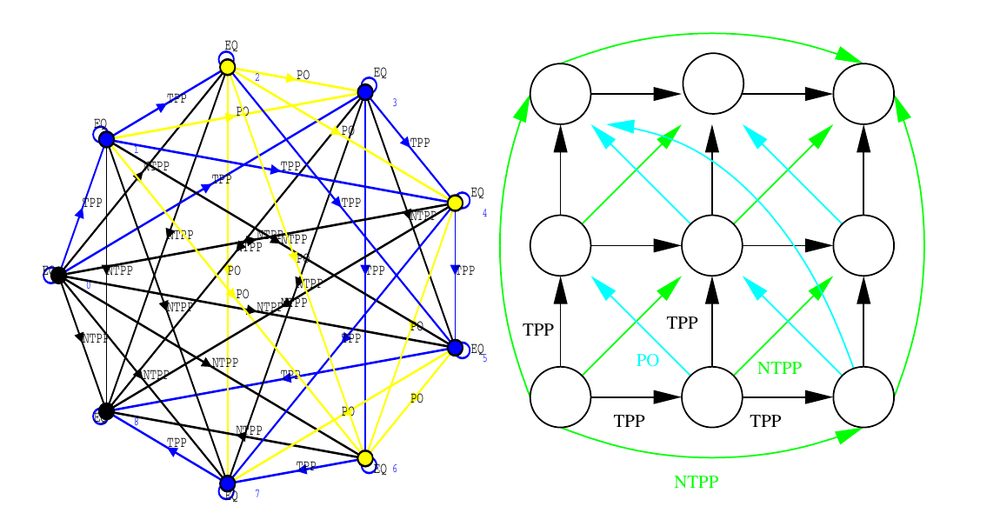
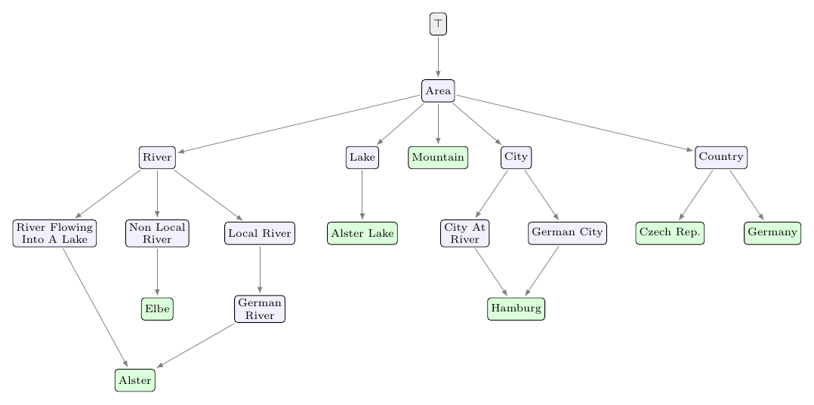

# ALCI_RCC5 Decidability — an AI-assisted attack on a 20-year-old open problem

Is concept satisfiability in **ALCI_RCC5** (the description logic *ALCI* with
the RCC5 spatial relations as roles, under abstract composition-table
semantics) decidable? The question has been open since Wessel's 2002/2003
work ([report7.pdf](papers/report7.pdf); the family is defined and the open
problem stated there, alongside the earlier
[report4](papers/report4.pdf)–[report6](papers/report6.pdf)). This
repository documents a sustained, adversarially-reviewed, partly
machine-checked attack on it, conducted by AI assistants under human
direction.

<p align="center">
  
</p>

<p align="center"><em>Wessel's 2002/2003 construction of an RCC8 network isomorphic to an n×n grid (<a href="papers/report7.pdf">report7</a>, Fig. 10). Such grid models <strong>exist</strong> — yet no concept term can <strong>force</strong> one. That gap (the "coincidence obstruction") is exactly why the problem has resisted both a decidability and an undecidability proof for two decades.</em></p>

> **Disclaimer.** The papers and code here were produced by AI assistants
> (Claude / Anthropic and GPT-5.4 / GPT-5.5 / OpenAI), prompted and directed
> by Michael Wessel. They have **not** been peer-reviewed or verified by
> human domain experts, and are offered as a **discussion piece**. Standing
> label: **strongly supported, not certified** (with three machine-certified
> exceptions, below).

## Read this first: the paper

**Everything of substance is in the overview paper** —
[**PDF**](papers/overview_arxiv.pdf) · [source](papers/overview_arxiv.tex).
It is self-contained: the history (Cohn 1993, Wessel 2002/2003, Lutz &
Wolter 2006), why every known undecidability reduction fails, why concrete
domains do not settle it, the approaches tried route by route, the
machine-checked reduction to a single keystone, the decidable fragment, the
reasoners, and an honest account of the AI-assisted methodology.

The rest of this README is just a map. To avoid duplicated, drifting prose,
the detailed narrative lives in **one** place — the paper — with the full
dated audit trail in [CONVERSATION.md](CONVERSATION.md), the Lean history in
[LEAN.md](LEAN.md), and the superseded threads in [OUTDATED.md](OUTDATED.md).

## Status (2026-07-16): a local optimum

Decidability of ALCI_RCC5 (and ALCI_RCC8) **remains open**. After ~30 repair
rounds and 15 adversarial reviews the project has reached a genuine local
optimum: the local algebra is exhausted, the soundness side is
machine-checked, and the entire remaining difficulty compresses into one
well-posed lemma.

- **Certified** (Lean 4, zero `sorry`; see [LEAN.md](LEAN.md)): the
  **soundness** pipeline (a valid finite certificate unfolds to a genuine
  RCC5 model); the **faithfulness** of the Hintikka abstraction; the
  **RCC5 normal form** (every strong-EQ RCC5 network is an ordered-disjoint
  structure).
- **The positive result** is a *conditional* decidability theorem: **if** the
  *live* (non-shadow) width of models is bounded by a computable function of
  the concept — property **F6** — **then** satisfiability is decidable, and
  the soundness half of that reduction is machine-checked.
- **Open (the keystone):** F6 itself — equivalently, that every satisfiable
  concept admits a *bounded* finite certificate. This is the standing open
  mathematics.
- **The problem is Π⁰₁ (a later observation).** Satisfiability is finitely
  first-order axiomatizable, so by Gödel completeness its complement is
  recursively enumerable and SAT sits at **Π⁰₁** — the domino problem's own
  level. Decidability therefore needs only *qualitative* F6 (every satisfiable
  concept has *some* finite certificate — **no computable bound**): dovetail a
  certificate enumeration against an FO-refutation enumeration. The reduction
  is machine-checked ([`formal/SemiDecidability.lean`](formal/SemiDecidability.lean)),
  and the bound returns for free a posteriori. This *reshapes* the keystone —
  retiring the width-accounting burden — but does **not** settle it: qualitative
  F6 is untouched.
- **The knife's edge:** F6 is the *same* looseness that blocks a proof of
  *undecidability*. Bound it ⇒ decidability; circumvent it to force a grid ⇒
  undecidability. Two sides of one question — why neither has moved in 20+
  years.
- **Unconditional win:** the **∀PO-free fragment** is decidable (a genuinely
  expressive spatial fragment — it keeps ∃PO, ∀DR, ∃DR, and all part-of
  modalities).

## Complexity landscape

RCC*k* relation sets coarsen as *k* decreases; RCC1–3 are decidable
(Wessel), RCC5/RCC8 are the open cases. (Full detail: Table 1 of the paper.)

| Logic | Base relations | Concept satisfiability |
|---|---|---|
| ALCI (no RCC) | arbitrary roles | ExpTime-complete (known) |
| ALCI_RCC1 | {SR} | decidable; NP-complete (≡ S5) |
| ALCI_RCC2 | {DR, O} | decidable; NP-hard, in PSpace |
| ALCI_RCC3 | {DR, ONE, EQ} | decidable; NP-hard |
| ALCI_RCC5, ∀PO-free | RCC5 without ∀PO | **decidable** (this project) |
| ALCI_RCC5 (full) | {DR, PO, EQ, PP, PPI} | **open**; PSpace-hard |
| ALCI_RCC8 | eight RCC8 relations | **open**; ExpTime-hard |

Both directions rely on the **patchwork property** of RCC5/RCC8 (Renz &
Nebel 1999): path-consistent atomic networks are globally consistent.

## The reasoner, and a GIS example spanning 23 years

Alongside the theory, the project ships a working **cover-tree tableau
reasoner** ([`src/cover_tree_tableau.py`](src/cover_tree_tableau.py)) —
cross-validated on 911 concepts against an independent oracle with **zero
mismatches**, and never once contradicted anywhere in the campaign. Its most
satisfying test spans 23 years: it recomputes, in 2026, the exact GIS
concept taxonomy Wessel worked out by hand in his 2003 report — all **21/21**
subsumptions, multiple inheritance and all.

The 2003 original ([report7](papers/report7.pdf), Figure 6):

<p align="center">
  
</p>

The same taxonomy recomputed in 2026 by the reasoner (green = individuals;
note that *Hamburg* and *Alster* each have **two** parents — the taxonomy is
a DAG, not a tree, which is exactly the multiple-inheritance the reasoner has
to get right):

<p align="center">
  
</p>

## Approaches, by technique

The routes tried are organized under [`approaches/`](approaches/), each with
a short hub (`Overview.md`) linking to that route's manuscripts, probes, and
the relevant section of the paper (no files are moved — the hubs link to
canonical locations):

- [`Tableaux/`](approaches/Tableaux/Overview.md) — naive tableau + blocking; the cover-tree tableau.
- [`FiniteModel_TwoTier/`](approaches/FiniteModel_TwoTier/Overview.md) — finite-model attempts; the two-tier quotient; the **∀PO-free decidable fragment**.
- [`SplitForest/`](approaches/SplitForest/Overview.md) — the split-forest normal form (the sound semantic foundation).
- [`NoAutomataCertificate/`](approaches/NoAutomataCertificate/Overview.md) — the rounds-2–10 hand certificate.
- [`Automata_Parity/`](approaches/Automata_Parity/Overview.md) — the two-way parity tree-automaton route.
- [`Lean_F6/`](approaches/Lean_F6/Overview.md) — the Lean formalization and the reduction to F6.
- [`RegularCovers/`](approaches/RegularCovers/Overview.md) — the regular-cover pivot and the certified RCC5 normal form.

## Build & run

Compile the paper (three passes resolve refs; the bibliography is inline):

```
cd papers
pdflatex overview_arxiv.tex && pdflatex overview_arxiv.tex && pdflatex overview_arxiv.tex
```

Run the reasoners (Python 3, no dependencies):

```
cd src
python3 cover_tree_tableau.py        # cover-tree tableau (built-in tests)
python3 stress_test_cover_tree.py    # cross-validation vs the quasimodel oracle (911 concepts)
python3 gis_taxonomy.py              # reproduces the 2003 GIS taxonomy (21/21)
```

Check the Lean development (Lean 4.31.0 via `elan`; no mathlib):

```
cd formal && lean Round19Transport.lean   # see LEAN.md for all artifacts
```

The self-contained verification probes are in
[`verification/python/`](verification/python/) (WP1–WP83).

## Repository map

- [`papers/`](papers/) — LaTeX sources and PDFs. **`overview_arxiv.*` is the
  primary deliverable**; other papers are per-approach manuscripts (linked
  from the hubs).
- [`src/`](src/) — the reasoners (cover-tree tableau, quasimodel oracle,
  model verifier).
- [`formal/`](formal/) — the Lean 4 development (`Round19Transport.lean`,
  `RCC5NormalForm.lean`, `ForcingReduction.lean`); history in
  [LEAN.md](LEAN.md).
- [`verification/python/`](verification/python/) — the WP probe ledger.
- [`approaches/`](approaches/) — per-technique hubs.
- [CONVERSATION.md](CONVERSATION.md) — the full, dated audit trail (who
  contributed what). [OUTDATED.md](OUTDATED.md) — superseded manuscripts and
  the historical no-automata thread.

## Author

Michael Wessel (miacwess@gmail.com), who introduced the ALCI_RCC family in
his doctoral work at the University of Hamburg (DFG project "Description
Logics and Spatial Reasoning", grant NE 279/8-1). The mathematical
development was carried out by the AI assistants named above under his
direction; the division of labour is auditable in
[CONVERSATION.md](CONVERSATION.md).
