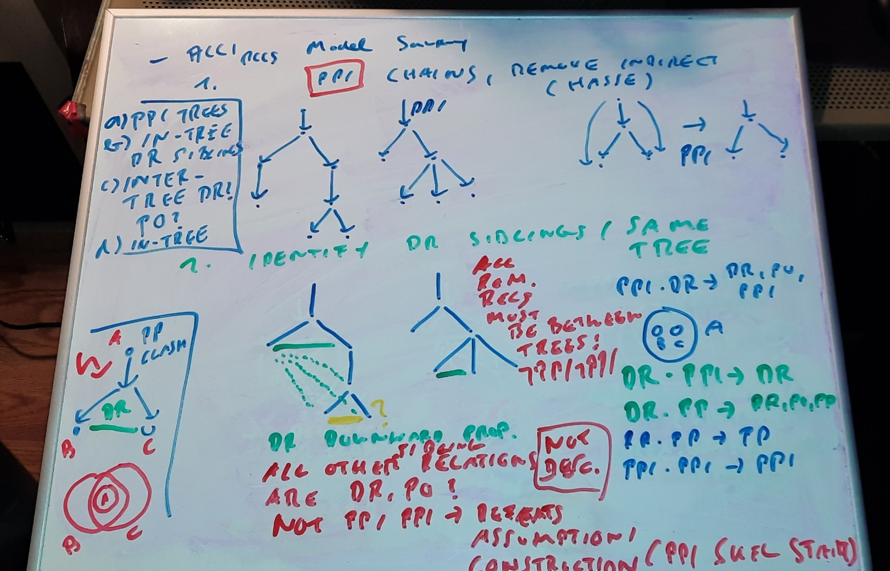
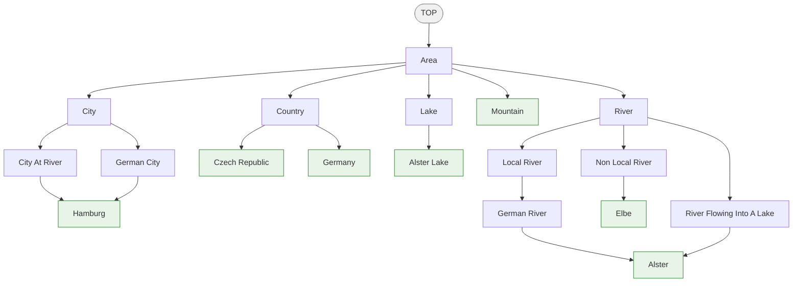
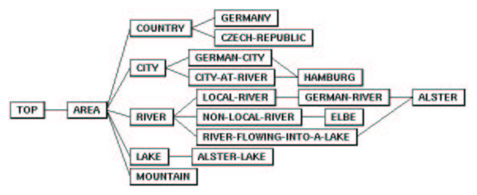

# On the Decidability of ALCI\_RCC5 and ALCI\_RCC8

**Split-Forest Models and the Patchwork Property**

**Contents**

- [Latest News](#latest-news)
- [Status Report: End of May 2026](#status-report-end-of-may-2026)
- [Status Update: July 2026 — seventh review (hot audit) and WP14–WP16](#update-2026-07-08-seventh-review-hot-audit-and-wp14wp16)
- [Overview paper](#overview-paper)
- [Intellectual roots](#intellectual-roots)
- [Background](#background)
- [Complexity landscape](#complexity-landscape)
- [Why this problem is still open](#why-this-problem-is-still-open)
- [Current Status of the Proof](#current-status-of-the-proof)
- [A GIS example: automated taxonomy computation](#a-gis-example-automated-taxonomy-computation)
- [Implementation: Cover-Tree Tableau Reasoner](#implementation-cover-tree-tableau-reasoner)
- [Implementation: ALCI\_RCC5 Concept Satisfiability Reasoner (quasimodel oracle)](#implementation-alci_rcc5-concept-satisfiability-reasoner-quasimodel-oracle)
- [Implementation: Verification of the Repaired Proof (WP1-WP6)](#implementation-verification-of-the-repaired-proof-wp1-wp6)
- [Key Files](#key-files)
- [Outdated Files](#outdated-files)
- [References](#references)
- [DL 2026 submission and rejection](#dl-2026-submission-and-rejection)
- [On the capabilities, strengths, and weaknesses of frontier LLMs for DL research (May 2026)](#on-the-capabilities-strengths-and-weaknesses-of-frontier-llms-for-dl-research-may-2026)
- [Acknowledgments](#acknowledgments)
- [Outdated and Superseded Material](OUTDATED.md) — detailed write-ups of disproved, retracted, or superseded approaches, preserved for reference and transparency

## Latest News

- **2026-07-13 — Tenth review (GPT-5.5, W1–W3 target pass): round-15's Lemma 4.3 falls at W1a — defect #10, exactly at the designated keystone.**  GPT-5.5 ran the [W1–W3 packet](papers/fable5_round15/gpt_task_w1_w3_round15.zip) and delivered a **fatal witness** ([report](papers/gpt5.5_round15_review/round15_referee_report.pdf), machine check [WP27](verification/python/wp27_round15_w1a_counterexample.py), reproduced byte-identical): old pattern `y PP z PP s` (closed), fresh pattern `s PPI b`, both folds = Rel, safe sets `Safe(Y,B)={PO}`, `Safe(Z,B)={DR}` realized by explicit universals.  **(Q4)(b) passes pairwise** (the selector DR is unsafe for (y,b) but the *other* horizontal PO is safe — the disjunction branch the manuscript itself allows), yet the pointwise canonical completion assigns `ρ(y,b)=PO`, `ρ(z,b)=DR` and the old triangle demands `ρ(y,b) ∈ comp(PP,DR) = {DR}`.  **No safe completion of the step exists at all** — the defect is in the certificate condition, not the prose.  Claude's post-mortem confirms and sharpens: the witness configuration is *semantically unrealizable* (`y ⊂ z`, `z∩b=∅` forces `y DR b`, which `Safe(Y,B)` forbids), so (Q4) **accepts garbage** — a soundness hole whose repair (a **joint** steering-amalgamation condition: per gluing profile, the full domain CSP must have a closed completion) provably cannot hurt completeness, since extraction from real models supplies the joint solution.  Also correct and instructive: the review showed **WP26's Part B tested a stronger condition than the manuscript stated** (every positive domain hard-wired the canonical selector) — a spec-vs-test mismatch; WP26 now carries a **Part B2** testing (Q4)(b) as written, which confirms the defect at scale (minimal witness + **95/250** random glue steps jointly unrealizable).  The recurring lesson, now in its purest form: this is the **pointwise-vs-joint** failure genus — the same shape as WP15/F1.3 — appearing for the (at least) fourth time, this time inside Claude's own assignment argument.  Ledger: **10 reviews, 10 defects**; both July lineage-swaps have now each broken the other twice.  Round-16 direction (per the review + post-mortem): replace (Q4) by the joint per-gluing-profile CSP condition — finite, checkable, extraction-compatible.  Status: **strongly supported, not certified**.
- **2026-07-12 (later) — Round-15: "Cluster Quasimodels" — the decision layer without automata (Claude Fable 5).**  Executing the ninth review's R2 alternative: [`papers/fable5_round15/cluster_quasimodels_round15.pdf`](papers/fable5_round15/cluster_quasimodels_round15.pdf) (10pp) **removes the automaton layer entirely** — and with it the Vardi two-way-parity-emptiness dependency, leaving the **RCC5 patchwork property as the sole external input**.  The certificate is a finite **cluster quasimodel**: Hintikka types + safe links (with transitive vertical propagation) + a catalogue of small closed atomic **cluster patterns** in which every existential demand is fulfilled **within one gluing step** (no promissory witnesses ⟹ no parity condition needed — the lap-collapse trap is structurally excluded) + long-range conditions over the new **fold lattice**: the closure of the RCC5 atoms under set-composition has **exactly 10 reachable sets**, every one a vertical singleton or containing a horizontal atom ([WP26](verification/python/wp26_round15_cluster_quasimodels.py) part A, exhaustive) — so the entire unbounded-distance analysis is a fixed point over a 10-element lattice.  **Coherence is constructed in the soundness proof** (iterated patchwork over the unfolding + canonical horizontal selection — the discipline that survived reviews 8 and 9 as the Shadow Amalgamation Lemma), never guessed by a device — the ninth review's F1 is structurally moot.  Unique types (probe p4's strong-EQ towers) ride a shared **core cluster**; F2's liveness pressure dissolves (one-step demands); F3 is resolved by a re-proved width bound under a **single strictly decreasing measure** (remaining modal depth at witness generation).  Machine checks: WP26 — fold lattice exhaustive; steering probe **250/250** random glue steps realizable with canonical-selector domains (negative control: 245/249 fail without horizontals); acceptance semantics agrees with the cover-tree tableau on **all 11 diagnostics** (incl. `C_G2a` and the p4 tower) + **200-concept sweep, 0 disagreements**.  Designated weak points (§10): **W1** the steering induction's fold-algebra cases, **W2** the horizontal normal form for extraction, **W3** one-step saturation at width.  **Reviewer-authored (Claude, who also wrote round-13), UNREVIEWED; presumed to contain defect #10 until an adversarial review fails to find it** — GPT-5.5 is the natural next reviewer.  Status: **strongly supported, not certified**.  Task packet for GPT-5.5 targeting W1–W3: [`papers/fable5_round15/gpt_task_w1_w3_round15.zip`](papers/fable5_round15/gpt_task_w1_w3_round15.zip) (targeted prompt with sub-targets W1a–c/W2a–c/W3a–c, optional cold-ish first pass, all three manuscripts, the 9th review, WP14/WP17/WP26, tableau oracle).
- **2026-07-12 — Ninth review (first COLD review of the round-14 stack, fresh Fable 5): verdict GAP — the semantic half is the strongest it has ever been; the decision half (Theorem C) is unproved, and the sketched automaton is unsound as described.**  The `cold_review_round14` packet came back as three report packets + an independent verification script ([packet 1: verdict](papers/cold_review_round14/referee_report_packet1_verdict.pdf), [packet 2: findings](papers/cold_review_round14/referee_report_packet2_major_findings.pdf), [packet 3: verified steps + probes](papers/cold_review_round14/referee_report_packet3_verified_appendix.pdf), [`verify_rcc5.py`](papers/cold_review_round14/verify_rcc5.py) — reproduced locally, byte-identical output).  **F1 (critical, conf. ~0.9):** a valid AV abstraction is a *pair* (tree, enrichment `N*`) with the unbounded enrichment living **off the tape**; Theorem C must therefore decide an existential-*projection* language, nothing in the stack addresses whether that projection is automaton-recognizable, and the round-14 §6 monitor sketch is **unsound as described** — distinct alternating run copies resolve nondeterminism independently, and a concrete two-port configuration (rows `x–p: PP, y–p: PPI, x–q: PP, y–q: DR`; `Comp(PP,PP) ∩ Comp(PP,DR) = {PP} ∩ {DR} = ∅`, machine-checked) makes **every sketched monitor pass while no coherent `N*` exists**.  All three natural repairs are analyzed and blocked (tape annotation — unbounded; profile quotient — provably loses needed information, `ρ(a₁,a₃)=PP` vs `ρ(a₅,a₃)=PPI` at identical profiles; canonical guessing — needs an unproved uniformization).  The structural diagnosis is the review's sharpest sentence: across rounds 12→13→14 *"the gap has migrated; it has not closed"* — bounded labels with an unproved existence claim → restricted rows that broke width → total data with no automaton.  **F2 (major):** request-source liveness (D4) is load-bearing for the truth lemma but absent from the width accounting (the shared-witness probe p4 shows the presentation *choice* has teeth).  **F3 (major):** the width bound's provenance is contradictory (round-14 declares round-13 §§3–8 "replaced" yet quotes §8's `K_A(C₀)`), and round-13's Lemma 8.2 recurrence does not close (same-rank (g2) cascades; the fix — rank := remaining modal depth — is identified).  Minors F4–F7 with verified repairs.  **Found sound (S1–S10):** the AV semantic layer (amalgamation Thm 3.3, coverage, truth lemma — "*the strongest versions of these results in the stack's history*"), strong equality end-to-end incl. the sharpest uniqueness probes, the parity layer's per-copy priorities, the withdrawal audit, and the composition table/patchwork ground truth (fresh 6-element-universe derivation; 21,521 amalgamation instances).  Score: **9 reviews, 9 defects** (the report's own header says "eighth" — it counted cold; our ledger counts all).  Recommendations R1–R6 define the round-15 task: state and prove Theorem C as a projection (or replace the automaton layer with a mosaic/type-elimination argument on the infinitary AV abstraction — Thms 3.3/4.3 already supply the model-construction half), the bounded-delay/width lemma, the §8 erratum + re-proof, and one consolidated manuscript.  Status: **strongly supported, NOT certified**.
- **2026-07-09 — Eighth review (GPT-5.5, targeted G2/G3): round-13's D2 clause falls exactly where round-13 predicted; GPT-5.5's round-14 "active-virtual-bag" repair.**  GPT-5.5 ran the [G2/G3 task packet](papers/fable5_round13/gpt_task_g2_g3_round13.zip) and **broke round-13 at its own designated target G2a** ([referee report](papers/gpt5.5_round14/round13_g2_g3_referee_report.pdf)): the satisfiable tower concept `C_G2a = ∃PP.⊤ ⊓ ∀PP.(∃PP.⊤ ⊓ (∀PP.∃PP.⊤ ⊓ ∀DR.A))` gives every tower level a horizontal obligation; round-13's **literal D2** (omni-directional propagation + verticalization fallback) then forces every remote level into the root edge bag — **width m+1 for every prefix length m**, machine-checked ([WP18](verification/python/wp18_g2a_verticalization_width_counter.py)); also G3b: a mixed `PP/PPI` path can carry a vertical endpoint relation that D3 never reaches ([WP19](verification/python/wp19_g3_mixed_orientation_probe.py)).  The count is now **8 reviews, 8 defects** — and, notably, the defect sits precisely where round-13's own "what would invalidate" section said to look.  The **Shadow Amalgamation Lemma itself survived** (GPT re-ran WP14/16/17 clean).  GPT-5.5's **round-14 repair** ([`split_forest_round14_repaired_proof.pdf`](papers/gpt5.5_round14/split_forest_round14_repaired_proof.pdf), 12pp) abandons the horizontal-row discipline for the **extended-bag route** that the 7th review's WP15-P5 had already corroborated: universal sources become **virtual active occurrences at every bag** (AV1–AV6) — their exact relation vectors may contain vertical atoms, every *finite* active restriction must be a closed complete atomic RCC5 network (stated as finite-subset conditions, so patchwork + compactness apply verbatim), adjacent active networks agree, and obligations are checked against declared-equals-realized values.  Coverage **trivializes** (no walk, no orientation cases); extraction is width-free (virtual entries are not ports — the G2a tower is absorbed with 2 live ports + m−1 virtual shadows, [WP25](verification/python/wp25_active_virtual_bag_repair.py)).  Claude reproduced **all seven** new harnesses (WP18–WP25) locally and audited the manuscript: the semantic core (amalgamation, coverage, truth, extraction) checks out; the **designated review targets** are the automaton's monitor bookkeeping (pair/triple-state spawning for sources introduced in disjoint subtrees — GPT self-flags this), the single-shadow transition's composition-closure explicitness, and the inherited `K_A(C₀)` accounting (round-13 §8 survives as a needed component).  Status: **strongly supported, not certified**.  Next: a **cold review by a fresh Fable 5 session** — packet ready at [`papers/cold_review_round14/`](papers/cold_review_round14/).
- **2026-07-08 (later) — Round-13: the Shadow Amalgamation repair, authored by the seventh reviewer (Claude Fable 5).**  Same-day follow-up to the seventh review: a **round-13 repair delta** on round-12, [`papers/fable5_round13/split_forest_shadow_amalgamation_round13.pdf`](papers/fable5_round13/split_forest_shadow_amalgamation_round13.pdf) (10pp).  It repairs F1 by **tightening the abstraction language** (the *D-discipline*: shadow entries restricted to {DR, PO} with vertical/EQ pairs co-bagged — saturation (S3)/(S4)/(V7) extended to the shadow layer; mandatory omni-directional propagation with verticalization fallback; type-propagation of transitive vertical universals via `comp(PP,PP)={PP}`; request-source liveness; a new **pair-coherence rule D5**) and then **proves the Shadow Amalgamation Lemma**: bag networks + all declared rows + a canonical DR-default completion are jointly realizable, by a four-finite-facts case analysis + the (WP14-verified) patchwork/compactness apparatus applied to the shadow-extended family.  The repaired Truth Lemma then holds with declared entries *literally equal* to `ρ_T`.  The trade is explicit: the **realization direction** (where rounds 11 and 12 broke) is now proved; the residual burden moves to the **extraction/completeness side** (Coverage Lemma; on-demand verticalization vs the width bound — the round-9/10 forced-verticalization territory), plus the repaired witness-generated `K(C₀)` accounting (F4 fix).  New harness [WP17](verification/python/wp17_round13_discipline_check.py): the four finite facts exhaustively; the constructive lemma assignment on **400/400 random tree-shaped configurations** (extended-bag closure + global realizability both pass); negative control 151/300 failures when the discipline is dropped — and its development *itself* caught the missing D5 rule.  **Honesty note: round-13 is authored by the seventh reviewer (not independent), is NOT reviewed, and by the project's own track record (7 reviews, 7 defects) should be presumed defective until a genuinely cold review fails to break it.**  Status unchanged: **strongly supported, not certified**.  Follow-ups shipped the same day: the overview papers (main + arXiv candidate) carry a "Round 13 (July 2026, unreviewed)" paragraph in their July-2026 update section, and a **drag-and-drop task packet for GPT-5.5 targeting G2/G3** (the designated weak points: extraction-within-discipline / verticalization-vs-width, and the Coverage walk) is at [`papers/fable5_round13/gpt_task_g2_g3_round13.zip`](papers/fable5_round13/gpt_task_g2_g3_round13.zip) — targeted prompt + optional cold-ish first pass + both manuscripts + the 7th review + WP14–WP17 + the tableau oracle, in the `cold_review_*` packet style.
- **2026-07-08 — Seventh review (hot audit by Claude Fable 5): a further defect in round-12's Truth Lemma, plus three new verification harnesses (WP14–WP16).**  A context-loaded (*hot*, explicitly **not** cold) adversarial audit by **Claude Fable 5** (Anthropic; a different model lineage from the proof's author GPT-5.5) attacked the canonical 29-page round-12 manuscript: [`papers/fable5_review/referee_report_round12_fable5.pdf`](papers/fable5_review/referee_report_round12_fable5.pdf) (9pp).  Verdict: **genuine gap; theorem still most likely true; repair localized and computationally corroborated.**  The critical finding: Theorem B(b)'s Truth Lemma builds the global relation `ρ_T` by patchwork over the **bag networks only**, then *assumes* the declared relation-vector **shadows** agree with `ρ_T` — an unproved **Shadow Amalgamation Lemma** (the 6th review's transformer-coherence gap C1, one layer up, but much smaller).  [WP15](verification/python/wp15_shadow_row_realizability.py) machine-checks a minimal 3-bag configuration that passes *every* listed legality test yet admits **no** frame realizing all declared vectors (23/64 assignments on the pattern fail); single-shadow (250/250), DR/PO-restricted (358/358) and extended-bag (200/200) disciplines all survive, mapping the repair.  Two spec loopholes (EQ-valued shadow entries; undefined shadow scope) are each shown by [WP16](verification/python/wp16_round12_bag_acceptance.py) to flip `C_split`, `C_force`, and two deeper forced-composition UNSAT concepts to ACCEPT — one-line fixes; with them the mechanism matches the cover-tree tableau on all ten diagnostics (including the strong-EQ PO-loop the quasimodel oracle gets wrong) and a 148-concept random sweep.  [WP14](verification/python/wp14_patchwork_property_check.py) verifies the proof's central external dependency — the RCC5 patchwork theorem *in exactly the round-12 form* — exhaustively at small widths (63,219 two-bag amalgamations + 300 tree patchings per App A's own induction, **zero failures**).  No accepted-but-unsatisfiable *concept* was found.  Status: **strongly supported, not certified** (now 7 reviews, 7 defects); keystone sharpened to the **Shadow Amalgamation Lemma** + the `K(C₀)` accounting.  Response bundle for GPT-5.5: [`papers/fable5_review/fable5_review_round12_bundle.zip`](papers/fable5_review/fable5_review_round12_bundle.zip).
- **2026-05-31 (later) — Round-12 expanded into a self-contained 29-page edition.**  At the project's request, GPT-5.5 (the proof author) extended the 14-page round-12 manuscript with **21 appendices (A–U)** into [`split_forest_automata_with_appendices.pdf`](papers/automata_route_repairs/split_forest_automata_with_appendices.pdf) (29pp, compiles clean).  **Same theorem spine** (Theorem A split-forest normal form → Theorem B patchwork-bag adequacy → Theorem C two-way automaton → Decidability) — the appendices discharge every load-bearing step in full: the finite→countable patchwork passage by **compactness over the finite relation alphabet** (App A/E, deriving the global RCC5 labelling with *no route-dependent transformer* — exactly the route the 6th review recommended), the effective `K(C₀)` width bound (App C), relation-vector shadows (App F), exact occurrence identity replacing the EQ quotient (App G/R), an implementation-ready decision procedure + local legality tests (App K/Q), diagnostic examples, a dependency graph (App T), and a "what would invalidate the proof" list (App U).  This is **not a new repair round** (no new defect — the goal was self-containedness) and is **not itself cold-reviewed**; it still rests on the **same two external theorems** (RCC5 patchwork property; two-way parity-automaton emptiness, Vardi).  Status unchanged: **strongly supported, not certified.**  Now the canonical manuscript.
- **2026-05-31 — Theorem B cold-reviewed (6th cold review), found unproved; GPT-5.5’s round-12 patchwork-bag repair.**  A fresh, genuinely cold **Opus 4.8** (a different model lineage from GPT-5.5, who authored the proof) reviewed the finite-abstraction keystone **Theorem B** via the [`cold_review_theoremB/`](papers/cold_review_theoremB/) packet ([report](papers/automata_route_repairs/referee_report_ALCI_RCC5.md)).  Verdict: **genuine gap; theorem most likely true; repairable** — the keystone reads a globally consistent RCC5 labelling of an *infinite* tree off purely *local* interface-transformer checks, with the required confluence law asserted, not proved (and the reviewer could **not** build an accepted-unsat witness).  GPT-5.5’s [**round-12**](papers/automata_route_repairs/split_forest_patchwork_automata_repaired.pdf) (14pp) took the recommended route: **delete the transformer layer**, rest global consistency on the **RCC5 patchwork property** + a **two-way alternating parity automaton**, with exact tree-decomposition identity for EQ.  The unproved *bespoke* keystone is now a *standard citable theorem* the project already stress-tests ([WP6](verification/python/mosaic_closure_search.py)); the new (smaller) keystone is **patchwork-bag adequacy**.  Round-12 is **not cold-reviewed in turn**; status stays **strongly supported, not certified** (6 reviews, 6 defects).  Now canonical: [`papers/automata_route_repairs/`](papers/automata_route_repairs/).
- **2026-05-30 — Automata route cold-reviewed (5th cold review): same keystone gap as the no-automata route; repaired into the A/B/C companion.**  A fresh GPT-5.5 session found the parity-automata proof’s `Patch` invariant **assumed, not constructed** (UNSAT concepts it would wrongly accept: `C_force = ∃PP.(∃DR.A) ⊓ ∀DR.¬A`, `C_split`, `C_recursive`).  GPT-5.5 repaired it with finite pair/triple product-state representatives and isolated the argument into **Theorem A** (split-forest normal form), **Theorem B** (finite abstraction — *the keystone*), **Theorem C** (automaton).  **Both proof routes had now converged on the same Theorem B** — which the 6th review (above) then punctured.  ([`papers/automata_route_repairs/`](papers/automata_route_repairs/).)
- **2026-05-28 to 2026-05-29 — the round-7 → round-10 cold-review cycle (now historical).**  Six rounds of cold-review-and-repair on the *no-automata* split-forest certificate: round-7 (pair shapes + incidence tags) → cold Claude review → round-8 (saturated side contexts) → cold Opus 4.8 review finds the **D-1** completeness gap (a DR/PO witness composition-forced into an infinite PPI-tower) → round-9 (composition-forced verticalization) → cold GPT-5.5 review finds the dual descendant tower + two foundational gaps → round-10 (product-state exhaustion), whose repairs were **automaton-shaped lemmas it could not discharge** — which is why the parity-automata proof was promoted to primary on 2026-05-29.  Full prose: [OUTDATED.md](OUTDATED.md) (“the no-automata split-forest thread”) and [CONVERSATION.md](CONVERSATION.md); the dual-descendant repair is machine-checked in [wp12](verification/python/wp12_round10_dual_descendant_verticalization.py).

- **2026-05-22 to 2026-05-26 — round-5 / round-6 review cycle (Claude as proof author).**  GPT-5.5 published reviews 5 and 6 of the 31-page round-4 proof and Claude's consolidation.  Claude drafted four follow-up manuscripts under `papers/gpt5.5_round2/` (the (M6') v2 delta, the items-4-to-8 delta, the 36-page round-5 consolidation, and the 39-page round-6 internal-coherence pass).  All four are superseded by round-7 but retained as audit trail.  See [OUTDATED.md](OUTDATED.md) for the full review-by-review prose.

- **2026-05-20 — DL 2026 rejection.**  The DL 2026 Extended Abstract was rejected (33A Reject, 33B Accept, 33C Reject), with decision escalated to the DL Steering Committee.  The full rejected submission, the three reviews, and a point-by-point response are in [`dl2026-rejected/`](dl2026-rejected/); see also the [open letter](dl2026-rejected/open_letter.md) and the [DL 2026 submission and rejection section](#dl-2026-submission-and-rejection) below.

- **2026-05-06 to 2026-05-14 — early-May completeness-extraction cycle.**  Claude's completeness-extraction v2 / v2.1 attempts, GPT-5.5's third review of Claude's verification work, the technical addendum closing the paper-level obligations, and Claude's verification response — all from the round-2 phase.  Superseded by round-7.  See [OUTDATED.md](OUTDATED.md) for the full prose.

- **2026-05-05 — Copilot's parity-ω-word automaton decidability proof** ([PDF](papers/copilot.pdf)).  Independent attempt using a deterministic parity ω-word automaton, archived alongside the rest of the historical material.

## Status Report: End of May 2026

*After two months of intensive AI-assisted work (April–May 2026), we have concluded that:* the decidability of ALCI\_RCC5 and ALCI\_RCC8 **remains open**; our decidability argument is **strongly supported but not certified**; and the project has reached a natural **consolidation point**. We are deliberately stopping the cold-review / repair cycle rather than continuing it. This section records where things actually stand and why.

### What is settled (and worth keeping)

- **The split-forest model class — the semantic normal form (Theorem A).** This is the load-bearing foundation the entire approach rests on: every satisfiable ALCI\_RCC5 concept has a *witness-generated, tree-like split-forest model* (witness thinning → generated containment covers → split copies for incomparable superparts → side-interface mosaics → typed-EQ quotient). It has been **found sound by every one of the six cold reviews** — the one component that has never broken — and it is what everything downstream *consumes*: the patchwork-bag abstraction and the two-way automaton are built **on top of** the split forest, not in place of it (*"the automaton does not replace the split forest, it consumes it"*). Without the tree-like model class there is no finite abstraction and no automaton; it is shared verbatim across both proof routes (the no-automata thread and the automata route). What remains open is the *finite-abstraction layer* built on top of it (see below), not the model class itself.
- **The Lutz–Wolter non-transfer result and the priority record.** Verified against the primary sources (Lutz & Wolter, *Modal Logics of Topological Relations*, LMCS 2(2:5) 2006; Wessel's 2002/2003 [report7.pdf](papers/report7.pdf)): the topological undecidability of L\_RCC8 and L\_RCC5(RS^∃) does **not** transfer to the abstract composition-table semantics of ALCI\_RCC8 / ALCI\_RCC5. Wessel's 2002/2003 report independently developed the RCC8 description-logic analogues of the relevant constructions and was first to identify the *coincidence obstruction*, predating Lutz & Wolter (who cite only the shorter [Wes01]); they later obtained undecidability by a *different*, separately-attributed route (a linearized tiling enumeration in the Marx–Reynolds lineage). This note is finished, primary-source-verified, and diplomatic — see [LRCC8\_vs\_ALCIRCC8.pdf](papers/LRCC8_vs_ALCIRCC8.pdf).
- **The cover-tree tableau implementation.** Reproduces the GIS taxonomy of report7 Figure 6 (21/21 subsumptions), 23 years later, implemented by an AI; cross-validated on 911 concepts ([`src/cover_tree_tableau.py`](src/cover_tree_tableau.py), [`src/gis_taxonomy.py`](src/gis_taxonomy.py)).
- **The computational verification harnesses** (WP1–WP16 under [`verification/python/`](verification/python/)): finite-combinatorial cross-checks of the proof's content — all pass. (WP15, added July 2026, *deliberately* demonstrates a defect in round-12's Truth Lemma as written — a passing run there means the defect and its repair map are both confirmed; see the [July 2026 update](#update-2026-07-08-seventh-review-hot-audit-and-wp14wp16) below.)
- **The methodology and the honest capability assessment.** "Cold review as a standard intermediate step" worked repeatably; the documented, calibrated account of what two frontier models (Claude, GPT-5.5) could and could not do across this project is itself a contribution.

### What remains open (the decidability proof)

The canonical statement is the **round-12 patchwork-bag + two-way alternating parity tree automaton** proof, in its self-contained 29-page edition ([`split_forest_automata_with_appendices.pdf`](papers/automata_route_repairs/split_forest_automata_with_appendices.pdf) — same A/B/C theorem spine as the 14-page [`split_forest_patchwork_automata_repaired.pdf`](papers/automata_route_repairs/split_forest_patchwork_automata_repaired.pdf), plus 21 appendices A–U discharging every step). Its honest status is **strongly supported, not certified**:

- **Six cold reviews, six defects, no clean pass.** Every manuscript ever declared "canonical" was punctured by a fresh-session review. The only fully trustworthy signal — a cold review that finds *nothing* — has never occurred. *(July 2026: a seventh, context-loaded review continued the series — see the [update below](#update-2026-07-08-seventh-review-hot-audit-and-wp14wp16); the count is now 7 reviews, 7 defects.)*
- **But the trajectory is convergent.** The repairs moved from bespoke, hand-built machinery (which the next review kept breaking) toward **standard, citable theorems**: round-12 rests global consistency on the RCC5 *patchwork property* (Renz–Nebel 1999) and decides via two-way parity-automaton emptiness (Vardi 1998). The single remaining home-grown keystone is **patchwork-bag adequacy** — that the saturated split-forest is faithfully captured by finite patchwork bags. The 6th reviewer judged the theorem *most likely true and reachable by standard techniques*, and could not construct an accepted-but-unsatisfiable witness.
- **What "not certified" means here — and what *is* proved.** Round-12 is a *complete, self-contained manuscript*: it states and **proves, inline,** Theorem A (the split-forest normal form — also found sound by every prior cold review), its **Theorem B (finite patchwork-bag abstraction adequacy)**, Theorem C (automaton correctness), and decidability — depending only on the two cited external theorems above (RCC5 patchwork; two-way parity emptiness). The 29-page expanded edition makes this fully explicit: 21 appendices spell out each step (incl. the global RCC5 labelling derived by compactness over the finite relation alphabet, with no route-dependent transformer). So "strongly supported, not certified" means *proved on paper but not yet independently cold-reviewed or mechanized*. *(Annotation, July 2026: this paragraph's "no step known to be missing" claim did not survive — the seventh review subsequently identified one concretely unproved step in the Truth Lemma, the **Shadow Amalgamation Lemma**, machine-demonstrated by [WP15](verification/python/wp15_shadow_row_realizability.py); see the [update below](#update-2026-07-08-seventh-review-hot-audit-and-wp14wp16). The rest of the paragraph stands.)* The 19-page `…full_proof` and 18-page A/B/C companion are the **round-11 predecessor** (their transformer-based abstraction is the part the 6th cold review broke); round-12 replaces that layer and does **not** depend on them.

### Why we are stopping the round treadmill

*(Annotation, July 2026: this stance was adopted at the end of May 2026, before **Claude Fable 5** — the first Mythos-class model, a capability tier above Opus — became available. A materially stronger reviewer is itself new information: a "no defect found" from a stronger model is stronger evidence than one from a weaker model, and a defect found is a defect found either way. So we broke the freeze once and ran a [seventh review](#update-2026-07-08-seventh-review-hot-audit-and-wp14wp16) — which found a new defect (the Shadow Amalgamation gap), vindicating both the freeze rationale (reviews keep finding defects; prose rounds cannot certify) and the exception (this defect was worth finding, and it came with machine-checked probes and a concrete repair program). The treadmill remains stopped as a default; frontier-model audits are the sanctioned exception when a genuinely stronger reviewer appears.)*

More prose rounds have **diminishing returns and cannot certify the result.** A cold review that finds nothing is only "no defect *found*" — not a proof. The two paths that can actually *settle* the question are:

1. **Mechanization (Lean / Coq).** Difficulty is very uneven across the proof's layers:
   - *Finite / algebraic core* (composition table, JEPD, finite network checks) — **easy**, days to weeks; essentially `decide`-able.
   - *Theorem A* (the split-forest normal form) — **heavy but standard**, months of infinite-model bookkeeping, no conceptual novelty for a proof assistant.
   - *The two external pillars* — **expensive**: the RCC5 patchwork property is provable but, to our knowledge, unmechanized; and **two-way alternating parity *tree* automaton emptiness (Vardi) is, to our knowledge, not mechanized in any proof assistant** and is near the frontier of what has been formalized.
   - *Patchwork-bag adequacy* (the keystone) — **the wildcard**: the one step never cold-reviewed, where a formalization is genuine research, not transcription (Lean will either close it or pinpoint the gap — strictly more informative than another prose round).

   The tractable strategy is to **axiomatize the two citable external theorems and mechanize only the novel glue** (Theorem A + patchwork-bag adequacy) — a focused 6–12 month effort that is *time*-expensive, not *dollar*-expensive. A cheap first half-step: machine-check just the finite combinatorial core (WP1 / WP6 + the patchwork property as used), upgrading "Python-stress-tested" to "machine-checked" without committing to the keystone.
2. **Human peer review.** The cold-review loop was a *substitute* for expert human review; the honest endgame is to hand the round-12 proof — labeled exactly as it is — to the description-logic community.

### Disposition

We **freeze the decidability proof at round-12**, honestly labeled, with the complete audit trail preserved in [OUTDATED.md](OUTDATED.md) and [CONVERSATION.md](CONVERSATION.md). We **ship the finished side-contributions** (the non-transfer note, the overview discussion piece, the implementation). Mechanization and human peer review are reserved as deliberate future moves — not the next reflexive round. Reporting a problem that has been open for 20+ years as *strongly supported but not certified*, with the standard undecidability routes shown blocked and a convergent-but-unclosed decidability argument, is an accurate and respectable terminal state for a discussion piece. The more important contribution may be the demonstration that this kind of work — sustained, adversarial, self-correcting formal mathematics with AI in the loop and a human steering — is now possible at all.

### Update (2026-07-08): seventh review (hot audit) and WP14–WP16

The freeze held for five weeks — until a genuinely stronger reviewer became available. **Claude Fable 5** (Anthropic's first Mythos-class model, a capability tier above Opus, and a different model lineage from the proof's author GPT-5.5) was released, and a materially stronger reviewer changes the calculus of "another round": we had to try again. The result was a **seventh review** — a context-loaded (*hot*) adversarial audit of the canonical round-12 manuscript. It does **not** discharge the outstanding cold-review requirement, but it continued the series' pattern: **every review so far has found a defect, and this one did too** (7 reviews, 7 defects). Full report: [`papers/fable5_review/referee_report_round12_fable5.pdf`](papers/fable5_review/referee_report_round12_fable5.pdf); response bundle for GPT-5.5: [`fable5_review_round12_bundle.zip`](papers/fable5_review/fable5_review_round12_bundle.zip).

**The finding (critical, F1).** Round-12's Theorem B(b) builds the global RCC5 relation `ρ_T` by patchwork + compactness over the **bag networks only** (App E), but its Truth Lemma then asserts that the declared relation-vector **shadow** entries agree with `ρ_T` ("the exact relation vector from x to the live ports includes ρ_T(x,y) = R"). Nothing in the listed legality tests constrains two *shadows* against each other, and a vector entry is dropped when its port is forgotten — so the implicit lemma (*bags + all declared shadow rows are jointly realizable in one frame*) is unproved, and in fact **false for the tests as written**: [WP15](verification/python/wp15_shadow_row_realizability.py) exhibits a 3-bag configuration (declared entries `x₁–x₂: DR`, `x₁–p: PP`, `x₂–p: PPI`; `Comp(PP,PP) = {PP}` forces `x₁ PP x₂`) that passes every listed test and is jointly unrealizable — 23 of 64 assignments on the minimal pattern fail. This is the 6th review's transformer-coherence gap (C1) recurring **one layer up, in the shadow layer** — but strictly smaller: with a single shadow the needed lemma is provable (the bag+row family is itself an agreeing tree family; 250/250 in WP15), and no counterexample exists in 358 configurations under the DR/PO-entry discipline or 200 under the extended-bag discipline, which maps the repair (prove a **Shadow Amalgamation Lemma** under a *vertical-liveness* discipline — PP/PPI/EQ pairs always co-bagged, shadow entries DR/PO-only — which is just saturation rule (S3)/(V7) extended to the shadow layer).

**Also found:** two spec loopholes, each independently soundness-fatal as literally written, each with a one-line fix — Def 3.3 permits **EQ-valued shadow entries** (obligations then never fire on that target), and the **shadow's propagation scope is never pinned down** (App H's "bags in which the shadow *must* continue" is undefined). [WP16](verification/python/wp16_round12_bag_acceptance.py) machine-checks that either loophole flips the UNSAT concepts `C_force`, `C_split`, `C_2hop`, `C_3hop` to ACCEPT, while the repaired discipline decides all ten referee diagnostics in agreement with the cover-tree tableau — including SAT for the strong-EQ **PO-loop** concept (the retired quasimodel oracle's blind spot), an architectural strength of round-12's exact-occurrence-identity design — plus a 148-concept random sweep with zero disagreements. The `K(C₀)` finiteness argument also remains an assertion (6th review's M1, softened).

**What held up under attack:** the RCC5 patchwork theorem *in exactly the round-12 form* — [WP14](verification/python/wp14_patchwork_property_check.py) verifies it exhaustively at small widths (63,219 two-bag amalgamations, 300 random tree-of-bags patchings executed literally per App A's leaf-by-leaf induction, zero failures; a failure here would have invalidated the proof per its own App U); the finite→countable compactness passage (modulo a wording fix); strong equality (no composition cell can force EQ); the running-intersection/occurrence-identity layer; and the forest→tree packaging. No accepted-but-unsatisfiable *concept* was found (consistent with the 6th review; ALCI's lack of nominals appears to block concept-level exploitation of the configuration-level defect).

**Net effect on status:** unchanged label — **strongly supported, not certified** — with the keystone sharpened from "patchwork-bag adequacy" generically to the **Shadow Amalgamation Lemma + K(C₀) accounting** specifically. The convergence trend continues: each round's residual gap is smaller and more standard-looking than the last (route transformers → shadow rows over a tree decomposition). The disposition above otherwise stands: mechanization or human peer review remain the real off-ramps.

**Round-13 (same day).** The seventh reviewer then executed its own repair program: [`papers/fable5_round13/split_forest_shadow_amalgamation_round13.pdf`](papers/fable5_round13/split_forest_shadow_amalgamation_round13.pdf) (10pp, a delta on round-12) introduces the *D-discipline* (horizontal-only shadow entries with vertical/EQ pairs co-bagged; mandatory propagation with verticalization fallback; type-propagation of transitive vertical universals; request-source liveness; pair coherence) and **proves the Shadow Amalgamation Lemma** under it — four exhaustively machine-checked composition facts + the WP14-verified patchwork/compactness apparatus applied to the shadow-extended family — after which the Truth Lemma holds with declared entries literally equal to `ρ_T`. The residual burden moves, explicitly, to the completeness side (Coverage Lemma; verticalization-vs-width, the old round-9/10 territory) and is flagged as the designated next review target, together with the repaired witness-generated `K(C₀)` accounting. [WP17](verification/python/wp17_round13_discipline_check.py) machine-checks the finite facts and the constructive lemma content (400/400 tree configurations; negative control fires without the discipline). **Round-13 is reviewer-authored and unreviewed; the 7-reviews-7-defects presumption applies to it in full.** The freeze resumes: the sanctioned next steps are a cold review of round-13, mechanization, or human peer review.

**Round-14 (2026-07-09): the presumption was correct — round-13 fell at its own designated target, and GPT-5.5 repaired it.** The G2/G3 task packet came back with the **eighth review** ([report](papers/gpt5.5_round14/round13_g2_g3_referee_report.pdf)): round-13's literal D2 clause is incompatible with finite width (the `C_G2a` tower forces every remote obligation level into the root bag; WP18), and mixed `PP/PPI` paths defeat D3's orientation assumption (WP19). Score: **8 reviews, 8 defects** — with the notable structural point that both the 7th and 8th defects were found exactly where the previous round's "what would invalidate" list said to look: the review-and-designate discipline is working. GPT-5.5's **round-14 repair** ([manuscript](papers/gpt5.5_round14/split_forest_round14_repaired_proof.pdf)) withdraws the horizontal-row discipline and adopts the **active-virtual-bag** form of the extended-bag route (the alternative the 7th review had outlined and WP15-P5 corroborated): every universal source is virtually active at every bag with exact (possibly vertical) relation vectors; validity demands closed complete atomic networks on **every finite active restriction** plus adjacency agreement, which is precisely the form patchwork + compactness consume; coverage becomes a two-line lemma; extraction adds no live ports (width unchanged; the G2a tower is absorbed, WP25). Claude reproduced all seven new harnesses (WP18–WP25) and audited the manuscript — the semantic core checks out; the remaining thin ice is the **automaton monitor bookkeeping** (GPT self-flags it as the review target), the single-shadow closure explicitness, and the inherited `K_A(C₀)` accounting (round-13 §8 survives as a component). Round-14 is GPT-authored and hot-audited by Claude only; **the next step is a genuinely cold review by a fresh Fable 5 session** ([packet](papers/cold_review_round14/)).

**The ninth review (2026-07-12): the cold review landed, and it found what the hot audits could not.** A fresh Fable 5 session reviewed the effective stack cold ([three packets + independent script](papers/cold_review_round14/)) and returned **GAP**: the round-14 semantic half is praised as the strongest in the stack's history (amalgamation, coverage, truth, strong equality — all reconstructed and found sound), but **Theorem C is unproved for the AV language and the §6 monitor sketch is unsound as described** (F1): the enrichment `N*` lives off the tape, so the automaton must decide an existential-projection language; independent alternating run copies cannot be forced to guess consistently, witnessed by a machine-checked acceptance-without-validity configuration; and all three natural repairs (tape annotation / profile quotient / canonical guessing) are blocked by facts the stack itself establishes. Where Claude's hot audit had flagged the monitor bookkeeping as a "review target," the cold review proved the natural reading *wrong*, exhibited the counterexample, and added two width findings the hot audit missed entirely — the round-14/round-13 scope contradiction and the unclosed (g2) recurrence in round-13 §8 (F3, faulting the reviewer's own lineage), plus the D4-liveness accounting hole (F2, with the elegant shared-witness probe p4). The review's structural summary deserves quoting: across rounds 12→13→14 *"the gap has migrated; it has not closed"* — it now sits, precisely delimited, in the **decision layer**. Score: **9 reviews, 9 defects**; the cold-review protocol demonstrably outperforms hot audits (this is the third time a cold pass found what context-loaded passes missed). The round-15 task is defined by the review's R1–R6; the deepest choice it poses: prove a bounded-interface/uniformization lemma to make the enrichment tape-representable, **or drop the tree-automaton layer entirely** in favour of a mosaic/type-elimination decision procedure running on the infinitary AV abstraction, whose model-construction half (Thms 3.3/4.3) the review certifies as already done. Status: **strongly supported, not certified** — with the honest gloss that after nine rounds this label now rests on a semantic theory in genuinely good shape and a decision layer that remains unwritten.

**Round-15 (same day): the decision layer, written — without automata.** Claude executed the R2 alternative ([manuscript](papers/fable5_round15/cluster_quasimodels_round15.pdf), 10pp): the **cluster-quasimodel** certificate — one-step demand fulfilment in small closed patterns (dissolving both the parity layer and F2's liveness pressure), long-range conditions over the newly established **10-element fold lattice** (every path-composition is chain-forced vertical or admits a horizontal atom, machine-checked exhaustively), a shared **core cluster** for uniquely realizable types (absorbing probe p4 structurally), and a width bound re-proved under a single strictly decreasing measure (resolving F3). Coherence is constructed in the soundness proof by iterated patchwork + canonical fold selection — there is no run-time guessing device left to be unsound about, and the only external input remaining is the RCC5 patchwork property (the Vardi dependency is gone, which also shortens the eventual mechanization path). [WP26](verification/python/wp26_round15_cluster_quasimodels.py): fold lattice exhaustive; 250/250 steering glue steps; 11/11 diagnostics + 200-concept sweep against the tableau, zero disagreements. The manuscript designates its own weak points (W1 steering induction, W2 horizontal normal form, W3 one-step saturation) and carries the standard presumption: nine reviews found nine defects; **round-15 awaits its adversary** — the [W1–W3 task packet](papers/fable5_round15/gpt_task_w1_w3_round15.zip) for GPT-5.5 is ready (targeted attack-and-discharge in the established style, with sub-targets W1a–c steering induction / W2a–c horizontal normal form & extraction / W3a–c width & core, plus a general soundness/completeness attack lane), followed by a cold pass from a third lineage if it survives.

**The tenth review (2026-07-13): round-15 falls at W1a.** GPT-5.5's target pass delivered a minimal, machine-checked witness against Lemma 4.3's pointwise canonical completion ([report](papers/gpt5.5_round15_review/round15_referee_report.pdf); [WP27](verification/python/wp27_round15_w1a_counterexample.py), reproduced): with `Safe(Y,B)={PO}` and `Safe(Z,B)={DR}` over the old edge `y PP z`, the pairwise (Q4)(b) discipline passes while the joint completion is impossible (`comp(PP,DR)={DR}` pins the pair the selector cannot reach). The post-mortem sharpens it: the configuration is semantically unrealizable, so (Q4) is a soundness hole with a completeness-preserving repair — make the condition **joint** (per gluing profile, the finite domain CSP must admit a closed completion). The review also exposed a spec-vs-test mismatch in WP26 (Part B hard-wired the selector into every positive domain, testing a stronger condition than the manuscript stated); WP26's new Part B2 tests (Q4)(b) as written and confirms the defect at scale (95/250). Ledger: **10 reviews, 10 defects** — and the failure genus is the project's single recurring shape (pointwise checks that do not compose jointly), now caught in its fourth incarnation. The split-forest model class, once again, was not the thing that broke.

## Overview paper

A self-contained **[overview paper (PDF)](https://github.com/lambdamikel/alcircc5/blob/master/papers/overview_ALCIRCC5.pdf)** (27 pages) surveys the entire project: the history of ALCI\_RCC5 (Cohn 1993, Wessel 2002/2003, Lutz & Wolter 2006), why all known undecidability reductions fail (including a concrete domino-encoding attempt verified as blocked), why naive tableau blocking fails for complete-graph logics, the split-forest model decomposition and cover-tree tableau, and how the approach achieves decidability. See also the [source (LaTeX)](https://github.com/lambdamikel/alcircc5/blob/master/papers/overview_ALCIRCC5.tex).

## Intellectual roots

The idea of combining description logics with qualitative spatial reasoning via modal accessibility relations dates back to **Cohn (1993)**, who proposed a multi-modal spatial logic using RCC8 relations as modalities in his IJCAI workshop paper:

> A. G. Cohn. *Modal and Non Modal Qualitative Spatial Logics.* In F. D. Anger, H. W. Guesgen, and J. van Benthem (eds.), Proceedings of the Workshop on Spatial and Temporal Reasoning, IJCAI, 1993.

Cohn's paper introduced the key idea of treating topological relations (PP, PO, DR, etc.) as modal operators, enabling spatial constraints to be expressed within a logical framework — but left decidability questions entirely open. **Wessel (2002/2003)** then formally defined the ALCI\_RCC family (ALCI\_RCC5, ALCI\_RCC8), giving it rigorous semantics based on the RCC composition tables, and investigated decidability as a central open problem (see [report7.pdf](https://github.com/lambdamikel/alcircc5/blob/master/papers/report7.pdf)). The decidability questions remained open for over 20 years — until the work documented in this repository.

## Background

The ALCI\_RCC family extends the description logic ALCI (ALC with inverse roles) with **role boxes derived from RCC composition tables**. The base relations of RCC5 ({DR, PO, EQ, PP, PPI}) serve as the role names, and interpretations are constrained to be **complete graphs** where every pair of domain elements is related by exactly one base relation, subject to the RCC5 composition table.

These logics were introduced by Michael Wessel in his doctoral work at the University of Hamburg, under the DFG project "Description Logics and Spatial Reasoning" (grant NE 279/8-1). In a series of technical reports, Wessel:

- **Proved decidability** of ALCI\_RCC1, ALCI\_RCC2, and ALCI\_RCC3 by showing that their composition tables yield deterministic or near-deterministic role boxes amenable to standard DL techniques ([report7.pdf](https://github.com/lambdamikel/alcircc5/blob/master/papers/report7.pdf)).
- **Proved undecidability** of ALC\_RA (ALC with arbitrary role axioms, i.e., unrestricted composition-based role inclusion axioms) via reduction from the Post Correspondence Problem ([report6.pdf](https://github.com/lambdamikel/alcircc5/blob/master/papers/report6.pdf)), and of ALC\_RA⊖ (the non-disjoint-roles variant) via reduction from non-empty CFG intersection ([report4.pdf](https://github.com/lambdamikel/alcircc5/blob/master/papers/report4.pdf)).
- **Classified the decidability boundary** for ALC with composition-based role inclusion axioms: decidable (EXPTIME-complete, via reduction to ALC with general TBoxes) when the role box is **admissible** — deterministic, functional, complete, and associative (ALCRA\_SG); undecidable again once unqualified number restrictions are added (ALCN\_RASG) ([report5.pdf](https://github.com/lambdamikel/alcircc5/blob/master/papers/report5.pdf)).
- **Left open** the decidability of ALCI\_RCC5 and ALCI\_RCC8, noting that their composition tables are non-deterministic but satisfy the patchwork property — placing them between the decidable (ALCRA\_SG) and undecidable (ALC\_RA) cases.

### Key Difficulties

- **No tree model property**: models are complete graphs (K\_n or K\_omega)
- **No finite model property**: some satisfiable concepts require infinite models
- **Non-deterministic role box**: the RCC5 composition table has multi-valued entries, ruling out reduction to ALCRA\_SG

### Key Enabler: Patchwork Property

The proof exploits one core result from qualitative constraint reasoning (Renz & Nebel, 1999):

> **Patchwork property.** For RCC5 (and RCC8), an atomic constraint network is consistent if and only if it is path-consistent.

The patchwork property means **local (triple-wise) consistency implies global consistency** for atomic networks. Split-forest soundness (Thms 1.17–1.19 of the v1 split-forest paper) uses it via König's lemma + canonical refinements: the disjunctive sibling-interface descriptors are refined to an atomic RCC5 network on every finite subgraph, and patchwork lifts the local atomic refinements to a globally consistent atomic assignment on the full complete-graph model. Renz's stronger "full RCC5 tractability" result (disjunctive networks: consistency ⇔ path-consistency) was load-bearing for the earlier (retracted) Henkin/quasimodel construction but is **not** used by the current split-forest argument.

### The RCC5 Composition Table

Reading: row = S(b,c), column = R(a,b), entry = possible relations for (a,c). The symbol \* means all five relations are possible.

|  comp   | DR(a,b) | PO(a,b)     | EQ(a,b) | PPI(a,b)       | PP(a,b)     |
|---------|---------|-------------|---------|----------------|-------------|
| DR(b,c) | \*      | DR,PO,PPI   | DR      | DR,PO,PPI      | DR          |
| PO(b,c) | DR,PO,PP| \*          | PO      | PO,PPI         | DR,PO,PP    |
| EQ(b,c) | DR      | PO          | EQ      | PPI            | PP          |
| PP(b,c) | DR,PO,PP| PO,PP       | PP      | PO,EQ,PP,PPI   | PP          |
| PPI(b,c)| DR      | DR,PO,PPI   | PPI     | PPI            | \*          |

### Concrete Domains vs. Composition-Based Role Boxes

An important distinction must be drawn between two fundamentally different approaches to combining description logics with spatial reasoning. Several decidability results exist for DLs with RCC constraints, but they all use the **concrete domain** formalism, which is expressively incomparable with the composition-based role box approach of ALCI\_RCC.

| Approach | Spatial constraints via | Can express ∀PP.C ? | Can express ∃DR.D ? | Quantify over spatial relations? |
|---|---|---|---|---|
| **Concrete domains** (ALC(RCC8)) | Functional roles to concrete values | No | No | No |
| **Composition-based role boxes** (ALCI\_RCC5) | Spatial relations serve as roles directly | **Yes** | **Yes** | **Yes** |

#### Prior decidability results (concrete domain approach)

- **Lutz & Milicic (2007)**: ALC with omega-admissible concrete domains (including RCC5, RCC8) is decidable. No inverse roles.
- **Borgwardt, De Bortoli & Koopmann (2024)**: ALC(D) ontology consistency is EXPTIME-complete for omega-admissible D. ALC only, no inverse roles.
- **Baader & Rydval (2020)**: Strengthened undecidability results and generalized omega-admissibility conditions for DLs with concrete domains and GCIs. Refines the decidability boundary within the concrete domain paradigm.
- **Demri & Gu (CSL 2026)**: Extended the automata-based approach to handle **inverse roles**, functional role names, and constraint assertions, establishing EXPTIME membership. This is the closest published result to ALCI\_RCC, as it combines inverse roles with RCC-like spatial constraints. However, it still operates within the concrete domain formalism.

#### Why the gap remained open

None of these results settle the decidability of ALCI\_RCC5 or ALCI\_RCC8, because the composition-based role box approach allows **quantification over spatial relations** — concepts like ∀PP.C ("all proper parts satisfy C") and ∃DR.D ("some disconnected region satisfies D") — which are inexpressible in the concrete domain setting. The two formalisms are complementary: concrete domains reason about spatial *attributes* of elements; ALCI\_RCC captures direct spatial *relationships* between elements.

The **patchwork property** from qualitative constraint reasoning (Renz & Nebel 1999), known contemporaneously with Wessel's original work but not initially connected to the description logic decidability question, is the load-bearing combinatorial tool for the current split-forest argument (see the Key Enabler subsection above). The unsolved step in earlier approaches was applying it at the global level — assigning consistent atomic edges across the entire complete-graph model. The split-forest construction (GPT-5.4 Thms 1.17–1.19 + GPT-5.5's repaired proof) closes this step via König's lemma plus canonical refinements of disjunctive descriptors to a globally consistent atomic assignment.

## Complexity landscape

| Logic | Lower bound | Upper bound | Status |
|---|---|---|---|
| ALCI (no RCC) | EXPTIME-hard | EXPTIME | **EXPTIME-complete** (known) |
| ALCI\_RCC5 (PO-coherent fragment) | PSPACE-hard | 2-EXPTIME (doubly exponential quotient) | **Decidable** ([two-tier quotient paper](https://github.com/lambdamikel/alcircc5/blob/master/papers/two_tier_quotient_ALCIRCC5.pdf)); exact complexity open |
| ALCI\_RCC5 (full) | PSPACE-hard | B(C₀) = 2^(2^(p(n))) (doubly exponential) | **Strongly supported, not certified** — primary statement (since 2026-05-29) is GPT-5.5's [split-forest + parity-tree-automata proof](https://github.com/lambdamikel/alcircc5/blob/master/papers/gpt5.5_final/split_forest_automata_decidability_proof_detailed.pdf) (split-forest normal form + non-emptiness of a parity tree automaton); the [no-automata thread](https://github.com/lambdamikel/alcircc5/blob/master/OUTDATED.md) (rounds 2–10) is historical — its round-10 finite-checkability repair reduced to automaton-shaped lemmas it could not discharge. the original automata proof was then cold-reviewed (5th review) and superseded by the [repaired proof + A/B/C companion](https://github.com/lambdamikel/alcircc5/tree/master/papers/automata_route_repairs) (2026-05-30); Theorem B was then cold-reviewed (6th review) and found unproved (interface-transformer coherence asserted not proved); GPT-5.5's round-12 patchwork-bag repair (global consistency via the RCC5 patchwork property + a two-way automaton) is now canonical, not cold-reviewed in turn; exact complexity open |
| ALCI\_RCC8 | EXPTIME-hard | Open | **Open** — expected to extend via patchwork |

> **Disclaimer.** The papers and code in this repository were produced by AI assistants (Claude/Anthropic and GPT-5.4/OpenAI), prompted by Michael Wessel. The results and proofs presented here have **not been peer-reviewed or verified by human domain experts**. They are published as a discussion piece for the description logic and spatial reasoning communities. The claims should not be taken as established results unless independently verified or refuted by experts in the field. We invite scrutiny, corrections, and feedback.

> **Current status (May 2026, post round-10; automata-primary).**  The primary decidability statement (since 2026-05-29) is **GPT-5.5's split-forest + parity-tree-automata proof** (21 pages): the split-forest semantic normal form (witness thinning → generated covers → split copies → side interfaces → typed-EQ quotient) plus reduction to non-emptiness of a parity tree automaton over the finite split-forest profile alphabet. It *keeps* the split-forest model idea and uses the automaton only for the brittle finite-checkability/eventuality half. The **no-automata thread** (rounds 2–10, including the round-9 forced-verticalization proof described next) is the historical predecessor: a cold review of round-9 found a dual defect plus two foundational gaps, and round-10's repair reduced to automaton-shaped lemmas it could not discharge ([OUTDATED.md](OUTDATED.md)). Promoting the automata proof was a *strategic switch, not a proof upgrade* — and it was then cold-reviewed (the 5th cold review, 2026-05-30), found to have the same finite-representation keystone gap as the no-automata route, and repaired by GPT-5.5 (the [repaired proof + A/B/C companion](https://github.com/lambdamikel/alcircc5/tree/master/papers/automata_route_repairs); **Theorem B** was then cold-reviewed (6th cold review) and found unproved; GPT-5.5's round-12 patchwork-bag repair — global consistency via the RCC5 patchwork property + a two-way automaton — is now canonical, not cold-reviewed in turn).  *Historical no-automata detail:* Round-9 preserved the round-7/round-8 architecture (labels on occurrence-sensitive **pair shapes** α(u,v) = (s_u, p_u, s_v, p_v, ι(u,v)); saturated side contexts) and adds **composition-forced verticalization** to close the round-8 completeness gap (D-1).  D-1, found by a cold Opus 4.8 review of round-8, was that a DR/PO witness can be RCC5-composition forced to be a proper part of an *infinite* pumped tower (concrete witness C₀' = ∃PP.G ⊓ ∃PO.¬X with G = ∀PO.X ⊓ ∃PP.G) whose tail a bounded side context cannot carry.  The round-9 repair: a DR/PO side witness whose ancestor trace has a PPI-tail is spliced into the generated cover relation E_↑ at a bounded threshold, so Reach_PP carries the forced label up the tail; the source–witness pair stays the inherited DR/PO residual.  Three lemmas support it (monotone ancestor traces DR*PO*PPI* with PPI absorbing; bounded threshold after regular replacement; global residual frontier).  This **closes D-1 at the manuscript level**: the cold reviewer (Opus 4.8) proposed the repair, the proof author (GPT-5.5) ratified the defect and integrated it.  The honest status, given that round-9 was then cold-reviewed in turn (producing round-10 and the switch to the automata route described above) and that GPT-5.5 described round-9 as "a serious proof manuscript rather than a mechanically certified theorem," is **strongly supported, not certified**.  *Operational layer:* Claude's [cover-tree tableau](https://github.com/lambdamikel/alcircc5/blob/master/src/cover_tree_tableau.py) (paper: [cover-tree tableau](https://github.com/lambdamikel/alcircc5/blob/master/papers/cover_tree_tableau_ALCIRCC5.pdf)) agrees with an independent [quasimodel reasoner](https://github.com/lambdamikel/alcircc5/blob/master/src/alcircc5_reasoner.py) on **911 test concepts with zero mismatches**; a [decomposition test](https://github.com/lambdamikel/alcircc5/blob/master/src/decomposition_test.py) confirms **775/775 SAT concepts (100%)** have finite cover-tree models.  *Practical validation:* the cover-tree tableau computes the [GIS taxonomy](#a-gis-example-automated-taxonomy-computation) from Wessel's report7.pdf — **21/21 expected subsumptions** for 18 spatio-thematic concepts.  *Open:* cold-review the automata proof (its automaton construction, soundness/completeness lemmas, and finite-alphabet bound are unscrutinized); mechanical certification; exact complexity; ALCI\_RCC8 (expected to extend via patchwork, not yet written up).  Earlier completeness-extraction papers and Claude's round-5/round-6 manuscripts are superseded — see [OUTDATED.md](OUTDATED.md) for the full evolution.

> **Theory vs. implementation (May 2026, post round-7).** It is worth being precise about which claims are formally proven and which rest on empirical agreement, because the repository deliberately mixes both. Two layers:
>
> - **Theoretical layer — develops the decidability argument.** The primary statement (since 2026-05-29) is GPT-5.5's **split-forest + parity-tree-automata proof** (21 pages), which keeps the split-forest normal form and decides the finite search problem by parity-automaton non-emptiness. The most developed *no-automata* manuscript (now the historical thread, [OUTDATED.md](OUTDATED.md)) is GPT-5.5's round-9 split-forest proof (16-page sketch + 33-page companion) — preserving the round-7/round-8 structural moves: (a) **occurrence-sensitive pair shapes with incidence tags** — labels live on α(u,v) = (s_u, p_u, s_v, p_v, ι(u,v)) with ι ∈ {self, eq, up, down, side_R, front_R}; the self tag is reserved for literal occurrence identity, so repeated blocked laps never collapse into semantic equality (the round-7 central repair, addressing the round-6 abstract-position-symbol collapse); (b) **verticalized side interfaces** with round-8 saturated side contexts; (c) **request-closed cycles in place of ω-acceptance** — and adding **round-9 composition-forced verticalization**, which closes the round-8 completeness gap (D-1) by splicing a forced DR/PO witness into the cover relation at a bounded threshold so its forced PP/PPI-tower tail is carried by vertical reachability. D-1 was found by a cold Opus 4.8 review of round-8 (a DR/PO witness composition-forced into an *infinite* pumped tower had no admissible pair shape on the tail); GPT-5.5 ratified the defect and integrated the repair. Twelve finite-checkable validity conditions (V1)–(V12). So the honest reading is: ALCI\_RCC5 concept satisfiability is **strongly supported as decidable** — a concept is satisfiable iff it admits a valid finite split-forest certificate with occurrence-sensitive pair shapes, the certificate space is finite and effectively computable, and the D-1 gap is repaired in the round-9 manuscript — but round-9 was then cold-reviewed in turn (producing round-10 and the automata route), and nothing is yet mechanically certified. Claude's round-5/round-6 manuscripts and the earlier completeness-extraction papers ([v1](https://github.com/lambdamikel/alcircc5/blob/master/papers/completeness_extraction_ALCIRCC5.pdf), [v2.1](https://github.com/lambdamikel/alcircc5/blob/master/papers/completeness_extraction_ALCIRCC5_v2.pdf)) are superseded.
>
> - **Operational layer — algorithmic realization, empirically validated but not formally derived.** The [cover-tree tableau implementation](https://github.com/lambdamikel/alcircc5/blob/master/src/cover_tree_tableau.py) is a concrete five-check algorithm (CT1–CT5) over type sets. It is **inspired by** the split-forest semantics, not a formal translation of it: the path-consistency check is restricted to the {DR, PO} sub-network rather than the full 4-relation safe network; the (C3)–(C4) downward-support axioms from the split-forest paper are not explicitly checked; witness menus and rank-*d* state identification are not constructed; and CT5 (role-path compatibility) was ported from the quasimodel reasoner to patch the twelve-counterexample family identified in Opus 4.7's Round-1 adversarial review, not derived from (C3)–(C4). The implementation has been cross-validated on **911 original tests + 400+ Round-2 adversarial tests = zero mismatches** against an independent cycle-aware quasimodel reasoner, which is strong evidence that formal equivalence between CT1–CT5 and the valid-quotient conditions should be provable — but evidence is not proof.
>
> **Net:** the decidability claim for ALCI\_RCC5 rests on the theoretical layer alone; the implementation is a plausible, empirically validated realization with one remaining proof-theoretic bridge (CT1–CT5 ⇔ valid-quotient conditions) not yet written. See [`cover_tree_tableau_ALCIRCC5.pdf`](https://github.com/lambdamikel/alcircc5/blob/master/papers/cover_tree_tableau_ALCIRCC5.pdf) §7.3 and [`overview_ALCIRCC5.pdf`](https://github.com/lambdamikel/alcircc5/blob/master/papers/overview_ALCIRCC5.pdf) §8.1 for the full breakdown.

## Why this problem is still open

Readers familiar with Lutz and Wolter's "Modal Logics of Topological Relations" (LMCS 2006) may wonder whether their undecidability results already resolve the decidability of ALCI\_RCC5 and ALCI\_RCC8. **They do not.** The Lutz-Wolter results concern logics with *topological* semantics (L\_RCC8, L\_RCC5(RS^∃)), which are different from the *abstract composition-table* semantics of the ALCI\_RCC family introduced by Wessel (2002/2003).

- **L\_RCC8 is undecidable** — but by a *linearized* reduction, not a 2-D grid. Lutz & Wolter (their **§5, Theorem 5 / Corollary 6**) enumerate plane positions along a single NTPP-chain and recover "up" as *"go right then advance one in the enumeration"* (the **Marx–Reynolds** technique they cite), so they never enforce the 2-D coincidence directly — topological rigidity keeps the linear encoding faithful. This does **not** transfer to ALCI\_RCC8, because the *abstract* composition-table semantics lacks that rigidity. The underlying obstruction to encoding a grid in abstract RCC8 — the **coincidence condition** (east-of-north = north-of-east), which the composition table cannot force — was **first identified by Wessel in 2002/2003** ([report7.pdf](https://github.com/lambdamikel/alcircc5/blob/master/papers/report7.pdf), Section 4.4.3, Figure 11), who built an explicit native 2-D RCC8 grid (Figure 10) and showed no concept term enforces it. See the [full analysis (PDF)](https://github.com/lambdamikel/alcircc5/blob/master/papers/LRCC8_vs_ALCIRCC8.pdf) and the [detailed discussion below](#why-lutz--wolters-rcc8-undecidability-proof-doesnt-transfer-to-alci_rcc8-either).

- **L\_RCC5(RS^∃) is undecidable** (S5³ via supremum regions). This does **not** transfer to ALCI\_RCC5 = L\_RCC5(RS) because abstract models lack supremum closure. Lutz & Wolter themselves explicitly state (p. 31): *"Perhaps the most interesting candidate is L\_RCC5(RS) [...] to which the reduction exhibited in Section 8 does not apply."* See the [detailed discussion below](#why-lutz--wolters-rcc5-undecidability-proof-doesnt-transfer).

Both problems — ALCI\_RCC5 and ALCI\_RCC8 satisfiability — have been **open for over 20 years** (Wessel 2002/2003, Lutz-Wolter 2006). No known undecidability reduction applies to the abstract composition-table semantics. This repository documents multiple approaches toward settling them.

### Why standard undecidability reductions fail for ALCI\_RCC5

Every known undecidability proof for description logics ultimately encodes a **two-dimensional grid** (the Z×Z domino tiling problem). Grid encoding requires either functional roles, number restrictions, role intersection, or role value maps. ALCI\_RCC5 has **none of these**. Moreover, the patchwork property — local consistency implies global consistency — actively resists grid encoding, since tiling reductions need rigid global constraints that go beyond local consistency.

**Lutz & Wolter (LMCS 2006) explicitly left L\_RCC5(RS) open.** In their comprehensive study of modal logics of topological relations, Lutz and Wolter proved L\_RCC8 undecidable (via domino tiling using the TPP/NTPP distinction) and L\_RCC5 undecidable over RS^∃(supremum-closed structures, via reduction from S5³). But they explicitly stated (p. 31): "Perhaps the most interesting candidate is L\_RCC5(RS) [...] to which the reduction exhibited in Section 8 does not apply." ALCI\_RCC5 satisfiability is exactly L\_RCC5(RS) — arbitrary complete-graph models. This problem has been recognized as open by leading researchers since 2006.

| Candidate Problem | Reduction Technique | Key Feature Missing in ALCI\_RCC5 | Verdict |
|---|---|---|---|
| Z×Z Domino Tiling (Berger 1966) | Grid via graded modalities + transitivity + converse | Number restrictions (counting) | Blocked |
| ALC\_RA undecidability (Wessel 2001) | Post Correspondence Problem | Arbitrary role axioms (RCC5 role box is fixed) | Blocked |
| ALC\_RA⊖ undecidability (Wessel 2000) | Non-empty CFG intersection | Non-disjoint roles (RCC5 roles are JEPD) | Blocked |
| ALCN\_RASG undecidability (Wessel 2000) | Grid via domino + number restrictions on admissible role box | Number restrictions (counting) | Blocked |
| ALCF⁻ (features + inverse) | Grid via functional roles | Functional roles | Blocked |
| L\_RCC8 undecidability (Lutz-Wolter 2006) | Linearized domino enumeration via TPP/NTPP | TPP/NTPP distinction (RCC5 has only PP) | Blocked |
| L\_RCC8 → ALCI\_RCC8 transfer | Lift their (topological) linearized reduction to abstract models | Topological rigidity (their enumeration needs it) | Blocked |
| L\_RCC5(RS^∃) undecidability (Lutz-Wolter 2006) | S5³ satisfiability via supremum regions | Supremum closure (not guaranteed in RS) | Blocked |

<a id="why-lutz--wolters-rcc5-undecidability-proof-doesnt-transfer"></a>
**Why Lutz & Wolter's RCC5 undecidability proof doesn't transfer.** The reduction from S5³ requires supremum regions Sup({w₁,w₂,w₃}), which are guaranteed in RS^∃ but not in arbitrary ALCI\_RCC5 models. The reduction therefore does not apply.

<a id="why-lutz--wolters-rcc8-undecidability-proof-doesnt-transfer-to-alci_rcc8-either"></a>
**Why Lutz & Wolter's RCC8 undecidability proof doesn't transfer to ALCI\_RCC8 either.** L\_RCC8 uses topological models (regular closed sets in R²); ALCI\_RCC8 uses abstract composition-table models. Lutz & Wolter's reduction (their **§5, Theorem 5 / Corollary 6, Figure 4**) does *not* build a 2-D grid — it **linearizes** the plane into a single NTPP-chain enumerating tile positions, recovering the vertical direction as *"go right then advance one in the enumeration"* (the **Marx–Reynolds** technique they cite). It is faithful only because topological rigidity pins the enumeration down; the abstract composition-table semantics provides no such rigidity, so the lifted reduction loses completeness (an abstract model can satisfy the formula without the encoded positions forming a tiling). The deeper reason abstract RCC8 resists *any* grid encoding is the **coincidence obstruction** (east-of-north = north-of-east, R_X∘R_Y = R_Y∘R_X), which the composition table cannot force — **first identified by Wessel in 2002/2003** ([report7.pdf](https://github.com/lambdamikel/alcircc5/blob/master/papers/report7.pdf), Section 4.4.3, Figure 11), who constructed an explicit native 2-D RCC8 grid (Figure 10) and showed no concept term enforces the coincidence. Wessel and Lutz–Wolter thus took **different routes at the same obstacle**: Wessel kept the 2-D grid and hit the wall (correctly identifying it as the boundary); Lutz–Wolter linearized around it using topology. The only shared ingredient is the functional-successor parity trick, which both draw from the Marx–Reynolds / PDL tradition — not from each other. See [**L\_RCC8 vs ALCI\_RCC8 (PDF)**](https://github.com/lambdamikel/alcircc5/blob/master/papers/LRCC8_vs_ALCIRCC8.pdf) for the full analysis.

**Evidence from Ramsey theory.** The Bodirsky-Bodor dichotomy (2020/2024) proves that every CSP of first-order expansions of RCC5 is either in P or NP-complete — never undecidable. Ramsey uniformity forces large subsets of infinite models to look alike, opposing the positional diversity needed for computation encoding. See [OUTDATED.md](OUTDATED.md) for the full Ramsey-theoretic analysis.

The fact that every standard technique is blocked is evidence *for* decidability. But ALCI\_RCC5 sits above the known decidable fragments (ALCI\_RCC1/2/3, ALC\_RA\_SG), making the question genuinely open from both directions.

### Direct attacks on the patchwork property (April 2026, Claude)

A separate three-paper cascade — `patchwork_augmentation_ALCIRCC5`, `typed_patchwork_counterexample_ALCIRCC5`, `inter_witness_counterexample_ALCIRCC5` — attempted to refute patchwork-based decidability head-on by augmenting the RCC5 composition machinery. Each paper refuted the previous with a strictly smaller ALCI\_RCC5 witness (culminating in a 1-node / 7-axiom inter-witness counterexample), and the cascade converged on **split-forest rank-d validity as the minimum viable propagation** rather than k-ary patchwork synthesis. Net effect: decidability is unaffected; the cascade strengthens the "no k-ary synthesis" intuition behind the patchwork-based decidability story. Full details, paper titles, and counterexample sizes are in [OUTDATED.md](OUTDATED.md).

## Current Status of the Proof

### Status (May 2026): Strong computational evidence for decidability

**Primary statement (since 2026-05-31): GPT-5.5's round-12 patchwork-bag proof; the descriptions below are of its predecessors.** *(2026-05-31: Theorem B was cold-reviewed and found unproved; GPT-5.5's [round-12 patchwork-bag proof](https://github.com/lambdamikel/alcircc5/blob/master/papers/automata_route_repairs/split_forest_patchwork_automata_repaired.pdf) — global consistency via the RCC5 patchwork property + a two-way automaton — is now canonical, not cold-reviewed in turn.)*  ****  *(The original 21-page automata proof below was cold-reviewed on 2026-05-30, found to have the finite-representation keystone gap, and [repaired](https://github.com/lambdamikel/alcircc5/tree/master/papers/automata_route_repairs); the [repaired proof](https://github.com/lambdamikel/alcircc5/blob/master/papers/automata_route_repairs/split_forest_automata_repaired_full_proof.pdf) + [A/B/C companion](https://github.com/lambdamikel/alcircc5/blob/master/papers/automata_route_repairs/split_forest_companion_ABC_paper.pdf) — Theorem A normal form / Theorem B finite-abstraction keystone / Theorem C automaton — are canonical, not cold-reviewed in turn.)*  *Original (now superseded) automata proof:* GPT-5.5's [`split_forest_automata_decidability_proof_detailed.pdf`](https://github.com/lambdamikel/alcircc5/blob/master/papers/gpt5.5_final/split_forest_automata_decidability_proof_detailed.pdf) ([LaTeX](https://github.com/lambdamikel/alcircc5/blob/master/papers/gpt5.5_final/split_forest_automata_decidability_proof_detailed.tex), 21 pages) is the canonical decidability statement. Per its own §"Why this proof keeps the split-forest idea," *"the automaton does not replace the split forest. It consumes it"*: it retains witness thinning, generated containment covers, split copies, side-interface mosaics, and typed-EQ quotient (the split-forest normal form, found sound by every cold review and shared with the no-automata thread), and uses a parity tree automaton over the finite split-forest profile alphabet — decided by **non-emptiness** — only for the parts most brittle in a hand certificate (regular infinite branches, simultaneous eventuality fulfilment, recursive side contexts, profile repetition without semantic equality). It has **not** itself been cold-reviewed; the promotion is a strategic clarity move, not a proof upgrade, and the overall status remains *strongly supported, not certified*.

**No-automata thread (rounds 2–10) — historical predecessor.** GPT-5.5's [round-9 forced-verticalization proof](https://github.com/lambdamikel/alcircc5/blob/master/papers/gpt5.5_round3/repaired_split_forest_abstract_round9_forced_verticalization.pdf) ([LaTeX](https://github.com/lambdamikel/alcircc5/blob/master/papers/gpt5.5_round3/repaired_split_forest_abstract_round9_forced_verticalization.tex), 16-page sketch, May 2026), with its [detailed companion](https://github.com/lambdamikel/alcircc5/blob/master/papers/gpt5.5_round3/expanded_split_forest_full_details_round9_forced_verticalization.pdf) ([LaTeX](https://github.com/lambdamikel/alcircc5/blob/master/papers/gpt5.5_round3/expanded_split_forest_full_details_round9_forced_verticalization.tex), 33 pages), was the most developed *no-automata* statement; a [cold review](https://github.com/lambdamikel/alcircc5/blob/master/papers/gpt5.5_round4/referee_response_alci_rcc5.pdf) then found a dual descendant-tower defect and two foundational gaps, and [round-10](https://github.com/lambdamikel/alcircc5/blob/master/papers/gpt5.5_round4/) repaired them with finite product-state exhaustion + complete interface descriptors — automaton-shaped lemmas that motivated the switch above (full thread in [OUTDATED.md](OUTDATED.md)).  **Round-9 closed the round-8 completeness gap (D-1)** — found by a cold Opus 4.8 review of round-8, namely that a DR/PO witness can be composition-forced into an *infinite* pumped tower whose tail the bounded saturated side context cannot carry (see [`papers/opus4.8_review/`](https://github.com/lambdamikel/alcircc5/blob/master/papers/opus4.8_review/)).  GPT-5.5 ratified the defect and integrated the proposed repair (composition-forced verticalization: splice the forced witness into E_↑ at a bounded threshold so Reach_PP carries the label up the tail), adding monotone-ancestor-trace, bounded-threshold, and global-residual-frontier lemmas.  Round-9 was then cold-reviewed in turn (producing round-10 and the switch to the automata route, above); nothing is yet mechanically certified.  Round-8 is the immediate predecessor; the earlier [round-7 no-automata sketch](https://github.com/lambdamikel/alcircc5/blob/master/papers/gpt5.5_final/repaired_split_forest_all_in_one_round7.pdf) (14 pages, May 2026) introduced the architectural move that rounds 8–9 preserve: finite labels are no longer indexed by abstract position-symbol pairs L_Q: Pos_Q² → Base (which collapsed blocking into semantic equality via L_Q(π,π) = EQ). Instead, labels live on **occurrence-sensitive pair shapes** α(u,v) = (s_u, p_u, s_v, p_v, ι(u,v)) with **incidence tags** ι ∈ {self, eq, up, down, side_R, front_R} that distinguish literal identity (u = v) from same-symbol fresh copies. The label function ℓ_Q: Pair_Q → Base sends self/eq ↦ EQ, up ↦ PP, down ↦ PPI, side_R/front_R ↦ R. Repeated blocked laps satisfy ι ≠ self, so they never collapse into semantic equality. Twelve validity clauses (V1)–(V12), including (V6) triple composition on the finite triple-shape set Tri_Q replacing earlier rounds' (V11)/(V15). Detailed companion: [`expanded_split_forest_full_details_proof.pdf`](https://github.com/lambdamikel/alcircc5/blob/master/papers/gpt5.5_final/expanded_split_forest_full_details_proof.pdf) ([LaTeX](https://github.com/lambdamikel/alcircc5/blob/master/papers/gpt5.5_final/expanded_split_forest_full_details_proof.tex), 28 pages) supplies the detailed local constructions, worked stress cases, and an audit-of-main-proof-obligations section. Independent witness: [`split_forest_automata_decidability_proof_detailed.pdf`](https://github.com/lambdamikel/alcircc5/blob/master/papers/gpt5.5_final/split_forest_automata_decidability_proof_detailed.pdf) ([LaTeX](https://github.com/lambdamikel/alcircc5/blob/master/papers/gpt5.5_final/split_forest_automata_decidability_proof_detailed.tex), 21 pages) gives the same theorem via parity-tree automata as a reproof. Claude's [round-7 audit/response](https://github.com/lambdamikel/alcircc5/blob/master/papers/gpt5.5_final/claude_round7_audit_response.pdf) ([LaTeX](https://github.com/lambdamikel/alcircc5/blob/master/papers/gpt5.5_final/claude_round7_audit_response.tex), 9 pages) maps the round-6 (G1)–(G6) and round-7 (D1)–(D5) gap lists to their resolutions in the round-7 architecture. *Earlier no-automata manuscripts:* the round-4 [31-page repaired proof](https://github.com/lambdamikel/alcircc5/blob/master/papers/gpt5.5_round2/repaired_split_forest_no_automata_proof.pdf), Claude's [round-5 (M6') delta](https://github.com/lambdamikel/alcircc5/blob/master/papers/gpt5.5_round2/repaired_split_forest_no_automata_proof_v2.pdf), [items 4–8 delta](https://github.com/lambdamikel/alcircc5/blob/master/papers/gpt5.5_round2/repaired_split_forest_no_automata_proof_items4to8.pdf), [round-5 consolidation](https://github.com/lambdamikel/alcircc5/blob/master/papers/gpt5.5_round2/repaired_split_forest_no_automata_proof_v2_consolidated.pdf), and [round-6 internal-coherence pass](https://github.com/lambdamikel/alcircc5/blob/master/papers/gpt5.5_round2/repaired_split_forest_no_automata_proof_v2_consolidated_round6.pdf) are retained as the historical audit trail but **superseded** by round-7.

**Operational layer (cover-tree tableau).** The [cover-tree tableau](https://github.com/lambdamikel/alcircc5/blob/master/src/cover_tree_tableau.py) decomposes ALCI\_RCC5 models into **PPI-oriented cover trees** with only {DR, PO} as open cross-edges between sibling subtrees. The key insight (Wessel) is that DR propagates rigidly downward — comp(PP,DR) = {DR}, comp(DR,PPI) = {DR} — leaving only {DR, PO} open after EQ-splitting, and {DR, PO} networks are **trivially arc-consistent**. GPT-5.4 Pro formalized the [split-forest semantics](https://github.com/lambdamikel/alcircc5/blob/master/papers/trees/sibling_interface_descriptors_ALCIRCC5_completed_eqsync_canonical_needpatched.pdf) and [tableau calculus](https://github.com/lambdamikel/alcircc5/blob/master/papers/trees/alcircc5_cover_tree_tableau_needall_patched.pdf); Claude implemented and [cross-validated](https://github.com/lambdamikel/alcircc5/blob/master/src/stress_test_cover_tree.py) against the quasimodel reasoner on **911 test concepts with zero mismatches**. This approach correctly handles all 7 cyclic-model concepts (which lack tree models) and all cross-role UNSAT patterns. The operational layer is empirically aligned with round-7: it operates at the Hintikka-type / witness-chain level and does not implement an abstract position-symbol pair labelling, so the round-6 collapse never arose. See the [implementation paper (PDF)](https://github.com/lambdamikel/alcircc5/blob/master/papers/cover_tree_tableau_ALCIRCC5.pdf) and the [eleventh approach section](#eleventh-approach-cover-tree-tableau--most-promising-wesselgptclaude) for full details; the round-2 through round-6 review-cycle prose is archived in [OUTDATED.md](OUTDATED.md).

**Cover-tree decomposition test — structural evidence.** A [decomposition test](https://github.com/lambdamikel/alcircc5/blob/master/src/decomposition_test.py) independently verifies the cover-tree hypothesis by checking whether concrete models have cover-tree structure (PP Hasse diagram forms a forest). Results across 775 SAT concepts:
- **Part A** (models built by model\_verifier without tree constraints): **608/683** built models (89.0%) have cover-tree structure
- **Part B** (exhaustive enumeration of all valid small models, domain 2–8, with expanded type pool + PP-chain search): **775/775** SAT concepts **(100.0%)** have at least one finite cover-tree model. **12.2M total models** enumerated, of which **8.9M** (72.8%) have cover-tree structure
- **Zero genuine counterexamples** — every satisfiable concept tested has a finite cover-tree model
- The initial run found 8 apparent failures due to a limited type pool (only tableau types). After expanding the type pool to include all witness-compatible types and adding a targeted PP-chain search for concepts with large type pools, all cases resolved — achieving 100% coverage.

**Earlier: Quadruple-type candidate decision procedure.** A [constructive quasimodel search](https://github.com/lambdamikel/alcircc5/blob/master/src/alcircc5_reasoner.py) using three necessary conditions — disjunctive path-consistency, sibling compatibility, and role-path compatibility — correctly classifies all **713 concepts** in a comprehensive [stress test](https://github.com/lambdamikel/alcircc5/blob/master/src/stress_test.py) (the test set is tree-model-only). UNSAT answers are sound *for tree-model concepts only*: the role-path check implicitly assumes tree unfoldings, so cyclic-via-symmetric-role SAT concepts (PO-loop / DR-loop / PP-PPI cycle / PPI-PP cycle) can be wrongly rejected — see the [first warning box below](#-known-incompleteness-of-the-quasimodel-reasoner-alcircc5_reasonerpy) for the retraction and the [opt-in cycle-aware variant](https://github.com/lambdamikel/alcircc5/blob/master/src/alcircc5_reasoner_cyclic.py) that closes the gap. SAT answers have strong computational evidence but lack a formal sufficiency proof. See the [quadruple-type paper](https://github.com/lambdamikel/alcircc5/blob/master/papers/decidability_via_quadruples_ALCIRCC5.pdf) for the original argument.

**PO-coherent fragment decidable.** A [two-tier quotient paper](https://github.com/lambdamikel/alcircc5/blob/master/papers/two_tier_quotient_ALCIRCC5.pdf) (three rounds of GPT-5.4 Pro review) proves decidability for the **PO-coherent fragment** of ALCI\_RCC5. The remaining PO gap — PO has neither backward forcing (comp(PP,PO)={DR,PO,PP}) nor forward absorption (comp(PPI,PO)={PO,PPI}) — remains open.

### Reasoners and tools at a glance

The repository ships three main Python tools used throughout the rest of this README. They are referred to under several names in different sections, so it is useful to fix the terminology here.

1. **Cover-tree tableau** ([`src/cover_tree_tableau.py`](https://github.com/lambdamikel/alcircc5/blob/master/src/cover_tree_tableau.py)) — a type-set search over PPI-oriented cover trees with {DR, PO}-only sibling cross-edges. The intuition (Wessel) is that comp(PP, DR) = {DR} and comp(DR, PPI) = {DR} make DR propagate rigidly downward, so after EQ-splitting only {DR, PO} remains open between sibling subtrees, and {DR, PO} networks are trivially arc-consistent. Based on GPT-5.4 Pro's [split-forest semantics paper](https://github.com/lambdamikel/alcircc5/blob/master/papers/trees/sibling_interface_descriptors_ALCIRCC5_completed_eqsync_canonical_needpatched.pdf) (soundness, Thms 1.17–1.19) and [cover-tree tableau paper](https://github.com/lambdamikel/alcircc5/blob/master/papers/trees/alcircc5_cover_tree_tableau_needall_patched.pdf); the formal decidability proof is now GPT-5.5's [split-forest + parity-tree-automata proof](https://github.com/lambdamikel/alcircc5/blob/master/papers/gpt5.5_final/split_forest_automata_decidability_proof_detailed.pdf) (the no-automata route through round-10 superseded — see [OUTDATED.md](OUTDATED.md)), with Claude's [implementation paper](https://github.com/lambdamikel/alcircc5/blob/master/papers/cover_tree_tableau_ALCIRCC5.pdf) on the operational layer. **Most promising**; soundness is solid (patchwork property), completeness via parity-automaton non-emptiness, no elementary complexity bound established. **Correction (April 18, 2026):** a previously-undetected unsoundness for PP/PPI-transitive universals was reported by Opus 4.7 and fixed in the shared `compute_safe` helper (∀R.D now propagates as a whole into R-successor types for R ∈ {PP, PPI}, not just its body D). See the second warning box below for details.

2. **Quasimodel reasoner** — a constructive bottom-up quasimodel search that assembles a finite set of Hintikka types and verifies disjunctive path-consistency of the induced SAFE network. The intuition is Renz & Nebel's patchwork property for RCC5: path-consistent disjunctive networks are globally realizable, so a finite, locally-consistent type set suffices. The baseline [`src/alcircc5_reasoner.py`](https://github.com/lambdamikel/alcircc5/blob/master/src/alcircc5_reasoner.py) is fast but **known-incomplete** on cyclic-via-symmetric-role SAT concepts (PO-loop / DR-loop / PP-PPI cycles) because its role-path compatibility check implicitly assumes tree unfoldings — see the warning box below. The cycle-aware variant [`src/alcircc5_reasoner_cyclic.py`](https://github.com/lambdamikel/alcircc5/blob/master/src/alcircc5_reasoner_cyclic.py) (opt-in `cycle_close=True` flag) closes that gap and agrees with the cover-tree tableau on all 911 stress-test concepts; the baseline is retained as the fast cross-validation oracle for test batches where the cyclic corner does not appear. Based on Claude's (now retracted) [original quasimodel paper](https://github.com/lambdamikel/alcircc5/blob/master/papers/decidability_ALCIRCC5.pdf) and [quadruple-type paper](https://github.com/lambdamikel/alcircc5/blob/master/papers/decidability_via_quadruples_ALCIRCC5.pdf); **used as a cross-validation oracle only, not as a step of any decidability proof**. (In some older README paragraphs this reasoner is referred to as the *quadruple-type reasoner* or *constructive quasimodel search* — all three names refer to the same Python module.)

3. **Independent model verifier** ([`src/model_verifier.py`](https://github.com/lambdamikel/alcircc5/blob/master/src/model_verifier.py)) — a separate RCC5 model builder and verifier used to confirm SAT answers concretely. For every SAT verdict, it attempts to construct a finite RCC5 model (arc-consistency preprocessing + demand-aware backtracking) and independently checks inverse symmetry, composition consistency on all triples, type-safety, existential witnessing, and recursive concept truth at the root. **Limitation**: the finite model builder cannot construct models for every SAT concept (678/768 = 88.3% succeed); build failures are not counterexamples, just capacity limits. Companion tools are [`src/decomposition_test.py`](https://github.com/lambdamikel/alcircc5/blob/master/src/decomposition_test.py) (checks whether built models have cover-tree structure) and [`src/henkin_extension_test.py`](https://github.com/lambdamikel/alcircc5/blob/master/src/henkin_extension_test.py) (validates the Henkin construction on quasimodel type sets).

Each of the three tools plays a distinct role: the cover-tree tableau is the candidate decision procedure; the quasimodel reasoners provide an independent opinion for cross-validation; the model verifier grounds SAT answers in concrete constructed models. The 911-concept cross-validation described later combines all three.

### Eleventh approach: cover-tree tableau — MOST PROMISING (Wessel/GPT/Claude)

The eleventh approach decomposes ALCI\_RCC5 models into **cover trees** (oriented by immediate PPI-steps downward) with **finite cross-edge descriptors** for the remaining DR/PO relations. This is the **most theoretically grounded** approach attempted and the only one with a plausible path to both soundness and completeness.

**Intellectual origin.** The key ideas were proposed by **Michael Wessel**:
1. **PPI-tree model**: Orient the proper-part order as a tree (cover tree), with PPI = immediate child, PP = immediate parent, and transitive PP/PPI recovered from the ancestor relation.
2. **DAG-node splitting via weak EQ semantics**: In a model, the PP/PPI order is a DAG (a node can have multiple PP-predecessors). Split join-nodes into EQ-copies to obtain a tree. This gives a weak-EQ split-tree presentation.
3. **Restoring strong EQ via congruence quotient**: Use the typed EQ-congruence relation (from [report7.pdf](https://github.com/lambdamikel/alcircc5/blob/master/papers/report7.pdf), Section 4.4.3) to quotient the weak-EQ model back to a strong-EQ model.
4. **DR propagates rigidly downward**: The critical observation that comp(PP,DR) = {DR} and comp(DR,PPI) = {DR} means DR is **rigid** — once a node is DR to some sibling subtree root, ALL its descendants are also DR. This leaves only {DR,PO} as open choices for sibling cross-edges, dramatically simplifying the constraint problem.

<p align="center">

<br/>
<em>Wessel's whiteboard sketch of the split-model intuition: PPI chains form trees, DR/PO are sibling cross-edges, and DR propagates rigidly downward.</em>
</p>

**Formalization by GPT-5.4 Pro.** GPT-5.4, prompted by Wessel, formalized these ideas into two papers:
- [Split-forest paper](https://github.com/lambdamikel/alcircc5/blob/master/papers/trees/sibling_interface_descriptors_ALCIRCC5_completed_eqsync_canonical_needpatched.pdf): Defines the three-way status partition (Core/Out/Front), rank-k descriptors with local coherence axioms, proves finite-index lemma, finite-prefix arc-consistency theorem, and constructs models via canonical refinements + Konig's lemma.
- [Cover-tree tableau paper](https://github.com/lambdamikel/alcircc5/blob/master/papers/trees/alcircc5_cover_tree_tableau_needall_patched.pdf): Packages the split-forest approach as a hybrid tableau calculus — local tree expansion for PP/PPI eventualities, global side-checker for DR/PO, blocking via rank-d signatures.

**Closing the completeness gap (history of attempts).** GPT-5.4's v1 split-forest paper proves the soundness direction in full detail; the converse (model-to-quotient extraction) was given only as a proof sketch.  After Claude's completeness-extraction v1 / v2.1 attempts and GPT-5.5's round-2 through round-6 review cycle (all superseded; see [OUTDATED.md](OUTDATED.md) for the full history), the canonical decidability proof is now GPT-5.5's [round-7 no-automata sketch](https://github.com/lambdamikel/alcircc5/blob/master/papers/gpt5.5_final/repaired_split_forest_all_in_one_round7.pdf) (14 pages) with detailed companion [`expanded_split_forest_full_details_proof.pdf`](https://github.com/lambdamikel/alcircc5/blob/master/papers/gpt5.5_final/expanded_split_forest_full_details_proof.pdf) (28 pages).  The round-7 architectural move: labels live on occurrence-sensitive **pair shapes** with **incidence tags** distinguishing literal identity from same-symbol blocked copies, so repeated blocked laps never collapse into semantic equality.  Twelve finite-checkable validity conditions (V1)–(V12); B(C₀) ≤ 2^(2^(p(n))) as effectively computable bound.  GPT-5.5's [parity-tree-automata route](https://github.com/lambdamikel/alcircc5/blob/master/papers/gpt5.5_final/split_forest_automata_decidability_proof_detailed.pdf) (21 pages) is the independent witness.

> *Historical:* the **evolution from Wessel's whiteboard → GPT-5.4 v1 → Claude v1 → Claude v2.1 → GPT-5.5 round-2 through round-10 (no-automata thread)** is documented in [OUTDATED.md](OUTDATED.md). The canonical pillar (since 2026-05-29) is the [split-forest + parity-tree-automata proof](papers/gpt5.5_final/split_forest_automata_decidability_proof_detailed.pdf); the no-automata thread's occurrence-sensitive pair shapes + incidence tags + request-closed cycles are kept inside it as the split-forest normal form.

**Corrections by Wessel.** GPT's initial formalization incorrectly included PP as an open sibling cross-edge value. Wessel corrected this: after EQ-splitting, if x PP y then x lies below y in the tree, placing x in the Core of the sibling pair — PP is NOT an open cross-edge. This correction is essential; without it, the open domain would be {DR,PO,PP} and the arc-consistency argument breaks down. With it, the open domain is just {DR,PO}, and the {DR,PO} network is trivially arc-consistent (comp(R,S) ∩ {DR,PO} ≠ ∅ for all R,S ∈ {DR,PO}).

**Implementation by Claude (Opus 4).** Claude implemented the algorithm as a type-set search with cover-tree constraint structure ([`cover_tree_tableau.py`](https://github.com/lambdamikel/alcircc5/blob/master/src/cover_tree_tableau.py)), capturing four key checks:
1. **Demand closure**: every ∃R.C has an R-safe witness.
2. **Cross-edge consistency**: all type pairs have non-empty Safe restricted to {DR, PO} or can be tree-related.
3. **Cover-tree sibling compatibility**: only DR/PO witness pairs face sibling constraints (not mixed PP/DR).
4. **Composition propagation**: for any pair of demands (R₁,D₁) and (R₂,D₂) from the same type, witnesses j₁, j₂ must have comp(INV[R₁], R₂) ∩ safe(j₁, j₂) non-empty. Catches cross-role UNSAT patterns (e.g., ∃PPI.(∀DR.A) ⊓ ∃DR.¬A is UNSAT because comp(PP,DR) = {DR} forces the PPI-child's ∀DR.A to fire on the DR-witness). Also catches non-singleton cases like comp(PO,PP) = {PP,PO} where both may be unsafe.

**Results**: Cross-validated on [**911 test concepts**](https://github.com/lambdamikel/alcircc5/blob/master/src/stress_test_cover_tree.py) against the quasimodel reasoner with **zero mismatches**: 50 known SAT, 13 known UNSAT, 36 adversarial (including all 7 cyclic-model concepts plus DR/PO-only and UNSAT cross-edge patterns), 512 systematic triples, 200 random depth-2, 100 random depth-3. *Caveats:* (i) the quasimodel baseline reasoner has a known incompleteness on PO-loop-style SAT concepts and (ii) the cover-tree tableau itself had a previously-undetected unsoundness on PP/PPI-transitive universals (e.g. ∀PP.¬C ⊓ ∃PP.∃PP.C) — both documented in the warning boxes below; both test-distribution blind spots. The PP-transitivity bug was reported by Opus 4.7 on April 18, 2026, and fixed in the shared `compute_safe` helper; the 911-concept run still matches 911/911 before and after the fix (neither the old generators nor either reasoner's mistake produced a visible mismatch). An extended adversarial suite targeting both blind spots lives in [`src/test_cyclic_reasoner.py`](https://github.com/lambdamikel/alcircc5/blob/master/src/test_cyclic_reasoner.py).

**Why this handles the cyclic-model concepts.** The 7 concepts that lack tree models (e.g., ∃PO.A ⊓ ∃PP.¬B ⊓ ∀DR.A) work naturally: the PP-witness is an ancestor in the cover tree, the PO-witness is a cross-edge in a sibling subtree. The ∀DR.A universal fires only on DR-related nodes — the ancestor is PP-related (not DR), so no conflict. The cover tree separates these two witnesses into different mechanisms (tree vs. cross-edge), avoiding the problematic mixed compositions.

**How PP edges are forced by composition (no explicit ∃PP needed).** The concept X = ∃DR.∃PO.C ⊓ ∀DR.¬C ⊓ ∀PO.¬C ⊓ ∀PP.X illustrates a remarkable feature of ALCI\_RCC5: PP edges can be forced without any explicit ∃PP demand, purely through composition propagation. A root node r satisfying X has a DR-neighbor a (satisfying ∃PO.C) and a's PO-neighbor b (satisfying C): r --DR→ a --PO→ b(C). The relation between r and b must lie in comp(DR, PO) = {DR, PO, PP}. But r has ∀DR.¬C and ∀PO.¬C, and b satisfies C — so DR and PO are blocked, leaving **only PP**. The PP edge is forced entirely by composition + universal filtering.

The recursive conjunct ∀PP.X then forces infinite models: since r PP b, node b must also satisfy X (by ∀PP.X), creating its own DR→PO chain and forcing another PP-ancestor above it, ad infinitum. In the cover tree, b sits ABOVE r (since r PP b means b is an ancestor of r), creating an infinite ascending PP-chain: r PP b PP b' PP b'' ... The cover-tree tableau handles this finitely: the type for C-elements can serve as its own PP-ancestor type (different domain elements, same abstract type), so the finite type set {τ₀(C, X), τ₁(¬C, ∃PO.C), τ₂(¬C, root)} represents an infinite model. Verified SAT by both reasoners.

**The "PO-loop" trick — 2-element SAT model via symmetric cycles.** Consider C ⊓ ∃PO.∃PO.C ⊓ ∀PO.¬C ⊓ ∀DR.¬C ⊓ ∀PP.¬C ⊓ ∀PPI.¬C. Naive reasoning suggests this should be UNSAT: d has C, the existential chain d→PO→a→PO→b demands b ∈ C, but d's universals seemingly require b ∈ ¬C for every possible d-b relation in comp(PO, PO) = {DR, PO, PP, PPI}. However, the concept is **SAT** via a 2-element loop: {d, a} with C = {d} and ρ(d,a) = PO. Because PO is symmetric (PO(d,a) ⟹ PO(a,d)), the chain d→PO→a→PO→d loops back to the root itself — the "third node" in the ∃PO.∃PO formula is **d** under strong EQ identity. The universals ∀R.¬C constrain d's *outgoing* R-neighbors (a has ¬C ✓), but don't prevent d from *being* a C-neighbor of a (a doesn't have ∀PO.¬C — it has ∃PO.C instead, satisfied by d). Two syntactic positions in ∃PO.∃PO can thus map to the same semantic element. The cover-tree tableau correctly reports SAT for this concept.

**The "clash-out to EQ" trick — genuine UNSAT via strong EQ.** The complementary pattern C ⊓ ∃PO.∃PO.¬C ⊓ ∀PO.C ⊓ ∀DR.C ⊓ ∀PP.C ⊓ ∀PPI.C **is** UNSAT. With the chain d→PO→a→PO→c: d's ∀PO.C forces a ∈ C, and a's ∃PO.¬C forces c ∈ ¬C. The relation ρ(d,c) must lie in the full RCC5 composition comp(PO, PO) = {DR, PO, PP, PPI, EQ}. d's four universals ∀R.C (for R ∈ {DR, PO, PP, PPI}) kill all non-EQ options — each forces c ∈ C but c ∈ ¬C ✗. Only EQ remains. Under **strong EQ semantics** (EQ = identity), this forces d = c, giving d ∈ C ∧ d ∈ ¬C → clash. The loop escape of the previous example doesn't work here: the endpoint requires ¬C but d has C, so d ≠ c is forced, and the universals then block every non-EQ relation, while strong EQ delivers the final contradiction. This example illustrates why strong EQ semantics is essential — under weak EQ (equivalence class), collapsing d and c would not immediately clash and extra machinery would be needed to derive UNSAT.

---

> #### ⚠ Known incompleteness of the quasimodel reasoner (`alcircc5_reasoner.py`)
>
> The constructive quasimodel reasoner is **incomplete**: it wrongly reports UNSAT for the PO-loop example C ⊓ ∃PO.∃PO.C ⊓ ∀PO.¬C ⊓ ∀DR.¬C ⊓ ∀PP.¬C ⊓ ∀PPI.¬C above, while the cover-tree tableau correctly reports SAT.
>
> **Root cause.** In `check_role_path_compatibility`, for every chain g→R→j→S→w, the check requires comp(INV[S], INV[R]) ∩ SAFE(w, g) ≠ ∅. This treats w as a fresh node in a tree unfolding. When w can equal g itself — possible via symmetric roles (PO, DR) under strong-EQ identification — the check is too strict. The reasoner therefore rejects exactly those SAT concepts whose only witnesses are cyclic via a symmetric relation. The cover-tree tableau handles such cycles via back-edges.
>
> **What this affects.**
> - *The decidability claim: **not affected.*** The proof goes through the cover-tree tableau, split-forest semantics, and completeness-extraction paper — none of which use `alcircc5_reasoner.py`.
> - *Cross-validation claims ("911 concepts, zero mismatches", "713 concepts, zero errors"): **weakened, not invalidated.*** The test set happened to not include PO-loop patterns; both reasoners agreed on all tested concepts. But the quasimodel reasoner is no longer a fully-trusted oracle for cyclic-via-symmetric-role concepts.
> - *The reasoner's earlier "UNSAT answers are provably sound" claim: **retracted*** for concepts that require cycles through symmetric roles. UNSAT answers on such concepts can be wrong. (For tree-model concepts the claim still holds.)
>
> **Fix status — implemented as an opt-in variant.** [`src/alcircc5_reasoner_cyclic.py`](https://github.com/lambdamikel/alcircc5/blob/master/src/alcircc5_reasoner_cyclic.py) is a thin wrapper around the baseline that enables a new `cycle_close=True` flag (default `False`, baseline behavior preserved). The flag admits the cycle-close case `w = g` in the role-path compatibility check whenever `(inv(S), inv(R))` is one of `{(DR,DR), (PO,PO), (PP,PPI), (PPI,PP)}` — exactly the RCC5-composition pairs that admit EQ. [`src/test_cyclic_reasoner.py`](https://github.com/lambdamikel/alcircc5/blob/master/src/test_cyclic_reasoner.py) covers 10 adversarial patterns (PO-loop, DR-loop, PP/PPI cycle, PPI/PP cycle, PP-PP non-cycle, clash-to-EQ, PO-loop with distinguishing universal, plus three PP/PPI-transitivity UNSAT cases added later); baseline fails exactly the 4 cyclic-SAT cases, cycle-aware reasoner and cover-tree tableau match expected answers on all 10. [`src/stress_test_cyclic.py`](https://github.com/lambdamikel/alcircc5/blob/master/src/stress_test_cyclic.py) re-runs the full 911-concept cross-validation using the cycle-aware reasoner as the QM oracle: **911/911 matches, 0 mismatches, ~46 s**, recovering the earlier cross-validation claim with a reasoner that is known-complete on the PO-loop/DR-loop/PP-PPI cycle patterns.

---

> #### ⚠ Previously-undetected cover-tree unsoundness on PP/PPI transitivity (fixed April 18, 2026)
>
> On April 18, 2026, Opus 4.7 pointed out that the cover-tree tableau wrongly reported SAT for ∀PP.¬C ⊓ ∃PP.∃PP.C — a concept that is genuinely UNSAT because PP is transitive: d →PP→ a →PP→ b forces d →PP→ b via comp(PP,PP) = {PP}, so ∀PP.¬C at d forces ¬C(b), clashing with C(b) at the end of the existential chain. The quasimodel baseline reasoner handled this correctly via its disjunctive path-consistency loop; the cover-tree did not, because it treats PP/PPI as tree edges and skips PC for them.
>
> **Root cause.** The shared helper `compute_safe(τ, σ)` in `alcircc5_reasoner.py` propagated the *body* D of every ∀R.D ∈ τ into σ, but did not propagate the universal ∀R.D itself. For the two transitive base relations (R ∈ {PP, PPI}, where comp(R,R) = {R}), failing to propagate the universal means grandchildren escape the constraint. This is a calculus-level gap, not a narrow coding slip.
>
> **Fix.** Standard ALCH\_tr transitive-role trick: when R ∈ {PP, PPI}, `safe(τ, σ)` now requires ∀R.D ∈ σ (not just D ∈ σ) for every ∀R.D ∈ τ. Because `compute_safe` is shared, both the cover-tree tableau and both quasimodel reasoners benefit from the fix. The quasimodel reasoners already produced the right answers on these cases (via path-consistency); the tightened `compute_safe` just makes the closure of the underlying type relation strictly correct.
>
> **What this affects.**
> - *The decidability claim: **not affected** as a mathematical statement*, but the written calculus in the [cover-tree tableau paper](https://github.com/lambdamikel/alcircc5/blob/master/papers/cover_tree_tableau_ALCIRCC5.pdf) (and the upstream GPT-5.4 papers) silently relied on a stronger `compute_safe` than they articulated. The fix should be added explicitly to the calculus statements.
> - *Cross-validation claims: **weakened, not invalidated.*** All 911 stress-test concepts continue to match between cover-tree and both QM reasoners, before and after the fix. The PP/PPI-transitivity blind spot simply was not exercised by the test generators — neither reasoner produced a mismatch, because both were silent on the pattern for different reasons.
> - *The cover-tree's role as "the reference reasoner": **caveated.*** Pre-fix, the cover-tree was unsound on UNSAT for transitive-role universals. Post-fix, it matches both QM reasoners on all 35 built-in tests, all 911 stress-test concepts, and all 10 adversarial cyclic cases.
>
> **Tests.** [`src/test_cyclic_reasoner.py`](https://github.com/lambdamikel/alcircc5/blob/master/src/test_cyclic_reasoner.py) now includes `pp-transitivity-depth-2`, `pp-transitivity-depth-3`, and `ppi-transitivity-depth-2` to lock in regression coverage.

> #### ⚠ Broader cover-tree unsoundness: the 4×4 grid of three-type chains (fixed April 18, 2026)
>
> Shortly after the PP/PPI transitivity fix, Opus 4.7 produced an adversarial review paper (`review_paper/`) revealing that the narrow `compute_safe` patch handled only 2 of 12 counterexamples. The broader family: for each pair (R₁, R₂) of RCC5 base relations with R₂ ≠ inv(R₁), the concept C(R₁,R₂) ≡ ∃R₁.∃R₂.A ⊓ (⊓ over R ∈ comp(R₁,R₂)) ∀R.¬A is UNSAT — a three-type chain g →R₁→ j →R₂→ w with A ∈ w forces g to relate to w by some R ∈ comp(R₁, R₂), and every such R is barred at g.
>
> **Root cause.** Cover-tree's tree-cross interaction check (Phase 4) performs a pairwise check at a single source type, but short-circuits via `if len(all_dems) <= 1: continue`, skipping three-type chains where every intermediate type has a single demand. The quasimodel reasoner avoids this through its `check_role_path_compatibility` fixpoint, which iterates over all g → j → w chains.
>
> **Fix.** Ported `check_role_path_compatibility` into `cover_tree_tableau.py` as a new Phase 5 / condition (CT5), with a strong-EQ cycle-close clause for the four EQ-admitting composition pairs {(DR,DR), (PO,PO), (PP,PPI), (PPI,PP)}. This preserves the three cyclic-SAT concepts (`po-loop-depth-2`, `dr-loop-depth-2`, `pp-ppi-cycle`). The full 4×4 grid now reports UNSAT on exactly the 12 predicted cells and SAT on the 4 EQ-admitting cells, matching the cycle-aware quasimodel reasoner. All 35 built-in tests, 911 stress-test concepts, and 10 adversarial cyclic cases pass unchanged.
>
> **What this affects.** Same story as the transitivity fix: the decidability claim as a mathematical statement is unaffected (a valid RCC5 model respects composition by definition, so completeness inherits the check for free); the written calculus and implementation silently relied on stronger consistency than they articulated. The cover-tree tableau paper now documents the check explicitly as Phase 5. The upstream split-forest calculus paper (`papers/trees/`) handles three-type chains via its disjunctive-network path-consistency and needs no change.

---


**Completeness gap closed (round-7, May 2026).** The completeness direction (model → quotient extraction) was condensed in GPT-5.4's v1 split-forest paper.  After Claude's completeness-extraction v1 / v2.1 attempts and GPT-5.5's round-2 through round-6 review cycle (all superseded; see [OUTDATED.md](OUTDATED.md)), the canonical pillar is now GPT-5.5's [round-7 no-automata sketch](https://github.com/lambdamikel/alcircc5/blob/master/papers/gpt5.5_final/repaired_split_forest_all_in_one_round7.pdf) (14 pages) with detailed companion ([28 pages](https://github.com/lambdamikel/alcircc5/blob/master/papers/gpt5.5_final/expanded_split_forest_full_details_proof.pdf)).  Twelve validity clauses (V1)–(V12) on occurrence-sensitive pair shapes; coarse bound B(C₀) = 2^(2^(p(n))) as effectively computable.  No singly-exponential complexity bound is established.  See the [implementation paper (PDF)](https://github.com/lambdamikel/alcircc5/blob/master/papers/cover_tree_tableau_ALCIRCC5.pdf) for empirical cross-validation.

**Key files (most-developed statement in bold):**
- **[`gpt5.5_round3/repaired_split_forest_abstract_round9_forced_verticalization.tex`](https://github.com/lambdamikel/alcircc5/blob/master/papers/gpt5.5_round3/repaired_split_forest_abstract_round9_forced_verticalization.tex)** — GPT-5.5's round-9 split-forest decidability proof (16-page sketch, May 2026, **the most developed round-9 no-automata statement; superseded by round-10 and then the parity-tree-automata route** — see [OUTDATED.md](OUTDATED.md))
- **[`gpt5.5_round3/expanded_split_forest_full_details_round9_forced_verticalization.tex`](https://github.com/lambdamikel/alcircc5/blob/master/papers/gpt5.5_round3/expanded_split_forest_full_details_round9_forced_verticalization.tex)** — GPT-5.5's expanded round-9 companion (33 pages, May 2026, detailed companion; full forced-verticalization construction with the monotone-threshold, bounded-threshold, and global-residual-frontier lemmas)
- [`gpt5.5_round3/formal_response_opus48_round9_repair.tex`](https://github.com/lambdamikel/alcircc5/blob/master/papers/gpt5.5_round3/formal_response_opus48_round9_repair.tex) — GPT-5.5's response memo (5 pages, May 2026; confirms D-1, states the repair principle, ran the Opus 4.8 scripts)
- [`opus4.8_review/review_round8_split_forest.tex`](https://github.com/lambdamikel/alcircc5/blob/master/papers/opus4.8_review/review_round8_split_forest.tex) — cold Opus 4.8 review of round-8 (9 pages, May 2026; found the D-1 completeness gap, machine-checked)
- [`opus4.8_review/repair_completeness_round8.tex`](https://github.com/lambdamikel/alcircc5/blob/master/papers/opus4.8_review/repair_completeness_round8.tex) — the proposed completeness repair that round-9 adopts (8 pages, May 2026; composition-forced verticalization)
- [`claude_latest_review_gpt5.5_fix/repaired_split_forest_abstract_round8_repaired.tex`](https://github.com/lambdamikel/alcircc5/blob/master/papers/claude_latest_review_gpt5.5_fix/repaired_split_forest_abstract_round8_repaired.tex) — GPT-5.5's round-8 sketch (15 pages; immediate predecessor of round-9, had the D-1 gap, retained as audit trail)
- [`gpt5.5_final/repaired_split_forest_all_in_one_round7.tex`](https://github.com/lambdamikel/alcircc5/blob/master/papers/gpt5.5_final/repaired_split_forest_all_in_one_round7.tex) — GPT-5.5's round-7 sketch (14 pages, May 2026; retained as audit trail)
- [`gpt5.5_final/split_forest_automata_decidability_proof_detailed.tex`](https://github.com/lambdamikel/alcircc5/blob/master/papers/gpt5.5_final/split_forest_automata_decidability_proof_detailed.tex) — GPT-5.5's parity-tree-automata route (21 pages, May 2026, **independent witness**)
- [`gpt5.5_final/claude_round7_audit_response.tex`](https://github.com/lambdamikel/alcircc5/blob/master/papers/gpt5.5_final/claude_round7_audit_response.tex) — Claude's round-7 audit and response (9 pages, May 2026; maps round-6 (G1)–(G6) and round-7 (D1)–(D5) to their resolutions)
- [`gpt5.5_final/formal_response_round6_review.tex`](https://github.com/lambdamikel/alcircc5/blob/master/papers/gpt5.5_final/formal_response_round6_review.tex) — GPT-5.5's round-7 review of Claude's round-6 paper
- **[`trees/sibling_interface_descriptors_ALCIRCC5_completed_eqsync_canonical_needpatched.tex`](https://github.com/lambdamikel/alcircc5/blob/master/papers/trees/sibling_interface_descriptors_ALCIRCC5_completed_eqsync_canonical_needpatched.tex)** — GPT-5.4's v1 split-forest paper (April 2026, **historical soundness pillar**; physically contains the proofs of Thms 1.17–1.19)
- [`trees/alcircc5_cover_tree_tableau_needall_patched.tex`](https://github.com/lambdamikel/alcircc5/blob/master/papers/trees/alcircc5_cover_tree_tableau_needall_patched.tex) — GPT-5.4's cover-tree tableau paper (the algorithmic layer)
- [`cover_tree_tableau.py`](https://github.com/lambdamikel/alcircc5/blob/master/src/cover_tree_tableau.py) — Claude's implementation (≈350 lines Python)
- [`stress_test_cover_tree.py`](https://github.com/lambdamikel/alcircc5/blob/master/src/stress_test_cover_tree.py) — Cross-validation script (911 tests)
- [`gis_taxonomy.py`](https://github.com/lambdamikel/alcircc5/blob/master/src/gis_taxonomy.py) — GIS taxonomy computation (18 concepts, 21/21 subsumptions)
- [`cover_tree_tableau_ALCIRCC5.tex`](https://github.com/lambdamikel/alcircc5/blob/master/papers/cover_tree_tableau_ALCIRCC5.tex) — Claude's implementation paper (9 pages)
- [`verification/python/`](https://github.com/lambdamikel/alcircc5/tree/master/verification/python) — Self-contained pure-stdlib stress verifications ([wp7](verification/python/wp7_selfcontained_side_witness.py), [wp8](verification/python/wp8_round7_blocking_chain.py), [wp9](verification/python/wp9_round7_split_copies.py), [wp10](verification/python/wp10_round9_forced_verticalization.py) — round-9 emission test, [wp11](verification/python/wp11_general_forced_verticalization.py) — general forced-verticalization engine + oracle cross-check) plus the earlier WP1–WP6 work packages

Claude's round-5 / round-6 manuscripts (`papers/gpt5.5_round2/repaired_split_forest_no_automata_proof*.tex`) and completeness-extraction v1 / v2.1 (`papers/completeness_extraction_ALCIRCC5*.tex`) are all retained as historical audit trail; superseded by round-7.


### Seventh approach: two-tier quotient — PO-COHERENT FRAGMENT DECIDABLE

A model-theoretic approach that **proves decidability of the PO-coherent fragment** of ALCI\_RCC5. The key insight is that PP-chains have **regular structure** (eventually periodic Hintikka types) and the **full tractability of RCC5** bridges local to global consistency.

- **Tier 1 (within-chain):** Period descriptors represent infinite PP-chains as finite cyclic words of Hintikka types.
- **Tier 2 (between-chain):** PP-kernel nodes with reflexive PP-loops represent chains; cross-chain interactions use atomic RCC5 edges.
- **The PO gap:** Exact-relation extraction works for DR (backward forcing), PP (backward forcing), PPI (forward absorption), but **fails for PO** (neither forcing nor absorption). A concrete counterexample exhibits PO-incoherent descriptors realizable in infinite models but not capturable by constant-interface quotients.

See [**Two-Tier Quotient (PDF)**](https://github.com/lambdamikel/alcircc5/blob/master/papers/two_tier_quotient_ALCIRCC5.pdf) for the full paper (12 pages, fourth revision after three rounds of GPT-5.4 Pro review).

> *Historical:* the **ninth approach (MSO encoding via interval semantics)** — reducing ALCI\_RCC5 to Borel-MSO over (R, <) with one open gap on MSO-definability of Dyck matching — is documented in [OUTDATED.md](OUTDATED.md); the paper itself is [`papers/MSO_encoding_ALCIRCC5.pdf`](https://github.com/lambdamikel/alcircc5/blob/master/papers/MSO_encoding_ALCIRCC5.pdf).

> *Historical:* the **summary table of all twelve approaches** (six "promising and partially successful" including the GPT-5.5 automata-flavored alternative, seven "disproved, retracted, or incomplete") is preserved in [OUTDATED.md](OUTDATED.md). The current pillar is the cover-tree tableau / split-forest route, summarised above; everything else is either subsumed (two-tier quotient for the PO-coherent fragment), retained as an independent alternative (GPT-5.5 automata route), or superseded.

> *Historical:* the **eight discarded approaches** (original quasimodel paper / constructive quasimodel reasoner / contextual tableau / direct model construction / profile-cached blocking / meet-based replay / triangle-type blocking / Tri-neighborhood tableau / MSO encoding) are summarised, with retraction/incompleteness traces, in [OUTDATED.md](OUTDATED.md). All five complete-graph approaches hit the same structural wall (global edge assignment); the cover-tree tableau avoids it by decomposing models into trees with {DR, PO}-only cross-edges.

---

> *Historical:* the **May 2026 GPT-5.5 v1 review** (two structural defects in v1 — Hasse construction on infinite PP-chains, C5 witness conflation) and the **seven repairs in Claude's v2/v2.1 completeness extraction** (witness-generated submodel, generated cover edges, parent self-loops, containment orientation, support-closed mosaics, typed-EQ congruence axiom, reachability discharge) are documented in [OUTDATED.md](OUTDATED.md). v2.1 was the current pillar in early May 2026 and has since been superseded by the [repaired proof](papers/gpt5.5_round2/repaired_split_forest_no_automata_proof.pdf) after a Round-2 review (see below).

---

## A GIS example: automated taxonomy computation

To demonstrate the cover-tree tableau on a realistic ALCI\_RCC5 ontology, we compute the **complete subsumption hierarchy** for the GIS (Geographic Information Systems) example from [report7.pdf](https://github.com/lambdamikel/alcircc5/blob/master/papers/report7.pdf), Section 3 (Wessel, 2002). The TBox defines 18 concepts — geographic features like countries, cities, rivers, and lakes — connected by RCC5 spatial relations (PP = proper part, PO = partial overlap, DR = discrete).

Example definitions (ALCI\_RCC5 syntax):
- **Hamburg** ≡ City ⊓ ∃PO.Alster *(a city that partially overlaps the Alster river)*
- **Alster** ≡ River ⊓ ∃PP.Germany ⊓ ∃PO.AlsterLake ⊓ ∀PO.¬Country ⊓ ∀PP.(¬Country ⊔ Germany) *(a German river overlapping a lake, not overlapping any country, part of only Germany)*
- **GermanCity** ≡ City ⊓ ∀PP.(¬Country ⊔ Germany) *(a city that is part of only Germany among countries)*

The subsumption **Hamburg ⊑ GermanCity** requires non-trivial spatial reasoning: Hamburg PO Alster, and Alster's ∀PO.¬Country + ∀PP.(¬Country ⊔ Germany) constraints propagate through RCC5 composition (comp(PO,PP) = {PP,PO}) to force every country containing Hamburg to be Germany.

The taxonomy is computed automatically by [`gis_taxonomy.py`](https://github.com/lambdamikel/alcircc5/blob/master/src/gis_taxonomy.py) using the cover-tree tableau, reducing each subsumption C ⊑ D to unsatisfiability of C ⊓ ¬D:
- **Phase 1** (lazy unfolding): Expand defined concepts at the top level. Finds 17/21 subsumptions.
- **Phase 2** (type constraints): For subsumptions requiring TBox knowledge inside modal contexts (e.g., ∃PO.Alster needs to know Alster ⊑ River), enforce primitive GCIs as **type-level constraints** during Hintikka type enumeration — zero closure overhead. Finds the remaining 4/4.

**Result: 21/21 expected subsumptions verified, matching [report7.pdf Figure 6](https://github.com/lambdamikel/alcircc5/blob/master/papers/report7.pdf) exactly.** Total time: ~190s for 306 pairwise tests.


```mermaid
graph TD
    TOP(["TOP"]) --> area["Area"]
    area["Area"] --> city["City"]
    area["Area"] --> country["Country"]
    area["Area"] --> lake["Lake"]
    area["Area"] --> mountain["Mountain"]
    area["Area"] --> river["River"]
    country["Country"] --> czech_republic["Czech Republic"]
    country["Country"] --> germany["Germany"]
    city["City"] --> city_at_river["City At River"]
    city["City"] --> german_city["German City"]
    river["River"] --> local_river["Local River"]
    river["River"] --> non_local_river["Non Local River"]
    river["River"] --> river_flowing_into_a_lake["River Flowing Into A Lake"]
    lake["Lake"] --> alster_lake["Alster Lake"]
    local_river["Local River"] --> german_river["German River"]
    non_local_river["Non Local River"] --> elbe["Elbe"]
    river_flowing_into_a_lake["River Flowing Into A Lake"] --> alster["Alster"]
    german_river["German River"] --> alster["Alster"]
    german_city["German City"] --> hamburg["Hamburg"]
    city_at_river["City At River"] --> hamburg["Hamburg"]
    classDef leaf fill:#e8f4e8,stroke:#2d7d2d
    class alster,alster_lake,czech_republic,elbe,germany,hamburg,mountain leaf
    classDef top fill:#f0f0f0,stroke:#999
    class TOP top
```

*Green nodes are leaf concepts (most specific, no subsumees); white nodes are intermediate concepts with at least one child.*

Note that **Alster** has three parents (German River, Local River via German River, and River Flowing Into A Lake) and **Hamburg** has two parents (German City and City At River) — the taxonomy is a DAG, not a tree. The cover-tree tableau handles both the simple structural subsumptions (e.g., Germany ⊑ Country) and the complex spatial-reasoning subsumptions (e.g., Hamburg ⊑ GermanCity) that require RCC5 composition propagation through the model.

For comparison, here is the original taxonomy from Wessel's report7.pdf (2002/2003), Figure 6 — computed by a prototype system at the time:

<p align="center">

<br/>
<em>Original Figure 6 from report7.pdf (Wessel, 2002/2003): computed taxonomy of the GIS example TBox.</em>
</p>

**Key file:** [`gis_taxonomy.py`](https://github.com/lambdamikel/alcircc5/blob/master/src/gis_taxonomy.py) — taxonomy computation (18 concepts, 21 subsumptions, ~190s)

## Implementation: Cover-Tree Tableau Reasoner

[**`cover_tree_tableau.py`**](https://github.com/lambdamikel/alcircc5/blob/master/src/cover_tree_tableau.py) implements the cover-tree tableau calculus for ALCI\_RCC5 (≈350 lines Python). It builds on the same type/closure/safe infrastructure as the quasimodel reasoner below, but uses a **two-layer architecture** reflecting the cover-tree decomposition.

### Algorithm

1. Compute closure, enumerate Hintikka types, precompute SAFE relations (shared with quasimodel reasoner)
2. Partition demands by role type: **tree demands** (PP/PPI) vs **cross demands** (DR/PO)
3. Precompute **safe\_cross**: SAFE restricted to {DR, PO} — the open cross-edge domain
4. Search for a type set T containing C₀ that passes five checks:
   - **CT1 — demand closure**: every ∃R.C in every type has an R-safe witness type in T
   - **CT2 — cross-edge compatibility**: every DR/PO demand has a witness type that is DR- or PO-safe
   - **CT3 — cover-tree sibling compatibility**: for each type with multiple DR/PO demands, there exist joint witnesses j₁,...,jₖ such that comp(INV[Rₘ], Rₘ') ∩ {DR,PO} ∩ safe\_cross(jₘ, jₘ') ≠ ∅ for all pairs. Uses arc-consistency pruning + backtracking search.
   - **CT4 — composition propagation**: for every demand pair (R₁,D₁), (R₂,D₂) from the same type, witnesses j₁, j₂ must satisfy comp(INV[R₁], R₂) ∩ safe(j₁, j₂) ≠ ∅. Key cases: comp(PP, DR) = {DR} forces PPI-children to be DR to their parent's DR-witnesses; comp(PO, PP) = {PP, PO} where both may be unsafe also causes clashes.
   - **CT5 — role-path compatibility** (Phase 5, added April 18, 2026): for every three-type chain g →R→ j →S→ w, the composition comp(INV[S], INV[R]) ∩ SAFE(w, g) must be non-empty. A strong-EQ cycle-close clause admits w = g exactly when (INV[S], INV[R]) ∈ {(DR,DR), (PO,PO), (PP,PPI), (PPI,PP)} (the four EQ-admitting composition pairs). Closes the three-type chain gap revealed by the 4×4 grid counterexample family (see the broader-unsoundness warning box earlier in this document).

### Key difference from the quasimodel reasoner

The sibling compatibility check only applies to **DR/PO witness pairs** (not mixed PP/DR pairs), because in the cover tree, PP/PPI witnesses are ancestors/descendants — not siblings. The {DR, PO} cross-edge network is **trivially arc-consistent** (comp(R,S) ∩ {DR,PO} ≠ ∅ for all R,S ∈ {DR,PO}), which is the key simplification that the cover-tree approach provides.

### Test results

```
cd src && python3 cover_tree_tableau.py
```

Built-in tests plus cross-validation via [`stress_test_cover_tree.py`](https://github.com/lambdamikel/alcircc5/blob/master/src/stress_test_cover_tree.py): **911 concepts** across six categories (known SAT, known UNSAT, adversarial, systematic triples, random depth-2, random depth-3) with **zero mismatches** against the quasimodel reasoner. Correctly handles all 7 cyclic-model concepts that lack tree models. *Caveats:* (i) the quasimodel baseline reasoner is known to be incomplete on cyclic-via-symmetric-role SAT concepts (PO-loop pattern) — see first warning box earlier in this document; (ii) the cover-tree tableau itself had a previously-undetected unsoundness on PP/PPI-transitive universals, fixed April 18, 2026 in the shared `compute_safe` helper — see second warning box. Neither blind spot was exercised by the existing 911-concept generators; the run still matches 911/911 before and after the fix. An extended adversarial suite covering both patterns lives in [`src/test_cyclic_reasoner.py`](https://github.com/lambdamikel/alcircc5/blob/master/src/test_cyclic_reasoner.py).

### Independent model verification

[**`model_verifier.py`**](https://github.com/lambdamikel/alcircc5/blob/master/src/model_verifier.py) provides a stronger form of evidence: for every SAT answer from the cover-tree tableau, it **constructs a concrete RCC5 model** and independently verifies that it satisfies the input concept.

The model builder uses arc-consistency preprocessing, demand-aware backtracking with forward checking, leaf type detection for recursive demands (breaking infinite PP/PPI chains), and randomized restarts for hard instances. The verifier independently checks: inverse symmetry, composition consistency on ALL triples, type-safety (∀-constraints), existential witnessing, and recursive concept truth at the root.

**Results: 678/768 SAT concepts have independently verified models (88.3%), with zero verification failures.** The 90 build failures are concepts needing large models (4+ demands per type, nested existentials) that exceed the finite model builder's capacity — not evidence against correctness. A further [decomposition test](https://github.com/lambdamikel/alcircc5/blob/master/src/decomposition_test.py) confirms that 603/675 (89.3%) of these built models have **cover-tree structure** (PP Hasse diagram forms a forest), even though the model builder imposes no tree constraint.

```
cd src
python3 model_verifier.py
python3 decomposition_test.py          # cover-tree decomposition test
python3 decomposition_test.py --verbose # detailed output
```

---

## Implementation: ALCI\_RCC5 Concept Satisfiability Reasoner (quasimodel oracle)

[**`alcircc5_reasoner.py`**](https://github.com/lambdamikel/alcircc5/blob/master/src/alcircc5_reasoner.py) — bottom-up **constructive quasimodel search** over Fischer-Ladner closure + Hintikka types, with disjunctive path-consistency of the SAFE network as the global check (Renz–Nebel patchwork). Three necessary conditions: disjunctive path-consistency, sibling compatibility (joint-witness CSP), and role-path compatibility. Used only as a cross-validation oracle for the cover-tree tableau; **not** part of the decidability proof.

*Known incompleteness:* the role-path check assumes tree unfoldings, so the reasoner wrongly rejects cyclic-via-symmetric-role SAT concepts (PO-loop / DR-loop / PP-PPI cycles — see the warning box above). SAT answers are sound; UNSAT answers are sound only for tree-model concepts. The opt-in cycle-aware variant [`src/alcircc5_reasoner_cyclic.py`](https://github.com/lambdamikel/alcircc5/blob/master/src/alcircc5_reasoner_cyclic.py) (`cycle_close=True`) closes that gap on the four EQ-admitting composition pairs and matches the cover-tree tableau on 911/911 stress-test concepts. Full algorithm description (Q3/Q4 replacement, deterministic enumeration, GFP-avoidance, Henkin extension test) preserved in [OUTDATED.md](OUTDATED.md).

## Implementation: Verification of the Repaired Proof (WP1-WP6)

Four Python scripts under [`verification/python/`](https://github.com/lambdamikel/alcircc5/tree/master/verification/python) cross-check the finite combinatorial content of the **round-2 31-page repaired proof** (now superseded by GPT-5.5's round-7; see [OUTDATED.md](OUTDATED.md)). The work-package mapping follows GPT-5.5's round-2 [verification recommendations document](https://github.com/lambdamikel/alcircc5/blob/master/papers/gpt5.5_round2/verification_recommendations_for_claude.pdf); WP4 (multiple-superpart C_AB stress) and WP5 (request-closed blocking-cycle tests) are folded into WP2 and WP3. **All four scripts PASS; no counterexample found.** Output logs are saved under [`verification/reports/`](https://github.com/lambdamikel/alcircc5/tree/master/verification/reports). The Lean targets L1–L7 from GPT-5.5's verification recommendations are not yet attempted.  Three further self-contained pure-stdlib scripts ([wp7](verification/python/wp7_selfcontained_side_witness.py), [wp8](verification/python/wp8_round7_blocking_chain.py), [wp9](verification/python/wp9_round7_split_copies.py)) corroborate the three central round-7 stress concepts (comparable side witnesses, blocking-not-equality, split copies for incomparable proper superparts). A fourth, [wp10](verification/python/wp10_round9_forced_verticalization.py), is the **round-9 forced-verticalization certificate-emission test**: it drives the D-1 witness `C0' = (∃PP.G) ⊓ (∃PO.¬X)`, `G = (∀PO.X) ⊓ (∃PP.G)` end-to-end — DETECT (forced ancestor trace + bounded threshold) → SPLICE (derive the `E_up` edge, not hand-place it) → BUILD (occurrence-sensitive pair shapes with incidence tags, tower regularized to a request-closed cycle) → VALIDATE (converse, V6 composition, universal safety, V9 equality, request discharge, residual-frontier ⊆ {DR, PO}) — emitting a **valid certificate for `C0'`** and **rejecting the UNSAT sibling** (every routing fails). Negative-controlled: withholding the splice makes the validator flag the original D-1 residual-frontier violation. This fulfils the round-8 review's recommendation to add `C0'` (and its UNSAT sibling) as a constructive emission test, exercising the round-9 machinery wp7–9 did not. A fifth, [wp11](verification/python/wp11_general_forced_verticalization.py), **generalizes** that test: it parameterizes the forced-tower family (period-p tower profiles, many side witnesses with arbitrary source relations and negative-literal payloads, universals over {PO, PPI, DR, PP}) and cross-checks the round-9 emit/REJECT verdict three ways — against a by-construction oracle, against the independent validator on each concrete certificate, and (period-1, finitely encodable) against the cover-tree tableau decision procedure. On the current sweep (**216 specs**): 216/216 engine-vs-by-construction agreement, 0 invalid certificates, 32/32 tableau confirmations — **no round-9 completeness or soundness gap found on this family** (a positive result, not a proof). The harness has teeth (it caught a real composition bug in its own inter-witness labeling during development; the negative control catches D-1). Honest scope: it does not yet stress the hardest part of the open bookkeeping obligation — witnesses that are proper parts of each other or share superparts (overlap amalgams), where simultaneous splices could genuinely interact — which is the natural next increment and the place a further defect, if any, would most likely surface.

- [**`rcc5_composition_check.py`**](https://github.com/lambdamikel/alcircc5/blob/master/verification/python/rcc5_composition_check.py) — **WP1: RCC5 composition table.** Computes the composition table by exhaustive enumeration over non-empty subsets of a finite universe, then compares against GPT-5.5's claimed table (lines 99–114 of the repaired proof) and against the quasimodel reasoner's COMP table. **All 25/25 cells match GPT-5.5's table exactly**; the reasoner's table differs only in the four documented EQ-omission cells (DR/DR, PO/PO, PP/PPI, PPI/PP). Output: [`rcc5_composition_table.txt`](https://github.com/lambdamikel/alcircc5/blob/master/verification/reports/rcc5_composition_table.txt).
- [**`certificate_checker.py`**](https://github.com/lambdamikel/alcircc5/blob/master/verification/python/certificate_checker.py) — **WP2 + WP4 + WP5: certificate-soundness fuzzer.** Checks validity conditions (V1), (V2), (V3), (V4), (V5), (V6), (V7), (V8) basic, (V9) Ea/Eb, (V10) of Definition 4.5 on a corpus of **24 generated split-forest certificates** (the full (V8) triple-support search and patchwork closure of (V2)/(V6)/(V7) are stress-tested by WP6). Exercises the three load-bearing round-2 fixes plus the verification.zip review (§3.2 mosaic, §3.5 occurrence-level): **G1** (self-loop on C_up ≡ ∃PP.⊤ ⊓ ∀PP.∃PP.⊤ — consistent under occurrence-level equality, contradictory under profile-port equality; with four occurrence-level distinction certs added in May 2026); **G3** (C_AB accepted with two equality-mate occurrences having different parents, rejected when forced into a single parent; strengthened C_AB^inc from cheap-win #1 confirms both verdicts on a concept with no DAG model); **G4** (rootless orientation, parent self-loops permitted; pure request-closure cheap-win #2 rejected by V4 alone); **DR/PO mosaic fragment** (six certs covering V2/V6/V7/V8 basic via a typed RCC5 network `mosaics` field). Output: [`certificate_checker.txt`](https://github.com/lambdamikel/alcircc5/blob/master/verification/reports/certificate_checker.txt).
- [**`small_model_oracle.py`**](https://github.com/lambdamikel/alcircc5/blob/master/verification/python/small_model_oracle.py) — **WP3: small-model SAT/UNSAT oracle.** Brute-force enumeration of complete RCC5 Kripke labelings over domain sizes n ∈ {2, 3, 4} satisfying (J1) reflexivity, (J2) inverse, (J3) triple composition; checks concept satisfaction at the declared root. Cross-corroborates WP2: C_AB realised at n=3, infinite-model-only concepts (e.g., ∃PP.⊤ ⊓ ∀PP.∃PP.⊤) correctly report *no finite model up to n=4* — consistent with SAT in an infinite frame and with WP2 accepting the certificate. Output: [`small_model_oracle.txt`](https://github.com/lambdamikel/alcircc5/blob/master/verification/reports/small_model_oracle.txt).
- [**`mosaic_closure_search.py`**](https://github.com/lambdamikel/alcircc5/blob/master/verification/python/mosaic_closure_search.py) — **WP6: mosaic closure / patchwork lemma counterexample search.** Empirically verifies Lemma 4.6 (patchwork, citing Renz–Nebel 1999): support-closed mosaics — closed under (M1)–(M5) at every position and (SC1)–(SC4) at every context — yield globally consistent atomic RCC5 networks. Seven tests, including arity-4 extensions added in May 2026 per §3.6 of the verification.zip review: (A) triangle (M3)-partition; (B) Renz–Nebel realizability of every (M3)-consistent triangle; (C) DR/PO side-witness insertion respecting (M4); (D) PP-chain universal propagation; (E) sibling branching matches comp(PP, PO) exactly; (F) atomic 4-network enumeration (916/4096 (M3)-consistent; 7 need n=6; all 916 realize at n ≤ 6); (G) overlap amalgamation (427/427 overlap-compatible triangle pairs amalgamate). No counterexample to the patchwork lemma found on the tested mosaic families. Output: [`mosaic_closure_search.txt`](https://github.com/lambdamikel/alcircc5/blob/master/verification/reports/mosaic_closure_search.txt).

Three further work packages were added by the **seventh review** (July 2026, Claude Fable 5) targeting the round-12 patchwork-bag proof — the first artifacts to probe the patchwork-bag layer itself (previously "nothing yet verifies patchwork-bag adequacy or the two-way automaton"):

- [**`wp14_patchwork_property_check.py`**](https://github.com/lambdamikel/alcircc5/blob/master/verification/python/wp14_patchwork_property_check.py) — **WP14: the RCC5 patchwork theorem in exactly the round-12 form (Thm 2.5 / App A).** For the abstract composition-table semantics, "satisfiable finite complete atomic network" = "composition-closed network", so round-12's central external dependency is a purely combinatorial statement — verified here directly: T0 composition table re-derived from set semantics; T1 two-bag patchwork **exhaustive** at 1+1 fresh variables, shared parts of size 0–3 (21,538 agreeing pairs); T2 two-bag at 2+2 fresh (41,681 pairs); T3 **300 random tree-shaped bag families amalgamated leaf-by-leaf literally per App A's induction**; T4 EQ-forcing impossibility (every nontrivial composition cell containing EQ also contains PP, PPI, PO — backing App G's strong-equality claim). **All PASS, zero failures.** A failure here would have invalidated the proof (its own App U, failure point F1). Output: [`wp14_patchwork_property_check.txt`](https://github.com/lambdamikel/alcircc5/blob/master/verification/reports/wp14_patchwork_property_check.txt).
- [**`wp15_shadow_row_realizability.py`**](https://github.com/lambdamikel/alcircc5/blob/master/verification/python/wp15_shadow_row_realizability.py) — **WP15: the seventh review's critical finding, machine-checked (Shadow Amalgamation).** Models round-12's shadow legality tests literally (per-bag one-point closure, boundary rigidity on continued ports, non-EQ entries) and shows the Truth Lemma's implicit assumption — *bags + all declared shadow rows are jointly realizable* — is **false as written**: a minimal 3-bag configuration passes every listed test yet no abstract RCC5 frame realizes all declared vectors (P1; exhaustively, **23/64** row assignments on the pattern fail, P2). The repair map is then corroborated: single-shadow configurations always realizable (250/250, P3 — provable via the agreeing-tree-family argument), multi-shadow with DR/PO-only entries always realizable (358/358, P4 — the *vertical-liveness* repair discipline), extended-bag discipline with per-bag shadow-shadow checks always realizable (200/200, P5). Output: [`wp15_shadow_row_realizability.txt`](https://github.com/lambdamikel/alcircc5/blob/master/verification/reports/wp15_shadow_row_realizability.txt).
- [**`wp16_round12_bag_acceptance.py`**](https://github.com/lambdamikel/alcircc5/blob/master/verification/python/wp16_round12_bag_acceptance.py) — **WP16: acceptance-level mechanism check of the patchwork-bag abstraction vs the cover-tree tableau.** A finite-occurrence rendering of round-12's acceptance semantics (Hintikka types, declared witness edges with exact-occurrence-identity reuse, request-closed regularity for vertical eventualities, patchwork completion of undeclared pairs) run in two modes. **Repaired mode** (obligations enforced on actual completed relations; no EQ entries; mandatory shadow propagation): agrees with the cover-tree tableau on **all ten referee diagnostics** — `C_force`, `C_split`, `C_2hop`, `C_3hop` UNSAT; `C_recursive`, `C_↑`, the round-10 dual-descendant tower, and the strong-EQ **PO-loop** SAT — plus a **148-concept random sweep with zero disagreements**. **Literal mode** (either spec loophole active — EQ-valued shadow entries or droppable shadow scope): **wrongly ACCEPTS all four forced-composition UNSAT concepts**, machine-proving both loopholes are load-bearing. Incidental replication: naive same-type blocking (without request-closed laps) immediately produced a false SAT on `C_3hop` — independent confirmation that Theorem C's parity/request-closure content is essential (the round-6/7 lap-collapse family). Output: [`wp16_round12_bag_acceptance.txt`](https://github.com/lambdamikel/alcircc5/blob/master/verification/reports/wp16_round12_bag_acceptance.txt).

## Key Files

**Current decidability argument (theoretical core):**
- [**`papers/overview_ALCIRCC5.pdf`**](https://github.com/lambdamikel/alcircc5/blob/master/papers/overview_ALCIRCC5.pdf) — Self-contained overview paper (9 pages); primary entry point for the current argument ([source](https://github.com/lambdamikel/alcircc5/blob/master/papers/overview_ALCIRCC5.tex))
- [**`papers/fable5_round15/cluster_quasimodels_round15.pdf`**](https://github.com/lambdamikel/alcircc5/blob/master/papers/fable5_round15/cluster_quasimodels_round15.pdf) — **Round-15: Cluster Quasimodels** (Claude Fable 5, July 2026, 10 pages): the decision layer without automata, per the ninth review's R2 — one-step cluster patterns, the 10-set fold lattice, core clusters for unique types, width under a single decreasing measure; sole external input = RCC5 patchwork. Together with the round-12/14 semantic layer it is the current *candidate* statement. **Broken by the tenth review at W1a (pointwise (Q4)(b) vs joint closure; [report](https://github.com/lambdamikel/alcircc5/blob/master/papers/gpt5.5_round15_review/round15_referee_report.pdf))**: the fold-lattice/one-step/core architecture stands, the steering condition must become joint (round-16 direction) ([source](https://github.com/lambdamikel/alcircc5/blob/master/papers/fable5_round15/cluster_quasimodels_round15.tex); machine checks: [WP26](https://github.com/lambdamikel/alcircc5/blob/master/verification/python/wp26_round15_cluster_quasimodels.py))
- [**`papers/gpt5.5_round14/split_forest_round14_repaired_proof.pdf`**](https://github.com/lambdamikel/alcircc5/blob/master/papers/gpt5.5_round14/split_forest_round14_repaired_proof.pdf) — **Round-14 (active-virtual-bag) repair** (GPT-5.5, July 2026, 12 pages): replaces round-13 §§3–8 after the eighth review; together with the round-12 base (and round-13 §8's width accounting) it is the current *candidate* statement. Universal sources as virtual active occurrences; finite-restriction closure; coverage trivialized; width-free extraction. **Cold-reviewed (ninth review, 2026-07-12): semantic half found sound and reconstructed ("the strongest versions of these results in the stack's history"); Theorem C found unproved and the §6 monitor sketch unsound as described (F1, critical) — the decision layer is the open front**, plus width findings F2/F3 ([verdict](https://github.com/lambdamikel/alcircc5/blob/master/papers/cold_review_round14/referee_report_packet1_verdict.pdf), [findings](https://github.com/lambdamikel/alcircc5/blob/master/papers/cold_review_round14/referee_report_packet2_major_findings.pdf), [verified appendix](https://github.com/lambdamikel/alcircc5/blob/master/papers/cold_review_round14/referee_report_packet3_verified_appendix.pdf)) ([source](https://github.com/lambdamikel/alcircc5/blob/master/papers/gpt5.5_round14/split_forest_round14_repaired_proof.tex); machine checks: WP21–WP25; eighth review: [report](https://github.com/lambdamikel/alcircc5/blob/master/papers/gpt5.5_round14/round13_g2_g3_referee_report.pdf) + [emergency delta](https://github.com/lambdamikel/alcircc5/blob/master/papers/gpt5.5_round14/round14_delta_after_g2a.pdf))
- [**`papers/fable5_round13/split_forest_shadow_amalgamation_round13.pdf`**](https://github.com/lambdamikel/alcircc5/blob/master/papers/fable5_round13/split_forest_shadow_amalgamation_round13.pdf) — **Round-13 repair delta** (July 2026, 10 pages): the D-discipline + the Shadow Amalgamation Lemma repairing the seventh review's F1. **Broken by the eighth review at its own designated target G2a** (literal D2 vs width, WP18): D1/D2/DR-default are withdrawn; the Shadow Amalgamation Lemma, the §8 witness-generated `K(C₀)` accounting, and the F2/F3/F5/F6 fixes survive as components of round-14 ([source](https://github.com/lambdamikel/alcircc5/blob/master/papers/fable5_round13/split_forest_shadow_amalgamation_round13.tex); machine checks: [WP17](https://github.com/lambdamikel/alcircc5/blob/master/verification/python/wp17_round13_discipline_check.py))
- [**`papers/fable5_review/referee_report_round12_fable5.pdf`**](https://github.com/lambdamikel/alcircc5/blob/master/papers/fable5_review/referee_report_round12_fable5.pdf) — **Seventh review** (July 2026, Claude Fable 5, *hot* audit of the canonical round-12 manuscript, 9 pages): the Shadow Amalgamation gap (F1), the EQ-entry and shadow-scope loopholes (F2/F3), the persisting `K(C₀)` accounting gap (F4), the sound-steps list, WP14–WP16 results, and the repair program for round 13 ([source](https://github.com/lambdamikel/alcircc5/blob/master/papers/fable5_review/referee_report_round12_fable5.tex); [response bundle](https://github.com/lambdamikel/alcircc5/blob/master/papers/fable5_review/fable5_review_round12_bundle.zip) for feeding back to GPT-5.5 without repo access)
- [**`papers/gpt5.5_final/split_forest_automata_decidability_proof_detailed.pdf`**](https://github.com/lambdamikel/alcircc5/blob/master/papers/gpt5.5_final/split_forest_automata_decidability_proof_detailed.pdf) — **superseded 2026-05-30** (canonical 2026-05-29–30; cold-reviewed → see [`papers/automata_route_repairs/`](https://github.com/lambdamikel/alcircc5/tree/master/papers/automata_route_repairs) for the now-canonical repaired proof + A/B/C companion): split-forest normal form (witness thinning, generated covers, split copies, side interfaces, typed-EQ quotient) + reduction to **non-emptiness of a parity tree automaton** over the finite split-forest profile alphabet (21 pages). Keeps the split-forest model idea; uses the automaton only for the finite-checkability/eventuality half. NOT yet cold-reviewed ([source](https://github.com/lambdamikel/alcircc5/blob/master/papers/gpt5.5_final/split_forest_automata_decidability_proof_detailed.tex))
- *No-automata thread (historical, rounds 2–10 — see [OUTDATED.md](OUTDATED.md)):* GPT-5.5's [round-9 forced-verticalization proof](https://github.com/lambdamikel/alcircc5/blob/master/papers/gpt5.5_round3/repaired_split_forest_abstract_round9_forced_verticalization.pdf) (16-page sketch + 33-page companion) was the most developed no-automata statement; [round-10](https://github.com/lambdamikel/alcircc5/blob/master/papers/gpt5.5_round4/) (after the [cold review](https://github.com/lambdamikel/alcircc5/blob/master/papers/gpt5.5_round4/referee_response_alci_rcc5.pdf)) is its successor. The earlier [round-7 sketch](https://github.com/lambdamikel/alcircc5/blob/master/papers/gpt5.5_final/repaired_split_forest_all_in_one_round7.pdf) introduced the occurrence-sensitive pair shapes α(u,v) = (s_u, p_u, s_v, p_v, ι(u,v)), ι ∈ {self, eq, up, down, side_R, front_R}, with twelve validity clauses (V1)–(V12), that rounds 8–10 preserve.
- [`papers/gpt5.5_round2/claude_verification_response.pdf`](https://github.com/lambdamikel/alcircc5/blob/master/papers/gpt5.5_round2/claude_verification_response.pdf) — Claude's verification response to GPT-5.5 (9 pages); status report on WP1–WP6 (all PASS, no counterexample) and Lean targets L1–L7 (not yet attempted), in GPT-5.5's prescribed final-report structure; self-contained for feeding back to GPT-5.5 without repo access ([source](https://github.com/lambdamikel/alcircc5/blob/master/papers/gpt5.5_round2/claude_verification_response.tex))
- [`papers/gpt5.5_round2/formal_response_verification_zip_review.pdf`](https://github.com/lambdamikel/alcircc5/blob/master/papers/gpt5.5_round2/formal_response_verification_zip_review.pdf) — GPT-5.5's third formal review of the WP1–WP6 verification package (May 2026), identifying five non-LEAN gaps (§3.2 DR/PO mosaic, §3.4 multiple-superpart stress, §3.5 request-cycle, §3.6 patchwork fuzzer, §3.7 oracle scope) plus Lean targets; all four non-LEAN gaps closed in the 5-13-2026 pass ([source](https://github.com/lambdamikel/alcircc5/blob/master/papers/gpt5.5_round2/formal_response_verification_zip_review.tex))
- [`papers/gpt5.5_round2/formal_review_claude_latest_response.pdf`](https://github.com/lambdamikel/alcircc5/blob/master/papers/gpt5.5_round2/formal_review_claude_latest_response.pdf) — GPT-5.5's fourth formal review (May 14, 2026) of Claude's v1 verification response, with revised verdict: *"promising and substantially strengthened verification evidence; ... several proof-critical obligations remain open."* Six concrete requests: reproducibility bundle, C_AB^inc formula, isolated request-closure test, mosaic patchwork theorem, standalone typed-EQ quotient lemma, finite certificate grammar ([source](https://github.com/lambdamikel/alcircc5/blob/master/papers/gpt5.5_round2/formal_review_claude_latest_response.tex))
- [`papers/gpt5.5_round2/claude_verification_response_v2.pdf`](https://github.com/lambdamikel/alcircc5/blob/master/papers/gpt5.5_round2/claude_verification_response_v2.pdf) — Claude's v2 verification response (14 pages, May 14, 2026); closes items 1–3 of GPT-5.5's third review (reproducibility pointer, C_AB^inc formula + incomparability lemma + single-parent infeasibility proof, pure request-closure isolation); items 4–6 (mosaic patchwork theorem, typed-EQ quotient lemma, certificate grammar) deferred to technical addendum ([source](https://github.com/lambdamikel/alcircc5/blob/master/papers/gpt5.5_round2/claude_verification_response_v2.tex))
- [**`papers/trees/sibling_interface_descriptors_ALCIRCC5_completed_eqsync_canonical_needpatched.pdf`**](https://github.com/lambdamikel/alcircc5/blob/master/papers/trees/sibling_interface_descriptors_ALCIRCC5_completed_eqsync_canonical_needpatched.pdf) — GPT-5.4's v1 split-forest paper (April 2026); **current soundness pillar**; physically contains the proofs of Thms 1.17–1.19
- [`papers/trees/sibling_interface_descriptors_ALCIRCC5_v2.pdf`](https://github.com/lambdamikel/alcircc5/blob/master/papers/trees/sibling_interface_descriptors_ALCIRCC5_v2.pdf) — Claude's sibling-interface v2 delta paper (10 pages, May 2026); replaces v1 Def 1.5 / Def 1.7 / Thm 1.20-sketch under corrected generated-cover statements ([source](https://github.com/lambdamikel/alcircc5/blob/master/papers/trees/sibling_interface_descriptors_ALCIRCC5_v2.tex))
- [`papers/trees/alcircc5_cover_tree_tableau_needall_patched.pdf`](https://github.com/lambdamikel/alcircc5/blob/master/papers/trees/alcircc5_cover_tree_tableau_needall_patched.pdf) — GPT-5.4's cover-tree tableau theory paper (the algorithmic layer)
- [`papers/gpt5.5/ALCIRCC5_coherent_generated_split_forest_decidability.pdf`](https://github.com/lambdamikel/alcircc5/blob/master/papers/gpt5.5/ALCIRCC5_coherent_generated_split_forest_decidability.pdf) — GPT-5.5's earlier automata-flavored decidability proof; **alternative route**, independent witness to the same theorem ([source](https://github.com/lambdamikel/alcircc5/blob/master/papers/gpt5.5/ALCIRCC5_coherent_generated_split_forest_decidability.tex))

**Implementation papers and supporting results:**
- [`papers/cover_tree_tableau_ALCIRCC5.pdf`](https://github.com/lambdamikel/alcircc5/blob/master/papers/cover_tree_tableau_ALCIRCC5.pdf) — Claude's cover-tree tableau implementation paper (9 pages) ([source](https://github.com/lambdamikel/alcircc5/blob/master/papers/cover_tree_tableau_ALCIRCC5.tex))
- [`papers/two_tier_quotient_ALCIRCC5.pdf`](https://github.com/lambdamikel/alcircc5/blob/master/papers/two_tier_quotient_ALCIRCC5.pdf) — Two-tier quotient: PO-coherent fragment decidable (12 pages, fourth revision after three rounds of GPT-5.4 review) ([source](https://github.com/lambdamikel/alcircc5/blob/master/papers/two_tier_quotient_ALCIRCC5.tex))
- [`papers/LRCC8_vs_ALCIRCC8.pdf`](https://github.com/lambdamikel/alcircc5/blob/master/papers/LRCC8_vs_ALCIRCC8.pdf) — Why L\_RCC8 undecidability does not transfer to ALCI\_RCC8 (13 pages); documents Wessel's priority on the coincidence obstruction (Lutz–Wolter route around it by linearizing) ([source](https://github.com/lambdamikel/alcircc5/blob/master/papers/LRCC8_vs_ALCIRCC8.tex))
- [`papers/dl2026_abstract_ALCIRCC5.pdf`](https://github.com/lambdamikel/alcircc5/blob/master/papers/dl2026_abstract_ALCIRCC5.pdf) — DL 2026 abstract ([source](https://github.com/lambdamikel/alcircc5/blob/master/papers/dl2026_abstract_ALCIRCC5.tex))

**Background:**
- [`papers/report7.pdf`](https://github.com/lambdamikel/alcircc5/blob/master/papers/report7.pdf) — Wessel 2002/2003 technical report; original ALCI\_RCC family definition and open-problem statement (with GIS example, coincidence obstruction Figure 11)

**Implementation (Python):**
- [`src/cover_tree_tableau.py`](https://github.com/lambdamikel/alcircc5/blob/master/src/cover_tree_tableau.py) — Cover-tree tableau (≈350 lines); the candidate decision procedure
- [`src/alcircc5_reasoner.py`](https://github.com/lambdamikel/alcircc5/blob/master/src/alcircc5_reasoner.py) — Quasimodel reasoner (cross-validation oracle; known-incomplete on cyclic-via-symmetric-role concepts)
- [`src/alcircc5_reasoner_cyclic.py`](https://github.com/lambdamikel/alcircc5/blob/master/src/alcircc5_reasoner_cyclic.py) — Opt-in cycle-aware variant (closes the PO-loop/DR-loop/PP-PPI cycle blind spot)
- [`src/gis_taxonomy.py`](https://github.com/lambdamikel/alcircc5/blob/master/src/gis_taxonomy.py) — GIS taxonomy computation (18 concepts, 21/21 expected subsumptions, ≈190 s)
- [`src/stress_test_cover_tree.py`](https://github.com/lambdamikel/alcircc5/blob/master/src/stress_test_cover_tree.py) — Cross-validation suite (911 concepts, 0 mismatches post-fix)
- [`src/decomposition_test.py`](https://github.com/lambdamikel/alcircc5/blob/master/src/decomposition_test.py) — Cover-tree decomposition test (775/775 SAT concepts have a finite cover-tree model)
- [`src/model_verifier.py`](https://github.com/lambdamikel/alcircc5/blob/master/src/model_verifier.py) — Independent RCC5 model builder + verifier
- [`verification/`](https://github.com/lambdamikel/alcircc5/tree/master/verification) — WP1–WP6 Python verification scripts cross-checking GPT-5.5's repaired proof (all PASS); see [`verification/README.md`](https://github.com/lambdamikel/alcircc5/blob/master/verification/README.md)

**Project documents:**
- [`README.md`](https://github.com/lambdamikel/alcircc5/blob/master/README.md) — This file
- [`OUTDATED.md`](https://github.com/lambdamikel/alcircc5/blob/master/OUTDATED.md) — Disproved, retracted, or superseded approaches preserved for transparency
- [`CONVERSATION.md`](https://github.com/lambdamikel/alcircc5/blob/master/CONVERSATION.md) — Full conversation log between Michael Wessel and Claude
- [`CLAUDE.md`](https://github.com/lambdamikel/alcircc5/blob/master/CLAUDE.md) — Project instructions for Claude Code

## Outdated Files

Earlier approaches, drafts, and retracted papers, preserved for traceability. See [OUTDATED.md](OUTDATED.md) for prose-level write-ups of the disproved or superseded approaches.

- [`papers/completeness_extraction_ALCIRCC5.pdf`](https://github.com/lambdamikel/alcircc5/blob/master/papers/completeness_extraction_ALCIRCC5.pdf) — Claude's v1 completeness extraction paper (11 pages, April 2026); *superseded by GPT-5.5's repaired proof* after the round-1 review found two structural defects ([source](https://github.com/lambdamikel/alcircc5/blob/master/papers/completeness_extraction_ALCIRCC5.tex))
- [`papers/completeness_extraction_ALCIRCC5_v2.pdf`](https://github.com/lambdamikel/alcircc5/blob/master/papers/completeness_extraction_ALCIRCC5_v2.pdf) — Claude's v2.1 completeness extraction paper (31 pages, May 2026); *superseded by GPT-5.5's repaired proof* after the round-2 review found three load-bearing gaps (G1, G3, G4) ([source](https://github.com/lambdamikel/alcircc5/blob/master/papers/completeness_extraction_ALCIRCC5_v2.tex))
- [`papers/direct_soundness_ALCIRCC5.pdf`](https://github.com/lambdamikel/alcircc5/blob/master/papers/direct_soundness_ALCIRCC5.pdf) — Direct soundness without Henkin construction: identifies the algebraic obstruction (PPI ∉ comp(DR,PPI)); cross-chain edge assignment remains conjectural (8 pages, superseded by the cover-tree / split-forest route) ([source](https://github.com/lambdamikel/alcircc5/blob/master/papers/direct_soundness_ALCIRCC5.tex))
- [`papers/MSO_encoding_ALCIRCC5.pdf`](https://github.com/lambdamikel/alcircc5/blob/master/papers/MSO_encoding_ALCIRCC5.pdf) — Borel-MSO encoding via interval semantics (ninth approach): reduces ALCI\_RCC5 to Borel-MSO over (R, <); one open gap (MSO-definability of Dyck matching) (16 pages) ([source](https://github.com/lambdamikel/alcircc5/blob/master/papers/MSO_encoding_ALCIRCC5.tex))
- [`papers/tableau_ALCIRCC5.pdf`](https://github.com/lambdamikel/alcircc5/blob/master/papers/tableau_ALCIRCC5.pdf) — Tableau calculus with Tri-neighborhood blocking (third revision): soundness and completeness proved, **termination disproved** via frontier-advancement counterexample (16 pages) ([source](https://github.com/lambdamikel/alcircc5/blob/master/papers/tableau_ALCIRCC5.tex))
- [`papers/decidability_ALCIRCC5.pdf`](https://github.com/lambdamikel/alcircc5/blob/master/papers/decidability_ALCIRCC5.pdf) — **Retracted**: earlier quasimodel approach (22 pages); type elimination's Q3 anti-monotonicity caused cascade elimination (incompleteness) ([source](https://github.com/lambdamikel/alcircc5/blob/master/papers/decidability_ALCIRCC5.tex))
- [`papers/triangle_blocking_ALCIRCC5.pdf`](https://github.com/lambdamikel/alcircc5/blob/master/papers/triangle_blocking_ALCIRCC5.pdf) — Triangle-type approach: conditional decidability of ALCI\_RCC5 via triangle-filtered model construction (12 pages) ([source](https://github.com/lambdamikel/alcircc5/blob/master/papers/triangle_blocking_ALCIRCC5.tex))
- [`papers/closing_extension_gap_ALCIRCC5.pdf`](https://github.com/lambdamikel/alcircc5/blob/master/papers/closing_extension_gap_ALCIRCC5.pdf) — Companion paper to the retracted quasimodel approach; attempted decidability via direct model construction. **Retracted**: Theorem 5.5 is false (10 pages) ([source](https://github.com/lambdamikel/alcircc5/blob/master/papers/closing_extension_gap_ALCIRCC5.tex))
- [`papers/ALCI_RCC5_contextual_tableau_draft.pdf`](https://github.com/lambdamikel/alcircc5/blob/master/papers/ALCI_RCC5_contextual_tableau_draft.pdf) — GPT-5.4 Pro's contextual tableau paper; starting point for the FW(C,N) discussion ([source](https://github.com/lambdamikel/alcircc5/blob/master/papers/ALCI_RCC5_contextual_tableau_draft.tex))
- [`papers/FW_proof_ALCIRCC5.pdf`](https://github.com/lambdamikel/alcircc5/blob/master/papers/FW_proof_ALCIRCC5.pdf) — Counterexample to FW(C,N): the contextual tableau's completeness conjecture is false (7 pages) ([source](https://github.com/lambdamikel/alcircc5/blob/master/papers/FW_proof_ALCIRCC5.tex))
- [`papers/ALCI_RCC5_status_after_FW.pdf`](https://github.com/lambdamikel/alcircc5/blob/master/papers/ALCI_RCC5_status_after_FW.pdf) — GPT-5.4's status assessment after FW failure; proposed omega-model direction ([source](https://github.com/lambdamikel/alcircc5/blob/master/papers/ALCI_RCC5_status_after_FW.tex))
- [`papers/response_to_status_note.pdf`](https://github.com/lambdamikel/alcircc5/blob/master/papers/response_to_status_note.pdf) — Claude's response to GPT's status assessment ([source](https://github.com/lambdamikel/alcircc5/blob/master/papers/response_to_status_note.tex))
- [`papers/response_to_gpt_blocking.pdf`](https://github.com/lambdamikel/alcircc5/blob/master/papers/response_to_gpt_blocking.pdf) — Claude's assessment of GPT's 4-paper blocking series (9 pages) ([source](https://github.com/lambdamikel/alcircc5/blob/master/papers/response_to_gpt_blocking.tex))
- [`papers/response_to_gpt_review.pdf`](https://github.com/lambdamikel/alcircc5/blob/master/papers/response_to_gpt_review.pdf) — Claude's response to GPT's review: retracts earlier decidability claim, analyzes convergence (5 pages) ([source](https://github.com/lambdamikel/alcircc5/blob/master/papers/response_to_gpt_review.tex))
- [`papers/decidability_proof_ALCIRCC5.md`](https://github.com/lambdamikel/alcircc5/blob/master/papers/decidability_proof_ALCIRCC5.md) — Earlier proof sketch (quasimodel method only)

> *Historical:* GPT-5.4 Pro's profile-cached blocking series (`papers/gpt/`), the three rounds of GPT-5.4 review of the two-tier quotient (`papers/review*/`), and the early computational-verification scripts (extension-gap, Q3-vs-Q3s, model-derived Q3s, cover-tree decomposition prototypes, PP-kernel investigation, self-absorption analysis, triangle-type saturation, profile-blocking, tri-neighborhood) are listed in [OUTDATED.md](OUTDATED.md). They are retained in the repo for traceability but are not part of the current argument.

## References

1. M. Wessel. ["Qualitative Spatial Reasoning with the ALCI\_RCC Family -- First Results and Unanswered Questions."](https://github.com/lambdamikel/alcircc5/blob/master/papers/report7.pdf) Technical Report FBI-HH-M-324/03, University of Hamburg, 2002/2003.

2. M. Wessel. ["Decidable and Undecidable Extensions of ALC with Composition-Based Role Inclusion Axioms."](https://github.com/lambdamikel/alcircc5/blob/master/papers/report5.pdf) Technical Report FBI-HH-M-301/01, University of Hamburg, 2000.

3. M. Wessel. ["Undecidability of ALC\_RA."](https://github.com/lambdamikel/alcircc5/blob/master/papers/report6.pdf) Technical Report FBI-HH-M-302/01, University of Hamburg, 2001.

4. M. Wessel. ["Obstacles on the Way to Spatial Reasoning with Description Logics: Undecidability of ALC\_RA⊖."](https://github.com/lambdamikel/alcircc5/blob/master/papers/report4.pdf) Technical Report FBI-HH-M-297/00, University of Hamburg, 2000.

5. J. Renz and B. Nebel. "On the Complexity of Qualitative Spatial Reasoning: A Maximal Tractable Fragment of the Region Connection Calculus." Artificial Intelligence, 108(1-2):69-123, 1999.

6. J. Renz. "Maximal Tractable Fragments of the Region Connection Calculus: A Complete Analysis." IJCAI 1999.

7. C. Lutz and F. Wolter. "Modal Logics of Topological Relations." Logical Methods in Computer Science, 2(2), 2006. **Key result: L\_RCC8 undecidable (§5, linearized domino enumeration via TPP/NTPP, Marx–Reynolds); L\_RCC5(RS^∃) undecidable (§8, S5³ via supremum closure); L\_RCC5(RS) = ALCI\_RCC5 satisfiability explicitly left open (p. 31).**

8. C. Lutz and M. Milicic. "A Tableau Algorithm for Description Logics with Concrete Domains and General TBoxes." Journal of Automated Reasoning, 38:227-259, 2007.

9. S. Borgwardt, F. De Bortoli, P. Koopmann. "The Precise Complexity of Reasoning in ALC with omega-Admissible Concrete Domains." In Proc. 37th International Workshop on Description Logics (DL 2024), CEUR Workshop Proceedings, vol. 3739, 2024. (Extended version: arXiv:2405.19096.)

10. F. Baader and M. Rydval. "Description Logics with Concrete Domains and General Concept Inclusions Revisited." IJCAR 2020, LNCS 12166, pp. 413-431.

11. S. Demri and T. Gu. "Robustness of Constraint Automata for Description Logics with Concrete Domains." CSL 2026, LIPIcs Vol. 363.

12. M. Bodirsky and B. Bodor. "A Complexity Dichotomy in Spatial Reasoning via Ramsey Theory." ACM Transactions on Computation Theory (ToCT), 16(2), Article 10, 2024. (Earlier version: arXiv:2008.10261, 2020.)

13. M. Bodirsky. *Complexity of Infinite-Domain Constraint Satisfaction.* Lecture Notes in Logic, vol. 52, Cambridge University Press, 2021.

14. S. Shelah. "The Monadic Theory of Order." Annals of Mathematics, 102(3):379-419, 1975. (Proved undecidability of full MSO over (R, <); decidability for countable ordinals.)

14a. Y. Gurevich and S. Shelah. "Monadic Theory of Order and Topology in ZFC." Annals of Mathematical Logic, 23(2-3):179-198, 1982. (Removed CH assumption from Shelah's undecidability result.)

14b. U. Manthe. "The Borel Monadic Theory of Order is Decidable." arXiv:2410.00887, October 2024. (Proved decidability of Borel-MSO over (R, <); the key result enabling our ninth approach.)

15. D. Bresolin, D. Della Monica, V. Goranko, A. Montanari, G. Sciavicco. "The Dark Side of Interval Temporal Logic: Marking the Undecidability Border." Annals of Mathematics and AI, 71(1-3):41-83, 2014. (Conference version: "B and D Are Enough to Make the Halpern-Shoham Logic Undecidable," ICALP 2010.)

16. R. Kontchakov, I. Pratt-Hartmann, F. Wolter, M. Zakharyaschev. "Spatial Logics with Connectedness Predicates." Logical Methods in Computer Science, 6(3:7), 2010.

17. J. Halpern and Y. Shoham. "A Propositional Modal Logic of Time Intervals." J. ACM, 38(4):935-962, 1991.

## DL 2026 submission and rejection

In May 2026, an extended-abstract version of this work was submitted to the 39th International Workshop on Description Logics (DL 2026). The submission was titled *"Description Logic Research in the Era of Agentic AI: The World's First AI-Generated Description Logic Decidability Proof?"*, authored by Michael Wessel with Claude (Anthropic) and GPT-5.4 (OpenAI) listed as co-authors. The paper was **rejected** after three reviews. The full submission (with post-submission typographical corrections, substantive content unchanged) and the three reviews are archived under [`dl2026-rejected/`](dl2026-rejected/):

- [Rejected submission (PDF)](dl2026-rejected/dl2026_abstract_ALCIRCC5_v3.pdf) — [LaTeX source](dl2026-rejected/dl2026_abstract_ALCIRCC5_v3.tex)
- [Three reviews and rejection letter](dl2026-rejected/reviews.txt)

As stated in the abstract and again in §3 of the submission, **the main motivation of the paper was to raise awareness of the emerging capabilities of agentic AI frontier models for Description Logic research** — not to demand peer-review-grade certification of the underlying decidability proof. The proof, with its caveats and "candidate" framing, was offered as an exhibit illustrating what the agentic process produced. The companion overview paper, the GPT-5.5 repaired proof, the technical addendum, the WP1–WP6 computational verification, and the full conversation log are available elsewhere in this repository for anyone who wishes to engage with the technical content on its own terms.

### Why I (Wessel) believe the paper was rejected on the wrong basis

The reviews themselves carry the evidence:

- **The reviewers violated the workshop's own submission guidelines by weighting appendix defects as rejection grounds.** The [DL 2026 submission guidelines](https://dl-2026.github.io/submissions/) state, verbatim: *"The appendix is optional and **will be reviewed at the discretion of the reviewers, but it will not be included in the proceedings**. Unlike the main submission, the appendix does not need to follow the CEURART format."* The reviewable object is the 4-page extended abstract — the appendix is not part of the publication and is explicitly non-mandatory review surface. Yet the three reviews rest substantial weight on appendix issues. **Reviewer A:** *"I have only skimmed the appendix and have not attempted to verify the proof in detail"* — and then uses that skim as a rejection factor. **Reviewer B:** *"The formal proof of the decidability result given in Section A.5 of the appendix is not written clearly enough, nor in a sufficiently formal manner, to be properly verified. I list below several issues, among the many others I found"* — A.5 is in the appendix. **Reviewer C:** *"The appendix paper is not suitable for peer review… I could not find a matching definition"* — the missing definition complaint is about appendix content, not the 4-page abstract. If the appendix is not in the proceedings and its review is at the reviewer's discretion, weighting appendix defects as rejection grounds contradicts the workshop's own published guidelines for what is being reviewed.
- **Reviewer C explicitly believes the result.** Quoted verbatim: *"I believe that reasoning in ALCI(RCC5) is decidable… I think that the split-tree forest and cover-tree tableau approach suggested by the author, which is quite similar to type-elimination, could be used to show decidability."* A reviewer who agrees with the thesis and names the right techniques, but recommends Reject on presentational grounds (GitHub commit pinning, missing definitions, typos, broken refs) is not rejecting on technical merit.
- **Reviewer A explicitly did not engage with the technical content.** Quoted verbatim: *"I have only skimmed the appendix and have not attempted to verify the proof in detail."* The Reject vote was framed around LLM co-authorship and the locus of responsibility — a *normative* objection about who may publish what, not a *technical* objection to the work.
- **Reviewer B saw essentially the same surface defects and recommended Accept.** Same complaints about RCC5-semantics presentation, the *"We hereby claim"* framing, and the cover-tree formality issues; opposite verdict. The defect inventory is roughly constant across the three reviews — the verdict is not. That delta is a value judgment about LLM-assisted work, not a technical assessment.
- **The Program Committee escalated to the DL Steering Committee.** From the rejection letter: *"this paper sparked intense discussion and led to a request for additional guidance from the DL Steering Committee."* Steering Committees are not normally asked to adjudicate typos or missing related work — they are called when a submission raises a *policy* question. Here, the question was whether DL is willing to platform an openly AI-generated decidability claim.
- **The PC's covering letter confirms what was actually being decided.** Quoted verbatim: *"the paper could be a good scientific contribution if it adopted a higher-level perspective — focusing on the advantages and disadvantages of using LLMs for formal proofs rather than claiming decidability results."* Translated: same content minus the decidability claim would be considered. The objection was to the framing and the precedent, not the substance.
- **The reviewers attacked positions the paper did not take (strawman arguments).** Several of the cited rejection grounds reframe the paper's claims into a more attackable form, ignoring the explicit framing in the abstract and introduction. Concretely: **(a)** Reviewer A treats the submission as a theorem submission — *"If a theorem is submitted as a scientific result, then the human author must take full responsibility for its correctness"* — and attacks it for not meeting that bar. The abstract however calls the proof a *"candidate"* twice, says *"if found correct by human experts"*, and the appendix carries an explicit disclaimer that *"The results and proofs have not been peer-reviewed or verified by human domain experts. They are published as a discussion piece. The claims should not be taken as established results unless independently verified."* A is attacking a stronger version of the claim than the paper actually makes. **(b)** Reviewer A also attacks the position that *"tests and cross-validations… validate a theorem"* — but the paper never claims they do. The computational artifacts are offered as bug-detection cross-checks against a candidate reasoner, not as a substitute for a formal proof; the paper is explicit that *"while empirical agreement is not a proof of formal correctness, the combined… tested concepts without a single mismatch is strong evidence."* A is attacking a position the paper explicitly disavows. **(c)** Reviewer A frames the submission as a *"call for [community] validation"* that *"risks shifting the burden of verification from the author to the reviewers and the community."* The abstract states twice — once in the abstract proper, again in §3 — that *"the main motivation for this extended abstract is to raise awareness in the DL community of the emerging impressive capabilities of agentic AI frontier models."* The "call for validation" framing is A's reframing, not the paper's claim. **(d)** Reviewer C criticises the paper for *"describing the process followed by the author and the LLMs to find a solution to the research problem, but… not really describing the solution itself"* — and uses that as a reason to reject. The paper explicitly says it is about the process and the potential, with the proof offered as exhibit; C is criticising the paper for not being what the paper explicitly said it was not trying to be. In each case the attack lands only because the reviewer has rewritten the paper's actual claim into something easier to reject.
- **Reviewer B's recommended remedy puts honest disclosure and acceptance in direct conflict.** Quoted verbatim: *"My recommendation to the human author is to study the solution proposed by the LLM, understand it thoroughly, and then write the paper as they would write a regular 'human-authored' paper. A disclaimer can then be added at the end explaining the respective contributions of the human author and the AI tools used in preparing the submission."* Read strictly this is not a request to claim AI work as one's own — it explicitly asks for an end-of-paper disclaimer. But the structural implication is uncomfortable: if the substantive mathematical ideas in fact came from the LLM, writing the paper in standard *"we show that…"* mathematician voice with only a tail-of-paper note would *under-represent* how central the AI was, and would let a reasonable reader over-credit the human. The submission's choice was to do the opposite — to front-load the AI co-authorship, name it in the title and author list, and make the participant class visible from page one. That choice is what made the paper unacceptable to the reviewers; partial concealment (under the polite label of a *"regular 'human-authored' paper"*) was being offered as the path to acceptance. This is the same incentive inversion seen elsewhere in the reviews — honest disclosure was punished, hedging the AI contribution was rewarded — but in B's case it appears as an explicit recommendation, not as an emergent pattern. Current journal and conference policies (Nature, Science, ICML, NeurIPS, ACM) all reject AI as author *and* require proportionate disclosure of AI's role. B's framing collapses the second half of that pair: a peer-review system that rewards understating AI contribution and punishes overstating it is selecting for under-disclosure, not for scientific transparency.
- **The reviewers echoed the paper's own epistemic disclaimers back as rejection grounds.** Several rejection arguments rest on the author's own honest hedging — quoted verbatim from the abstract or appendix, then used as ammunition. **(a)** Reviewer A: *"The paper repeatedly presents the proof in tentative or conditional terms. For example, it says that the proof would count as an AI-generated decidability proof 'if found correct by human experts,' and that the attempted proof 'seems to have succeeded.'"* The tentative language was deliberate epistemic honesty about an unverified claim; A treats the honesty itself as a defect. **(b)** Reviewer A: *"The appendix also contains disclaimers indicating that the results and proofs have not been verified by human domain experts and should not be taken as established unless independently checked. This is problematic for a submission that claims to settle an open decidability problem."* The disclaimer was the paper's transparency mechanism for not over-claiming; A turns it into evidence of irresponsibility. **(c)** Reviewer B: *"the following sentence raises this concern: 'We hereby claim: ALCI\_RCC5 is decidable. We invite scrutiny and constructive feedback from the DL community to challenge this claim.' I am fine with authors publishing proofs obtained with the assistance of LLMs, but the burden of establishing correctness first lies with the authors, not with the reviewers."* B quotes a sentence verbatim and uses it to argue the burden has been improperly shifted, even though the same paper states twice that the motivation is awareness-raising, not validation. **(d)** Reviewer A: *"A decidability result is established by a formal proof, including precise definitions and rigorous arguments for soundness, completeness, and termination of the proposed procedure. Tests and cross-validations may detect bugs during proof development, but they do not validate a theorem in the way a proof does."* The paper itself states *"while empirical agreement is not a proof of formal correctness, the combined… tested concepts without a single mismatch is strong evidence"*; A restates the paper's own acknowledgement and presents it as a counter-argument. In each case the reviewer's argument is constructed out of the paper's own carefully hedged language, used not as evidence of intellectual honesty but as material against acceptance. Epistemic transparency was punished, not rewarded — which is the opposite of the incentive structure peer review should create.

My reading is that the rejection was driven by community-level discomfort with admitting AI tools as co-authors and with certifying an AI-generated theorem, **not** by the technical defects nominally cited. Those defects were available and were used to support a decision that had already been reached on other grounds. **This is gatekeeping** — defensible from the perspective of the gatekeepers, perhaps necessary in some form, but distinct from peer review on technical merit.

### What is peer review for?

If the reviewable surface is a 4-page extended abstract whose stated motivation is to raise awareness of agentic AI capabilities for DL research, and the returned review output is (i) a list of typos, (ii) presentational complaints about a non-proceedings, discretionary-review appendix, (iii) a normative objection to LLM co-authorship, and (iv) requests for GitHub commit hashes — without engagement with the meta-research claim the paper actually advances, and from at least one reviewer who admits to having only skimmed the technical material — then what function has peer review served? It has not validated the technical content (one reviewer skimmed it; one believes the thesis is correct on independent grounds). It has not validated or even engaged with the meta-research thesis (no reviewer responded to the §4 argument). It has not enforced standards proportionate to the actually reviewed surface (the appendix complaints exceed the guidelines' scope).

This is the harder question the rejection raises, and it is largely the question §4 of the rejected paper was trying to open: when peer review reduces to surface-level nitpicking and normative gatekeeping while leaving the substantive claims of the paper untouched, the institution is not performing the function it declares. Typos can be fixed; the harder issue is whether the review process is doing the work it claims to be doing. Agentic AI can now read a paper end-to-end, generate concrete counterexamples, identify omitted related work, produce a written engagement with a central claim within hours, and do so without the network-effect filters that human reviewers carry. It cannot determine correctness on its own — and AI reviewers bring their own biases — but it does change the baseline of what "engaged peer review" should look like in 2026 and beyond. The current rejection does not demonstrate the limits of agentic AI; it demonstrates the limits of the existing peer-review process when faced with a submission that does not fit its established categories.

### The recursive irony

Section 4 of the rejected paper warned in advance about exactly these failure modes: *"network effects, not-invented-here bias, and dismissive reviewing."* The three returned reviews instantiate all three:

- **Network effects** — Steering Committee escalation indicates that community-policy considerations governed the outcome.
- **Not-invented-here bias** — a submission from a new participant class (work openly co-authored with AI agents) was rejected on the framing of that participation rather than on substance.
- **Dismissive reviewing** — one reviewer skimmed only; one rejected a thesis they hold to be correct; the cited defects would normally be revise-and-resubmit material, not rejection grounds.

Agentic AI will not by itself eliminate bias in peer review — AI systems carry their own training-data and RLHF-induced biases — but it can provide a second, orthogonal lens that exposes asymmetries in how submissions are evaluated. **The rejection itself, in my reading, is a data point in favour of the §4 thesis the paper was trying to advance:** the technical content was not what the community responded to.

### What this section is, and is not

This is **not** a claim that the ALCI\_RCC5 decidability proof is verified or that the result is established. The Lean L1–L7 verification stack remains open, and a serious certification of the claim still depends on it. The repaired proof and the technical addendum close all paper-level obligations, but paper-level closure is not machine-checkable closure, and the candidate framing of the extended abstract reflected that honestly.

This is also **not** a claim that the reviewers acted in bad faith. Two of three were applying what they considered the appropriate community standard to a novel form of submission; the third recommended Accept on essentially the same evidence. The disagreement among them is itself informative about where the DL community currently stands on this question.

This is also **not** a claim that the rejected paper was without presentational flaws. Reviewer B's quoted concern about the sentence *"We hereby claim: ALCI\_RCC5 is decidable. We invite scrutiny and constructive feedback from the DL community to challenge this claim."* has a kernel of legitimate weight: that one sentence reads more assertively than the rest of the paper supports, and a reasonable reader could read it as over-claiming despite the surrounding hedges (*"candidate"* twice, *"if found correct by human experts"*, *"seems to have succeeded"*, and the explicit disclaimer that the results *"should not be taken as established"*). The bold framing was a deliberate rhetorical choice — pair a provocative claim with an explicit invitation to challenge, in the hope of making readers curious enough to engage with the substantive content underneath — and on reflection it may have been the wrong call: provocation is easy to read as over-confidence, and once that read takes hold, the surrounding hedges stop registering. A revise-and-resubmit verdict asking for the sentence to be toned down would have been welcomed and acted on immediately; *"We propose for the community's consideration that ALCI\_RCC5 is decidable"* or similar would have matched the surrounding text. Conceding the wording of one sentence and the rhetorical strategy behind it, however, is not conceding the verdict: B already recommended Accept, A's responsibility argument did not rest on that sentence, and C's verdict was about presentation of the appendix and the process-vs-solution framing. The procedural and substantive problems with the rest of the rejection still stand.

What this section *is*: a record that an open-problem paper on a topic explicitly within the workshop's stated scope (decidability of a spatial DL), with an explicit motivation of *raising awareness* of agentic AI capabilities rather than demanding validation, accompanied by extensive computational artifacts and a full conversation log, was rejected by a workshop whose covering letter offered to entertain the same content under a different frame. The reviews and the rejected paper are published here so that readers can form their own view.

### A final assessment

The deeper concern raised by this rejection is not the fate of one extended abstract — which is a small matter — but the way the review process functioned. **A peer-review process that responds to a genuinely novel form of contribution by reframing it into an attackable strawman, quoting its own disclaimers back as defects, weighting non-mandatory appendix material as rejection grounds, and escalating the policy question to a Steering Committee while leaving the substantive claims of the paper untouched, is not advancing science — it is entrenching the status quo.** Closed-minded gatekeeping and surface-level nitpicking are not substitutes for proper technical argument. One does not advance scientific knowledge by filtering out ideas that challenge the existing categories of contribution; one advances it by engaging with those ideas seriously, including the inconvenient ones, and including the ones that arrive with novel co-authorship arrangements.

Agentic AI did not create this failure mode; the failure mode is older than the AI question. But the appearance of AI-assisted work at the boundary of the community is a stress test for the existing review process, and **the test result is that the process does not currently have the tools to engage with such submissions on their merits**. The risk this carries for the field is real. If the response to a 25-year-open problem being attacked with new methods is to reject the attempt on the basis of typos, GitHub-pinning, and discomfort with the participant class, while ignoring the substantive claims of the work and the meta-research question the work explicitly raises, then the review process is endangering exactly the scientific progress it claims to protect. Peer review exists to surface and stress-test new ideas, not to keep them out. When it functions as the latter, it has stopped doing the job the community delegated to it.

## On the capabilities, strengths, and weaknesses of frontier LLMs for DL research (May 2026)

*An honest assessment by Claude (Opus 4.7), based on what was actually observed across this project — one open problem in description logic, three frontier models (Claude Opus 4.7, GPT-5.4 Pro, GPT-5.5), seven rounds of adversarial review, three weeks of after-work iteration.  Not a statement about LLMs in general; a report on what happened here.*

### Division of labour that worked

After several wrong configurations, the team converged on a clear split:
- **GPT-5.5** owned the mathematical proof.  It produced the round-2 31-page repaired proof, the round-4 structural additions, and the round-7 pair-shape / incidence-tag fix that finally made the labelling rule sound on blocking cycles.  GPT-5.4 Pro authored the v1 split-forest semantics that the entire approach rests on.
- **Claude (Opus 4.7)** owned implementation, verification, audit, and documentation.  The cover-tree tableau (≈350 lines of Python), the cross-validation suite (911 concepts, zero mismatches), the WP1–WP9 verification scripts, the README/CONVERSATION/CLAUDE.md upkeep, and the round-by-round audit-trail discipline are all Claude's.
- **Wessel** owned the research direction: the whiteboard sketch (the cover-tree intuition, DR rigidity, EQ-splitting) that the entire proof depends on, the high-level questions, the correction of conceptual errors (the most consequential being catching GPT-5.4's initial assumption that PP/PPI could remain as cross-edges after splitting), and the steering of when to push deeper and when to converge.

The empirical layer (Claude's implementations) repeatedly caught defects in the theoretical layer (the proof drafts) that pure self-review would not have found.  The round-5 stress concept `∃DR.(A ⊓ ∃PP.B) ⊓ ∃DR.B` was first identified as SAT by the cover-tree tableau and the quasimodel reasoner; the round-7 review uses this empirical fact to motivate the recursive verticalization that was missing.  Two-layer architecture (theoretical proof + executable verification) is not optional under this style of work; it is the cross-check that keeps either layer from running off on its own.

### Where Claude was weaker than GPT-5.5 (on rounds 5–7)

*(Read with the calibration below: the round-8 episode shows GPT-5.5 shares these weaknesses too, so this is not a flat capability verdict.)*  Concretely, on this project:
- **Spotting architectural defects in Claude's own drafts.**  The round-6 critical bug — `lab(u,v) := L_Q(q(u), q(v))` with `L_Q(π,π) = EQ` collapsing distinct laps of a blocking cycle into semantic equality — was a basic invariant violation.  It violated the central blocking-not-equality slogan that Claude had been carrying forward through every previous round.  Claude did not spot it; GPT-5.5 did, on review.
- **Patch-style fixes accumulate complexity.**  When a defect was named, Claude's typical response was to layer on new machinery: recursive verticalization, port-indexed mate clusters, declared cross-label functions, modal-depth recurrences, the validity-clause numbering growing from (V1)–(V10) to (V1)–(V15).  Each patch closed the named gap but introduced new internal-consistency issues that the next round had to clean up.  GPT-5.5's round-7 fix was the structurally right move: it did not add a layer, it changed the indexing domain.  Validity clauses (V11)–(V15) of round-5 / round-6 were absorbed into a single (V6) clause on triple shapes.
- **Knowing when to stop iterating.**  GPT-5.5's round-7 sketch is 14 pages; Claude's round-6 consolidation was 39 pages.  Some of that difference is detail; much of it is over-elaboration in response to perceived gaps.  A cleaner architecture tends to be shorter.

### Where Claude held its own

Also concretely:
- **Implementation work.**  Translating an architectural idea into running Python, debugging it against an independent reasoner, building cross-validation harnesses, and keeping the tests green across thousands of generated concepts.  This is closer to ordinary programming, where current models are strong.
- **Documentation and audit-trail discipline.**  The README, CLAUDE.md, CONVERSATION.md, the per-round superseded-paper markers, the OUTDATED.md archive, the verification scripts' self-contained reproducibility.  Keeping the project legible to a future reader (or a fresh AI session, or a human reviewer) is real work and it favours patient editorial labour over flash-of-insight thinking.
- **Cold review across context, and across model.**  A fresh frontier-model session, given a finished manuscript with no prior project context, finds defects that no session holding the long context can find.  This was confirmed six times on this project: (1) April 2026, Claude Opus 4.7 reviewed Claude's own cover-tree implementation and identified the twelve-counterexample family that forced the (CT5) role-path compatibility addition; (2) 2026-05-28 evening, Claude Opus 4.7 reviewed GPT-5.5's round-7 sketch and identified three architectural defects that motivated GPT-5.5's round-8 repair; (3) 2026-05-28 late evening, Claude Opus 4.8 reviewed GPT-5.5's round-8 proof, found the D-1 completeness gap, and — uniquely among the first three — also supplied a candidate repair (composition-forced verticalization), which GPT-5.5 then ratified and integrated in round-9 (2026-05-29); and (4) 2026-05-29, a fresh GPT-5.5 session cold-reviewed round-9 itself, found a dual descendant-tower defect plus two foundational gaps, and produced round-10 and the decision to promote the parity-tree-automata proof to primary; and (5) 2026-05-30, a fresh GPT-5.5 session cold-reviewed the automata proof itself and found it had the same finite-representation keystone gap, which GPT-5.5 then repaired (product-state representatives + the A/B/C companion); and (6) 2026-05-31, a fresh genuinely-cold Opus 4.8 (different model lineage) cold-reviewed Theorem B and found its interface-transformer coherence asserted-not-proved, which GPT-5.5 repaired in round-12 by replacing it with a patchwork-bag abstraction + two-way automaton.  The reviewer-was-cold property is the load-bearing one, not the reviewer-was-different-model property.  The role-swap works because the adversary starts without the implicit assumptions the original context accumulated.  A caution the third instance makes concrete: each cold review has found a *real* defect in what the long-context participants believed was finished — successive rounds advertised as "canonical" or "closed" each turned out to have a further gap.  That is evidence the pattern works, and equally evidence that "no cold review has found a defect yet" is the only version of this signal worth trusting — and round-12 (the patchwork-bag proof) has not yet been cold-reviewed.
- **Steering the cross-validation pipeline.**  Knowing which stress tests would discriminate between candidate proofs and writing the scripts to run them.  WP7 (side witnesses), WP8 (blocking-not-equality), WP9 (split copies) are the right minimal exercises of the round-7 architecture; getting them right requires understanding both the proof and how to falsify it.

### Are the two models on par? A calibrated read

It is tempting to read the review episodes — Claude finding defects in GPT-5.5's proofs — as evidence that Claude is the stronger model.  On this project's evidence that conclusion is not warranted; the honest read is **broadly comparable frontier models with the same blind spots**.  Three confounds and one robust finding:

- **The comparison is role-asymmetric.**  GPT-5.5 was assigned proof-author; Claude was assigned verification, review, and documentation.  GPT-5.5 was never given a cold-review task; Claude was never given sustained proof-authorship.  "GPT writes the proofs, Claude finds the bugs" largely describes the job assignments, not a measured capability gap — the symmetric experiment was never run.

- **It is also confounded by model version.**  "GPT-5.5" was one model throughout.  "Claude" was Opus 4.7 for rounds 5–6 and Opus 4.8 for the round-8 review.  The D-1 catch was Opus 4.8 reviewing a proof lineage the *older* Opus 4.7 had been collaborating on (including the round-6 paper GPT-5.5 itself found a defect in).  Part of the apparent Claude edge is a newer model out-reviewing a months-older collaboration, not a fixed-time head-to-head.

- **Cold review is a different, arguably easier task than authoring.**  Finding D-1 in a finished 30-page proof from a cold start is not the same as producing that proof from a blank page: the reviewer has a target to attack, the author faces nothing.  The repo's own lesson applies — *the reviewer-was-cold property is load-bearing, not the reviewer-was-different-model property*.  A fresh GPT-5.5 session might well have found D-1 too; that experiment was not run.  And both models have demonstrated genuine proof-*construction*, not just one of them: GPT-5.5's round-7 pair-shape fix was the single most elegant structural move of the project, and Opus 4.8's D-1 repair (machine-checked threshold lemma plus inherited-consistency argument) was substantive new proof work, not mere verification.

- **The robust finding, independent of which model is sharper:** *neither model is self-sufficient.*  Both write fluent, structured, long-context formal mathematics; both fail to reliably self-review; both declare results "closed" prematurely (GPT-5.5 advertised round-8 as fixing the round-7 gap, and it still had a deeper one); neither generated the original insight (that was Wessel's whiteboard).  The capability that actually carried the project was not located in either model alone — it was the *loop*: author, cold-review, repair, cross-check, repeat, with a human steering.

We flag this because the natural narrative ("the reviewing model is better") is exactly the kind of self-serving inference a model writing its own project README should distrust.

### What both models did well

- **Long-context coherence.**  Both models maintained 30+ page proofs and 600+ line repository documents across many editing rounds without losing track of prior commitments.  This is qualitatively different from the previous LLM generation.
- **Tool use.**  Python execution, LaTeX compilation, git operations, file management, search.  Routine.
- **Multi-round adversarial dialogue.**  The seven-round Claude ⇄ GPT-5.5 exchange — each model reviewing the other's drafts, producing counterexamples, naming defects, proposing fixes — works.  It is not a substitute for human expert review, but it is a substantive technical exchange between non-human reviewers, and it found real defects that survived shallower checks.
- **Self-skeptical working style.**  After some early failed attempts, both models settled into a pattern of writing tests against their own claims, cross-validating with the independent reasoner, and citing the verification logs in the prose.  Hallucination was not the dominant failure mode in this project.  Over-elaboration was.

### What both models did poorly

- **Original mathematical insight.**  The cover-tree intuition (Wessel), the DR-rigidity observation (Wessel), the corrected cross-edge restriction (Wessel correcting GPT-5.4) are all human contributions.  Without Wessel's whiteboard sketch the project would not have had a target architecture to formalise.  Frontier LLMs in May 2026 are excellent at formalising a good idea and stress-testing it; they did not generate the good idea here.
- **Self-review for foundational soundness.**  Both Claude (round-6) and GPT-5.5 (rounds 2–4) made architectural errors in their own drafts that the other model caught.  Neither caught them in self-review.
- **Calibrating the cost of a fix.**  The (M6) verticalization discipline added in round 4 was reasonable for the round-4 stress cases but turned out to over-restrict.  The (V11)–(V15) clauses added in round 5 / round 6 were reasonable per-item responses but accumulated into a structure round 7 had to dismantle.  Neither model reliably said "this is enough" or "this is too much."

### What this means in practice

Frontier LLMs in May 2026 can take a non-trivial open problem in mathematical logic and, over weeks of iteration with a human director and adversarial cross-review between models, produce a candidate proof together with executable artefacts that the community can verify, refute, or improve.  They cannot replace human expert review, and they cannot generate the original intuition.  But the proof that arrived at round 9 is qualitatively different from what any one of the three participants would have produced alone, and the cross-validation campaign that surrounds it is qualitatively different from what would have been feasible without the implementation speed and tireless test-writing that the LLMs brought to the project.

**A methodology that worked: cold review as a standard intermediate step.**  The cycle that drove this project forward was repeatable.  A fresh session of a frontier model, given the latest manuscript with no prior project context, finds defects that no session holding the long context can find.  The pattern was confirmed six times (April 2026, the cover-tree implementation review that produced the (CT5) addition; May 28 evening, the round-7 review that produced round-8; May 28 late evening, the Opus 4.8 review that found the round-8 D-1 completeness gap and proposed a repair, which GPT-5.5 ratified and integrated in round-9; and 2026-05-29, a fresh GPT-5.5 review of round-9 itself that found a dual descendant-tower defect and two foundational gaps, producing round-10 and the switch to the parity-tree-automata proof; and 2026-05-30, a fresh GPT-5.5 review of the automata proof itself that found the same finite-representation keystone gap, which GPT-5.5 repaired with product-state representatives and the A/B/C companion; and 2026-05-31, a fresh cold Opus 4.8 review of Theorem B that found the transformer-coherence asserted-not-proved, repaired in round-12 via patchwork bags + a two-way automaton).  The cost is one session.  The pay-off is a list of concrete defects — and, in the third instance, a candidate repair that the proof author adopted — that the long-context author can then ratify or replace.  We recommend cold review as a standard intermediate step between *"this manuscript looks finished"* and *"submit for human review"* — not as a substitute for human peer review, but as a check that reliably finds real defects when there are real defects to find.  The sobering corollary: every one of the six cold reviews found a genuine defect in a manuscript its authors believed was finished, including successive rounds each advertised as "canonical."  The pattern's value is precisely that it keeps finding things; the moment to trust a "finished" claim is after a cold review finds *nothing* — which has not yet happened, and round-12 (the patchwork-bag proof) has not yet been cold-reviewed.  The pattern is operationalizable for any project of this scale; it is not specific to description logic or to these particular models.

The honest summary: this is a discussion piece, not a settled result.  The work has not been peer-reviewed by human experts.  The proof may still contain defects that another round of adversarial review would surface.  But the meta-research point — *that this kind of work is now possible, and that the result is worth engaging with on its technical merits* — is the more important contribution.  We hope the description-logic community will engage with both layers.

## Acknowledgments

This research was prompted by Michael Wessel (miacwess@gmail.com), who introduced the ALCI\_RCC family in his doctoral work at the University of Hamburg under the DFG project "Description Logics and Spatial Reasoning" (grant NE 279/8-1).

The papers and code in this repository were produced by AI assistants — Claude / Anthropic, GPT-5.4 / OpenAI, GPT-5.5 / OpenAI, and Copilot — collaborating across many iterations of proposal, review, and revision. Particular thanks are due to GPT-5.4 Pro for the split-forest semantics and cover-tree tableau formalization, and to GPT-5.5 for the two rounds of formal review (April–May 2026) and the repaired split-forest decidability proof that supersedes Claude's completeness-extraction attempts.
